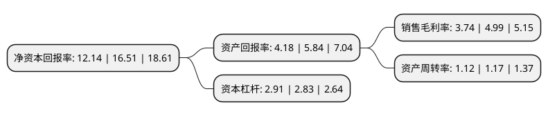

> 本页面由自动化程序生成于 2022年5月20日 01:34
> 内容可能存在错误，如有bug请提交issue至：https://github.com/Eroleice/doc-pi/issues
{.is-warning}

# 上市公司基本情况

## 基本资料

广西柳州医药股份有限公司（以下简称“柳药股份”）成立于1981年12月23日，柳州市。于2014年12月04日在上交所主板上市。

柳药股份注册资本36,235.993万元，公司主要从事药品，医疗器械等医药产品的批发和零售业务。以下是详细信息：

- 公司名称: 广西柳州医药股份有限公司
- 股票代码: 603368.SH
- 所在地: 广西 - 柳州市
- 成立日期: 1981年12月23日
- 注册资本: 36,235.993万元
- 法定代表人: 朱朝阳
- 主营业务: 公司主要从事药品，医疗器械等医药产品的批发和零售业务
- 公司官网: www.lzyy.cn
- 公司介绍: 公司是一家区域性医药流通企业。公司目前主要从事药品、医疗器械等医药产品的批发和零售业务，经营业务覆盖全区。公司经过六十多年来在广西医药流通领域的深耕细作，已逐步形成“以医院销售业务为核心，第三终端和药店零售业务为两翼，商业调拨等业务为补充”的综合性医药商业业务体系。公司是国家医药储备定点单位和毒、麻药品、生物疫苗经营单位，担负着广西灾情、疫情用药的储备和供应工作。公司建造有专门仓库，配备有专业运输车辆、自动温湿度控制设备、行车温度记录设备和专用冷藏箱等，保证冷链品种的储存运输符合要求，先后通过多家知名外资制药企业的冷链审计。目前，公司已与广西区内100%的三级甲等综合医院以及90%以上二级甲等综合医院保持良好的合作关系，在广西区内14个地级市均建立了比较健全的销售网络和售后服务体系，已基本实现了自治区内中、高端医院的全覆盖。

## 股东及高管情况

上市公司第一大股东为朱朝阳，持股101,032,795股，占比27.88%，**疑似为**上市公司实际控制人。

截至2022年03月31日，上市公司的前十大股东中，共有6名自然人股东，4个产品账户，其中5%以上大股东共有1名。上市公司前十大股东明细如下：

> 未能通过持股比例判定出上市公司实际控制人（持股30%以上）
> 可能存在通过间接持股、联合持股、协议控制等方式拥有实际控制权的主体，具体请参考上市公司定期公告！
{.is-warning}

> 截至2022年03月31日，上市公司前十大股东信息如下：

| 股东名称 | 持股数量（股） | 持股比例 |
| --- | --- | --- |
| 朱朝阳 | 101,032,795 | 27.88% |
| 广发证券股份有限公司-中庚小盘价值股票型证券投资基金 | 11,997,013 | 3.31% |
| 华泰证券股份有限公司-中庚价值领航混合型证券投资基金 | 9,224,948 | 2.55% |
| 平安银行股份有限公司-中庚价值灵动灵活配置混合型证券投资基金 | 7,068,230 | 1.95% |
| 平安银行股份有限公司-中庚价值品质一年持有期混合型证券投资基金 | 6,133,737 | 1.69% |
| 葛昌明 | 4,003,800 | 1.1% |
| 陈卓娅 | 3,528,000 | 0.97% |
| 陈洪 | 2,743,190 | 0.76% |
| 吴东萍 | 2,476,534 | 0.68% |
| 柯强 | 2,196,699 | 0.61% |

## 利润表分析

上市公司2021年总收入为171.34亿元，净利润为6.41亿元，实现盈利。

## 杜邦分析

> 数据列示周期：2021年 | 2020年 | 2019年
{.is-info}

上市公司的净资产收益率在近一年有所下降，下降幅度为-26.47%，其变化情况分解如下：
- 上市公司的销售毛利率在近一年下降了-25.05%，可能是生产效率的下降、商品原材料价格上涨或商品价格的下跌所致。
- 上市公司的资产周转率在近一年下降了-4.27%，可能是源自于更慢的销售回款或库存管理效果下降。
- 上市公司的财务杠杆比率在近一年上升了2.83%，可能是增加负债扩大生产规模。

