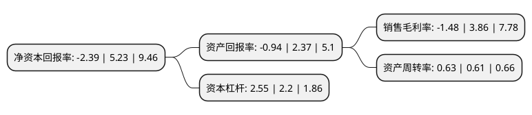

> 本页面由自动化程序生成于 2022年5月20日 01:35
> 内容可能存在错误，如有bug请提交issue至：https://github.com/Eroleice/doc-pi/issues
{.is-warning}

# 上市公司基本情况

## 基本资料

塞力斯医疗科技集团股份有限公司（以下简称“塞力医疗”）成立于2004年02月23日，武汉市。于2016年10月31日在上交所主板上市。

塞力医疗注册资本20,501.899万元，主营业务:专注于医疗检验集约化营销及服务业务，体外诊断产品的代理以及自主体外诊断产品的研发，生产和销售。业务模式:医疗检验集约化营销及服务业务，体外诊断产品的代理业务，自主体外诊断产品的研发，生产和销售业务。以下是详细信息：

- 公司名称: 塞力斯医疗科技集团股份有限公司
- 股票代码: 603716.SH
- 所在地: 湖北 - 武汉市
- 成立日期: 2004年02月23日
- 注册资本: 20,501.899万元
- 法定代表人: 温伟
- 主营业务: 主营业务:专注于医疗检验集约化营销及服务业务，体外诊断产品的代理以及自主体外诊断产品的研发，生产和销售业务模式:医疗检验集约化营销及服务业务，体外诊断产品的代理业务，自主体外诊断产品的研发，生产和销售业务
- 公司官网: www.thalys.net.cn
- 公司介绍: 公司是一家以医疗集约化业务与运营服务为主的上市公司。以“为健康中国而创新”的经营理念，洞悉行业动态和紧跟医改政策，因势而谋构建医疗集约化服务商业模式，应势而动借力资本市场完成全国业务布局，顺势而为搭建医疗集约化服务生态模式，立志成为具有较强影响力的医疗集约化运营服务提供商。公司总部坐落于武汉市东西湖区，拥有40多亩的自有产业园，以集约化业务与运营服务为主，拥有IVD试剂生产企业以及投资拥有自主知识产权的医疗集约化运营服务信息平台的企业，通过横向整合全国有区域影响力的渠道经销商成立30多家子公司，配套建设医疗耗材现代物流体系和运营管理团队，为多家医院终端提供医疗集约化运营模式。

## 股东及高管情况

上市公司第一大股东为赛海(上海)健康科技有限公司，持股60,843,770股，占比29.68%，**疑似为**上市公司实际控制人。

截至2022年03月31日，上市公司的前十大股东中，共有5名自然人股东，1名机构股东，4个产品账户，其中5%以上大股东共有1名。上市公司前十大股东明细如下：

> 未能通过持股比例判定出上市公司实际控制人（持股30%以上）
> 可能存在通过间接持股、联合持股、协议控制等方式拥有实际控制权的主体，具体请参考上市公司定期公告！
{.is-warning}

> 截至2022年03月31日，上市公司前十大股东信息如下：

| 股东名称 | 持股数量（股） | 持股比例 |
| --- | --- | --- |
| 赛海(上海)健康科技有限公司 | 60,843,770 | 29.68% |
| 上海雁丰投资管理有限公司-雁丰向日葵1号私募证券投资基金 | 10,251,050 | 5% |
| 温伟 | 9,634,208 | 4.7% |
| 深圳市华润资本股权投资有限公司-华润医药(汕头)产业投资基金合伙企业(有限合伙) | 4,384,900 | 2.14% |
| 宁波宁聚资产管理中心(有限合伙)-宁聚量化稳增4号私募证券投资基金 | 3,935,901 | 1.92% |
| 曲明彦 | 3,091,600 | 1.51% |
| 倪子涵 | 2,323,000 | 1.13% |
| 上海烜鼎资产管理有限公司-烜鼎星辰8号私募证券投资基金 | 1,999,950 | 0.98% |
| 朱晓红 | 1,537,500 | 0.75% |
| 周永胜 | 1,459,500 | 0.71% |

## 利润表分析

上市公司2021年总收入为25.99亿元，净利润为-0.39亿元，**未实现盈利**。

## 杜邦分析

> 数据列示周期：2021年 | 2020年 | 2019年
{.is-info}

上市公司的净资产收益率在近一年有所下降，下降幅度为-145.7%，其变化情况分解如下：
- 上市公司的销售毛利率在近一年下降了-138.34%，可能是生产效率的下降、商品原材料价格上涨或商品价格的下跌所致。
- 上市公司的资产周转率在近一年上升了3.28%，可能是源自于更快的销售回款或库存管理效果提升。
- 上市公司的财务杠杆比率在近一年上升了15.91%，可能是增加负债扩大生产规模。

