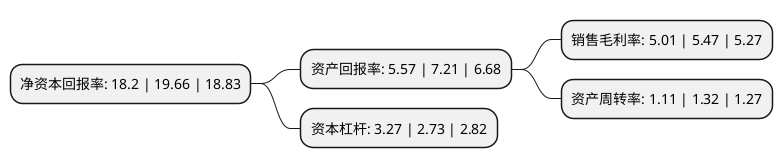

> 本页面由自动化程序生成于 2022年5月20日 01:35
> 内容可能存在错误，如有bug请提交issue至：https://github.com/Eroleice/doc-pi/issues
{.is-warning}

# 上市公司基本情况

## 基本资料

老百姓大药房连锁股份有限公司（以下简称“老百姓”）成立于2005年12月01日，长沙市。于2015年04月23日在上交所主板上市。

老百姓注册资本44,860.148万元，通过自有营销网络从事药品及健康相关商品的销售以下是详细信息：

- 公司名称: 老百姓大药房连锁股份有限公司
- 股票代码: 603883.SH
- 所在地: 湖南 - 长沙市
- 成立日期: 2005年12月01日
- 注册资本: 44,860.148万元
- 法定代表人: 谢子龙
- 主营业务: 通过自有营销网络从事药品及健康相关商品的销售
- 公司官网: www.lbxdrugs.com
- 公司介绍: 公司是全国领先的药品零售连锁企业之一。公司主要通过自有营销网络从事药品及健康相关商品的销售，经营商品包括中西成药、中药饮片、养生中药、健康器材、健康食品、普通食品、个人护理品和生活用品等品类，除药品零售外，公司兼营药品批发与制造(主要为中成药及中药饮片制造)，同时大力发展DTP专业药房、中医馆和电子商务O2O等业务。公司是国内零售药店行业“平价超市药店”模式的先行者，具有良好的口碑和广泛的认知度，“老百姓大药房”品牌效应显著。根据中康资讯中国药品零售发展研究中心评选，公司多次获得“中国药品零售企业综合竞争力”第一名。

## 股东及高管情况

上市公司第一大股东为老百姓医药集团有限公司，持股126,452,741股，占比28.19%，**疑似为**上市公司实际控制人。

截至2022年03月31日，上市公司的前十大股东中，共有2名自然人股东，4名机构股东，2个产品账户，1个海外主体，1名其他股东，其中5%以上大股东共有3名。上市公司前十大股东明细如下：

> 未能通过持股比例判定出上市公司实际控制人（持股30%以上）
> 可能存在通过间接持股、联合持股、协议控制等方式拥有实际控制权的主体，具体请参考上市公司定期公告！
{.is-warning}

> 截至2022年03月31日，上市公司前十大股东信息如下：

| 股东名称 | 持股数量（股） | 持股比例 |
| --- | --- | --- |
| 老百姓医药集团有限公司 | 126,452,741 | 28.19% |
| 泽星投资有限公司 | 99,415,997 | 22.16% |
| 香港中央结算有限公司(陆股通) | 38,100,001 | 8.49% |
| 陈秀兰 | 8,027,040 | 1.79% |
| 阿布达比投资局 | 7,043,332 | 1.57% |
| 广东恒阔投资管理有限公司 | 6,859,371 | 1.53% |
| 石展 | 6,068,420 | 1.35% |
| 兴业银行股份有限公司-兴全新视野灵活配置定期开放混合型发起式证券投资基金 | 5,400,314 | 1.2% |
| 林芝腾讯科技有限公司 | 4,373,400 | 0.97% |
| 中国建设银行股份有限公司-国泰大健康股票型证券投资基金 | 3,914,625 | 0.87% |

## 利润表分析

上市公司2021年总收入为156.95亿元，净利润为7.86亿元，实现盈利。

## 杜邦分析

> 数据列示周期：2021年 | 2020年 | 2019年
{.is-info}

上市公司的净资产收益率在近一年有所下降，下降幅度为-7.43%，其变化情况分解如下：
- 上市公司的销售毛利率在近一年下降了-8.41%，可能是生产效率的下降、商品原材料价格上涨或商品价格的下跌所致。
- 上市公司的资产周转率在近一年下降了-15.91%，可能是源自于更慢的销售回款或库存管理效果下降。
- 上市公司的财务杠杆比率在近一年上升了19.78%，可能是增加负债扩大生产规模。

