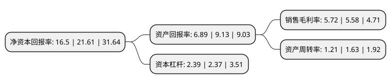

> 本页面由自动化程序生成于 2022年5月20日 01:37
> 内容可能存在错误，如有bug请提交issue至：https://github.com/Eroleice/doc-pi/issues
{.is-warning}

# 上市公司基本情况

## 基本资料

云南健之佳健康连锁店股份有限公司（以下简称“健之佳”）成立于2004年09月27日，昆明市。于2020年12月01日在上交所主板上市。

健之佳注册资本6,952.582万元，公司主要从事药品，保健食品，个人护理品，家庭健康用品，便利食品，日用消耗品等健康产品的连锁零售业务，并提供相关专业服务。以下是详细信息：

- 公司名称: 云南健之佳健康连锁店股份有限公司
- 股票代码: 605266.SH
- 所在地: 云南 - 昆明市
- 成立日期: 2004年09月27日
- 注册资本: 6,952.582万元
- 法定代表人: 蓝波
- 主营业务: 公司主要从事药品，保健食品，个人护理品，家庭健康用品，便利食品，日用消耗品等健康产品的连锁零售业务，并提供相关专业服务
- 公司官网: www.jzj.cn
- 公司介绍: 公司主要从事药品、保健食品、个人护理品、家庭健康用品、便利食品、日用消耗品等健康产品的连锁零售业务，并提供相关专业服务。历经多年逐步发展和积累，公司从昆明起步发展，立足云南，涵盖云南、重庆、四川、广西等区域，专注扎根西南，依托较为完善的连锁零售网络和专业医药服务实力，构筑核心竞争优势，形成稳步走向全国的发展战略趋势，构建了以药品销售为主、健康护理和便利品销售为辅，直营连锁药品门店实体零售为核心，与电商经营有机结合的商业模式和多元化社区健康服务生态圈，成为具有较强区域竞争实力的全国性知名健康连锁零售企业。长期以来，公司始终恪守“以专业的精神，优质的服务建立信誉，努力实现顾客满意的承诺”的企业使命，秉持“健康+专业+便利”的经营定位，践行“品质保证、专业服务、顾客满意”的服务宗旨，贯彻“集团化管理、多元化经营、全国性扩张”的总体战略，凭借行业内先进的营运管理技术、高效的物流体系和不断优化的信息系统三大支柱，联合佳e购、APP、微商城、官网、第三方平台等电商工具，搭建以会员为核心的全渠道营销平台，打造集合了社区专业便利药房、中医诊所、社区诊所、体检中心和便利店等业态的多元化社区健康服务生态圈。

## 股东及高管情况

上市公司第一大股东为深圳市畅思行实业发展有限公司，持股11,558,170股，占比15.14%，**疑似为**上市公司实际控制人。

截至2022年04月29日，上市公司的前十大股东中，共有3名自然人股东，6名机构股东，1个产品账户，其中5%以上大股东共有5名。上市公司前十大股东明细如下：

> 未能通过持股比例判定出上市公司实际控制人（持股30%以上）
> 可能存在通过间接持股、联合持股、协议控制等方式拥有实际控制权的主体，具体请参考上市公司定期公告！
{.is-warning}

> 截至2022年04月29日，上市公司前十大股东信息如下：

| 股东名称 | 持股数量（股） | 持股比例 |
| --- | --- | --- |
| 深圳市畅思行实业发展有限公司 | 11,558,170 | 15.14% |
| 深圳市畅思行实业发展有限公司 | 11,558,170 | 16.62% |
| 蓝波 | 10,637,553 | 13.93% |
| 王雁萍 | 7,762,171 | 10.17% |
| 云南祥群投资有限公司 | 6,813,757 | 8.93% |
| 中国工商银行股份有限公司-融通健康产业灵活配置混合型证券投资基金 | 1,933,422 | 2.78% |
| 郝培林 | 1,931,923 | 2.78% |
| 苏州和聚汇益投资合伙企业(有限合伙) | 1,139,684 | 1.64% |
| 苏州和聚融益投资合伙企业(有限合伙) | 1,139,684 | 1.64% |
| 珠海时间方舟投资合伙企业(有限合伙) | 1,078,480 | 1.55% |

## 利润表分析

上市公司2021年总收入为52.34亿元，净利润为2.99亿元，实现盈利。

## 杜邦分析

> 数据列示周期：2021年 | 2020年 | 2019年
{.is-info}

上市公司的净资产收益率在近一年有所下降，下降幅度为-23.65%，其变化情况分解如下：
- 上市公司的销售毛利率在近一年上升了2.51%，可能是生产效率的提升、商品原材料价格下跌或商品价格的上涨所致。
- 上市公司的资产周转率在近一年下降了-25.77%，可能是源自于更慢的销售回款或库存管理效果下降。
- 上市公司的财务杠杆比率在近一年上升了0.84%，可能是增加负债扩大生产规模。

