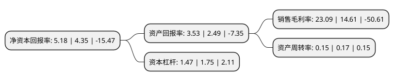

> 本页面由自动化程序生成于 2022年5月20日 01:06
> 内容可能存在错误，如有bug请提交issue至：https://github.com/Eroleice/doc-pi/issues
{.is-warning}

# 上市公司基本情况

## 基本资料

江苏大港股份有限公司（以下简称“大港股份”）成立于2000年04月20日，镇江市。于2006年11月16日在深交所中小板上市。

大港股份注册资本58,034.851万元，主营业务:房地产，高科技，园区服务。以下是详细信息：

- 公司名称: 江苏大港股份有限公司
- 股票代码: 002077.SZ
- 所在地: 江苏 - 镇江市
- 成立日期: 2000年04月20日
- 注册资本: 58,034.851万元
- 法定代表人: 王茂和
- 主营业务: 主营业务:房地产，高科技，园区服务
- 公司官网: www.dggf.cn
- 公司介绍: 公司是镇江新区第一家上市公司。通过十多年的努力，公司已形成三大板块的业务，即高科技新兴产业、房地产开发、园区运营服务，拥有中科激光、江苏艾科、港龙石化、港汇化工、港诚国贸、港源水务等多家控股子公司。自上市以来，公司秉承“以人为本，规范管理，创新发展”的经营理念，以改革创新为主题，紧抓资本市场大发展的机遇，依托上市公司的品牌优势、资金优势，积极融入镇江新区建设大潮，大力培育公司新的利润增长点，不断做大做强企业。通过近十年的努力，公司初步搭建了未来可持续发展的产业架构，保障了各项业务稳步增长的良好态势。

## 股东及高管情况

上市公司第一大股东为江苏瀚瑞投资控股有限公司，持股289,525,647股，占比49.89%，为上市公司实际控制人。

截至2022年03月31日，上市公司的前十大股东中，共有9名自然人股东，1名机构股东，其中5%以上大股东共有1名。上市公司前十大股东明细如下：

> 截至2022年03月31日，上市公司前十大股东信息如下：

| 股东名称 | 持股数量（股） | 持股比例 |
| --- | --- | --- |
| 江苏瀚瑞投资控股有限公司 | 289,525,647 | 49.89% |
| 王刚 | 5,232,966 | 0.9% |
| 张岳洲 | 4,701,800 | 0.81% |
| 张琪 | 3,036,700 | 0.52% |
| 顾斌 | 3,000,000 | 0.52% |
| 胡韩 | 2,652,800 | 0.46% |
| 易爱玉 | 2,050,900 | 0.35% |
| 杨砚 | 2,031,400 | 0.35% |
| 曾丽辉 | 1,890,100 | 0.33% |
| 王龙杰 | 1,515,400 | 0.26% |

## 利润表分析

上市公司2021年总收入为6.83亿元，净利润为1.57亿元，实现盈利。

## 杜邦分析

> 数据列示周期：2021年 | 2020年 | 2019年
{.is-info}

上市公司的净资产收益率在近一年有所上升，上升幅度为19.08%，其变化情况分解如下：
- 上市公司的销售毛利率在近一年上升了58.04%，可能是生产效率的提升、商品原材料价格下跌或商品价格的上涨所致。
- 上市公司的资产周转率在近一年下降了-11.76%，可能是源自于更慢的销售回款或库存管理效果下降。
- 上市公司的财务杠杆比率在近一年下降了-16%，可能是减少负债降低财务费用。

