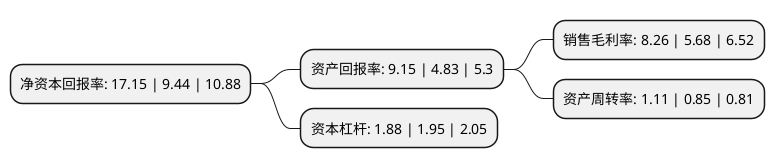

> 本页面由自动化程序生成于 2022年5月20日 01:06
> 内容可能存在错误，如有bug请提交issue至：https://github.com/Eroleice/doc-pi/issues
{.is-warning}

# 上市公司基本情况

## 基本资料

宁波康强电子股份有限公司（以下简称“康强电子”）成立于1992年06月29日，宁波市。于2007年03月02日在深交所中小板上市。

康强电子注册资本37,528.4万元，主营业务:制造和销售半导体封装材料引线框架和键合金丝。以下是详细信息：

- 公司名称: 宁波康强电子股份有限公司
- 股票代码: 002119.SZ
- 所在地: 浙江 - 宁波市
- 成立日期: 1992年06月29日
- 注册资本: 37,528.4万元
- 法定代表人: 叶骥
- 主营业务: 主营业务:制造和销售半导体封装材料引线框架和键合金丝
- 公司官网: www.kangqiang.com
- 公司介绍: 公司是一家专业从事各类半导体封装材料的开发、生产、销售的国家级高新技术企业。主要生产各类半导体塑封引线框架、键合丝、电极丝和生产框架所需的专用设备等产品。公司在原“省级研发中心”基础上扩大编制，成立了“浙江省康强电子封装材料研究院”，引进国内外先进的实验检测设备，广纳高科技人才，并与多家高校及科研院所开展产学研合作。同时公司再次承担了十二五国家重大科技专项——“高密度刻蚀引线框架”，一方面为发展我国极大规模集成电路奠定基础，另一方面快速提高了公司生产工艺、研发装备水平和生产、研发能力，实现了技术升级和产品升级。此外，公司发展始终以环保和节能为宗旨。凭借工艺改造、技术创新，首家实现生产点镀银引线框架，和全镀银产品相比大量节约了白银。自主研发电镀废水回收处理设施，采用“分质分流、膜法处理、在线回用”技术，实现了资源循环、节能降耗、绿色发展。

## 股东及高管情况

上市公司第一大股东为宁波普利赛思电子有限公司，持股74,009,208股，占比19.72%，**疑似为**上市公司实际控制人。

截至2022年03月31日，上市公司的前十大股东中，共有4名自然人股东，2名机构股东，4个产品账户，其中5%以上大股东共有2名。上市公司前十大股东明细如下：

> 未能通过持股比例判定出上市公司实际控制人（持股30%以上）
> 可能存在通过间接持股、联合持股、协议控制等方式拥有实际控制权的主体，具体请参考上市公司定期公告！
{.is-warning}

> 截至2022年03月31日，上市公司前十大股东信息如下：

| 股东名称 | 持股数量（股） | 持股比例 |
| --- | --- | --- |
| 宁波普利赛思电子有限公司 | 74,009,208 | 19.72% |
| 宁波司麦司电子科技有限公司 | 28,222,707 | 7.52% |
| 华润深国投信托有限公司-泽熙6期单一资金信托计划 | 18,764,272 | 5% |
| 郑康定 | 10,374,000 | 2.76% |
| 中国工商银行股份有限公司-海富通改革驱动灵活配置混合型证券投资基金 | 10,039,338 | 2.68% |
| 项丽君 | 6,643,064 | 1.77% |
| 邵琮元 | 3,995,000 | 1.06% |
| 熊基凯 | 3,729,445 | 0.99% |
| 海南翎展私募基金管理合伙企业(有限合伙)-翎展稳进价值私募证券投资基金 | 2,158,500 | 0.58% |
| 中国银行-海富通收益增长证券投资基金 | 2,146,800 | 0.57% |

## 利润表分析

上市公司2021年总收入为21.94亿元，净利润为1.81亿元，实现盈利。

## 杜邦分析

> 数据列示周期：2021年 | 2020年 | 2019年
{.is-info}

上市公司的净资产收益率在近一年有所上升，上升幅度为81.67%，其变化情况分解如下：
- 上市公司的销售毛利率在近一年上升了45.42%，可能是生产效率的提升、商品原材料价格下跌或商品价格的上涨所致。
- 上市公司的资产周转率在近一年上升了30.59%，可能是源自于更快的销售回款或库存管理效果提升。
- 上市公司的财务杠杆比率在近一年下降了-3.59%，可能是减少负债降低财务费用。

