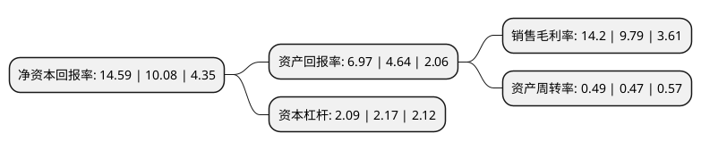

> 本页面由自动化程序生成于 2022年5月20日 01:06
> 内容可能存在错误，如有bug请提交issue至：https://github.com/Eroleice/doc-pi/issues
{.is-warning}

# 上市公司基本情况

## 基本资料

天水华天科技股份有限公司（以下简称“华天科技”）成立于2003年12月25日，天水市。于2007年11月20日在深交所中小板上市。

华天科技注册资本320,448.465万元，主营业务是集成电路封装，测试业务。主要产品:DIP，SOP，SSOP，QFP，SOT。以下是详细信息：

- 公司名称: 天水华天科技股份有限公司
- 股票代码: 002185.SZ
- 所在地: 甘肃 - 天水市
- 成立日期: 2003年12月25日
- 注册资本: 320,448.465万元
- 法定代表人: 肖胜利
- 主营业务: 主营业务是集成电路封装，测试业务主要产品:DIP，SOP，SSOP，QFP，SOT
- 公司官网: www.ht-tech.com
- 公司介绍: 公司主要从事半导体集成电路、MEMS传感器、半导体元器件的封装测试业务。目前公司集成电路封装产品主要有DIP/SDIP、SOT、SOP、SSOP、TSSOP/ETSSOP、QFP/LQFP/TQFP、QFN/DFN、BGA/LGA、FC、MCM(MCP)、SiP、WLP、TSV、Bumping、MEMS等多个系列，产品主要应用于计算机、网络通讯、消费电子及智能移动终端、物联网、工业自动化控制、汽车电子等电子整机和智能化领。公司不断加强先进封装技术和产品的研发力度，加大研发投入，完善以华天西安为主体的研发仿真平台建设，依托国家级企业技术中心、甘肃省微电子工程技术研究中心、甘肃省微电子工程实验室等研发验证平台，通过实施国家科技重大专项02专项等科技创新项目以及新产品、新技术、新工艺的不断研究开发，自主研发出FC、Bumping、MEMS、MCM(MCP)、WLP、SiP、TSV、Fan-Out等多项集成电路先进封装技术和产品，随着公司进一步加大技术创新力度，公司的技术竞争优势将不断提升。

## 股东及高管情况

上市公司第一大股东为天水华天电子集团股份有限公司，持股665,502,455股，占比20.77%，**疑似为**上市公司实际控制人。

截至2022年03月31日，上市公司的前十大股东中，共有4名机构股东，5个产品账户，1个海外主体，其中5%以上大股东共有1名。上市公司前十大股东明细如下：

> 未能通过持股比例判定出上市公司实际控制人（持股30%以上）
> 可能存在通过间接持股、联合持股、协议控制等方式拥有实际控制权的主体，具体请参考上市公司定期公告！
{.is-warning}

> 截至2022年03月31日，上市公司前十大股东信息如下：

| 股东名称 | 持股数量（股） | 持股比例 |
| --- | --- | --- |
| 天水华天电子集团股份有限公司 | 665,502,455 | 20.77% |
| 华芯投资管理有限责任公司-国家集成电路产业投资基金二期股份有限公司 | 102,914,400 | 3.21% |
| 香港中央结算有限公司(陆股通) | 52,976,758 | 1.65% |
| 广东恒阔投资管理有限公司 | 36,247,723 | 1.13% |
| 嘉兴聚力柒号股权投资合伙企业(有限合伙) | 31,056,466 | 0.97% |
| 中国建设银行股份有限公司-华夏国证半导体芯片交易型开放式指数证券投资基金 | 30,983,369 | 0.97% |
| 甘肃长城兴陇丝路基金管理有限公司-甘肃长城兴陇丝路基金(有限合伙) | 27,322,404 | 0.85% |
| 陕西省民营经济高质量发展纾困基金合伙企业(有限合伙) | 27,322,404 | 0.85% |
| 上海盛宇股权投资中心(有限合伙)-盛宇致远2号私募证券投资基金 | 24,590,163 | 0.77% |
| 国泰君安证券股份有限公司 | 19,942,023 | 0.62% |

## 利润表分析

上市公司2021年总收入为120.96亿元，净利润为17.18亿元，实现盈利。

## 杜邦分析

> 数据列示周期：2021年 | 2020年 | 2019年
{.is-info}

上市公司的净资产收益率在近一年有所上升，上升幅度为44.74%，其变化情况分解如下：
- 上市公司的销售毛利率在近一年上升了45.05%，可能是生产效率的提升、商品原材料价格下跌或商品价格的上涨所致。
- 上市公司的资产周转率在近一年上升了4.26%，可能是源自于更快的销售回款或库存管理效果提升。
- 上市公司的财务杠杆比率在近一年下降了-3.69%，可能是减少负债降低财务费用。

