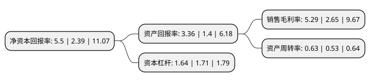

> 本页面由自动化程序生成于 2022年5月20日 01:09
> 内容可能存在错误，如有bug请提交issue至：https://github.com/Eroleice/doc-pi/issues
{.is-warning}

# 上市公司基本情况

## 基本资料

佛山市国星光电股份有限公司（以下简称“国星光电”）成立于1981年08月31日，佛山市。于2010年07月16日在深交所中小板上市。

国星光电注册资本61,847.717万元，主要从事LED器件及其组件的研发，生产与销售。主要产品有光电半导体器件，光电显示器件，LED显示屏，交通信号灯，光电半导体照明灯具灯饰，半导体集成电路，光电模组，电子调谐器，其他电子部件，组件，信息技术设备类产品等。以下是详细信息：

- 公司名称: 佛山市国星光电股份有限公司
- 股票代码: 002449.SZ
- 所在地: 广东 - 佛山市
- 成立日期: 1981年08月31日
- 注册资本: 61,847.717万元
- 法定代表人: 王佳
- 主营业务: 主要从事LED器件及其组件的研发，生产与销售主要产品有光电半导体器件，光电显示器件，LED显示屏，交通信号灯，光电半导体照明灯具灯饰，半导体集成电路，光电模组，电子调谐器，其他电子部件，组件，信息技术设备类产品等
- 公司官网: www.nationstar.com
- 公司介绍: 公司是专业生产LED半导体光电器件及LED应用产品的国家火炬计划重点高新技术企业。产品包括发光二极管(LAMPLED、CHIPLED、TOPLED、POWERLED)、LED交通灯、LED显示模块、LED光源模块、LED背光源、LED显示屏、LED装饰照明灯具系列产品、红外发射管、时间显示板、光敏管、像素灯、线状光源、一体化红外接收器、电子调谐器、锂电池保护器等。通过了ISO9001、ISO14001国际环境管理体系认证和ISO/TS16949国际质量管理体系认证，连续被广东省政府授予“广东省优秀高新技术企业”称号，公司产品多次获国家级、省级重点新产品称号，科研成果多次荣获省、市科技进步奖等荣誉。

## 股东及高管情况

上市公司第一大股东为佛山市西格玛创业投资有限公司，持股79,753,050股，占比12.9%，**疑似为**上市公司实际控制人。

截至2022年03月31日，上市公司的前十大股东中，共有7名自然人股东，2名机构股东，1个海外主体，其中5%以上大股东共有2名。上市公司前十大股东明细如下：

> 未能通过持股比例判定出上市公司实际控制人（持股30%以上）
> 可能存在通过间接持股、联合持股、协议控制等方式拥有实际控制权的主体，具体请参考上市公司定期公告！
{.is-warning}

> 截至2022年03月31日，上市公司前十大股东信息如下：

| 股东名称 | 持股数量（股） | 持股比例 |
| --- | --- | --- |
| 佛山市西格玛创业投资有限公司 | 79,753,050 | 12.9% |
| 佛山电器照明股份有限公司 | 53,066,845 | 8.58% |
| 张跃军 | 15,210,000 | 2.46% |
| 余军 | 10,000,000 | 1.62% |
| 钟易珍 | 5,957,250 | 0.96% |
| 香港中央结算有限公司(陆股通) | 5,656,822 | 0.91% |
| 蔡炬怡 | 4,657,910 | 0.75% |
| 宋代辉 | 3,959,800 | 0.64% |
| 郭冰 | 3,913,000 | 0.63% |
| 蔡永佳 | 3,751,000 | 0.61% |

## 利润表分析

上市公司2021年总收入为38.06亿元，净利润为2.01亿元，实现盈利。

## 杜邦分析

> 数据列示周期：2021年 | 2020年 | 2019年
{.is-info}

上市公司的净资产收益率在近一年有所上升，上升幅度为130.13%，其变化情况分解如下：
- 上市公司的销售毛利率在近一年上升了99.62%，可能是生产效率的提升、商品原材料价格下跌或商品价格的上涨所致。
- 上市公司的资产周转率在近一年上升了18.87%，可能是源自于更快的销售回款或库存管理效果提升。
- 上市公司的财务杠杆比率在近一年下降了-4.09%，可能是减少负债降低财务费用。

