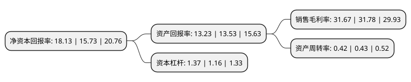

> 本页面由自动化程序生成于 2022年5月20日 01:14
> 内容可能存在错误，如有bug请提交issue至：https://github.com/Eroleice/doc-pi/issues
{.is-warning}

# 上市公司基本情况

## 基本资料

浙江中晶科技股份有限公司（以下简称“中晶科技”）成立于2010年01月25日，湖州市。于2020年12月18日在深交所中小板上市。

中晶科技注册资本9,976万元，主营业务为半导体硅材料的研发，生产和销售，主要产品为半导体硅片及半导体硅棒。以下是详细信息：

- 公司名称: 浙江中晶科技股份有限公司
- 股票代码: 003026.SZ
- 所在地: 浙江 - 湖州市
- 成立日期: 2010年01月25日
- 注册资本: 9,976万元
- 法定代表人: 徐一俊
- 主营业务: 主营业务为半导体硅材料的研发，生产和销售，主要产品为半导体硅片及半导体硅棒
- 公司官网: www.mtcn.net
- 公司介绍: 公司是一家专业从事硅材料研发、生产和销售的电子信息产业国家级高新技术企业。发行人是国家高新技术企业、全国半导体设备和材料标准化技术委员会成员单位，是中国半导体行业协会、中国电子材料行业协会会员单位，在半导体硅材料制造领域拥有多项核心技术和专利。发行人核心管理团队拥有二十多年的半导体行业从业经验，长期致力于半导体硅材料的研发与生产，在研发、生产工艺、质量控制等方面拥有完善的技术储备和强大的技术创新能力。经过近十年的发展，目前发行人在分立器件用半导体硅材料领域尤其是硅研磨片细分领域已具有领先的市场地位。

## 股东及高管情况

上市公司第一大股东为徐一俊，持股25,505,100股，占比25.57%，**疑似为**上市公司实际控制人。

截至2022年03月31日，上市公司的前十大股东中，共有8名自然人股东，2名机构股东，其中5%以上大股东共有3名。上市公司前十大股东明细如下：

> 未能通过持股比例判定出上市公司实际控制人（持股30%以上）
> 可能存在通过间接持股、联合持股、协议控制等方式拥有实际控制权的主体，具体请参考上市公司定期公告！
{.is-warning}

> 截至2022年03月31日，上市公司前十大股东信息如下：

| 股东名称 | 持股数量（股） | 持股比例 |
| --- | --- | --- |
| 徐一俊 | 25,505,100 | 25.57% |
| 徐伟 | 11,960,000 | 11.99% |
| 隆基绿能科技股份有限公司 | 9,000,000 | 9.02% |
| 黄笑容 | 3,369,500 | 3.38% |
| 缪玉华 | 3,364,500 | 3.37% |
| 张明华 | 3,351,600 | 3.36% |
| 郭兵健 | 2,630,093 | 2.64% |
| 李志萍 | 2,139,000 | 2.14% |
| 张海军 | 1,468,000 | 1.47% |
| 长兴科威创业投资合伙企业(有限合伙) | 1,180,000 | 1.18% |

## 利润表分析

上市公司2021年总收入为4.36亿元，净利润为1.38亿元，实现盈利。

## 杜邦分析

> 数据列示周期：2021年 | 2020年 | 2019年
{.is-info}

上市公司的净资产收益率在近一年有所上升，上升幅度为15.26%，其变化情况分解如下：
- 上市公司的销售毛利率在近一年下降了-0.35%，可能是生产效率的下降、商品原材料价格上涨或商品价格的下跌所致。
- 上市公司的资产周转率在近一年下降了-2.33%，可能是源自于更慢的销售回款或库存管理效果下降。
- 上市公司的财务杠杆比率在近一年上升了18.1%，可能是增加负债扩大生产规模。

