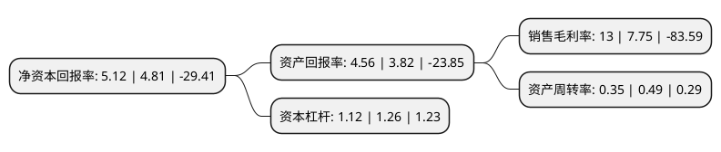

> 本页面由自动化程序生成于 2022年5月20日 01:14
> 内容可能存在错误，如有bug请提交issue至：https://github.com/Eroleice/doc-pi/issues
{.is-warning}

# 上市公司基本情况

## 基本资料

湖北台基半导体股份有限公司（以下简称“台基股份”）成立于2004年01月02日，襄阳市。于2010年01月20日在深交所创业板上市。

台基股份注册资本23,717.137万元，主营业务:功率晶闸管，整流管，电力半导体模块等大功率半导体器件及其组件和电力半导体散热器的研发，制造，销售及服务。以下是详细信息：

- 公司名称: 湖北台基半导体股份有限公司
- 股票代码: 300046.SZ
- 所在地: 湖北 - 襄阳市
- 成立日期: 2004年01月02日
- 注册资本: 23,717.137万元
- 法定代表人: 邢雁
- 主营业务: 主营业务:功率晶闸管，整流管，电力半导体模块等大功率半导体器件及其组件和电力半导体散热器的研发，制造，销售及服务
- 公司官网: www.tech-sem.com
- 公司介绍: 公司是国内大功率半导体器件领域为数不多的掌握前道(扩散)技术、中道(芯片制成)技术、后道(封装测试)技术，并掌握大功率半导体器件设计、制造核心技术并形成规模化生产的高新技术企业。公司采用垂直整合(IDM)一体化的经营模式，专业致力于功率半导体芯片及器件的研发、制造、销售及服务，主要产品为功率晶闸管、整流管、IGBT、电力半导体模块等功率半导体器件，广泛应用于工业电气控制和电源设备。公司致力于中国电力电子技术应用的普及和提升，节约能源，造福社会，成为中国具竞争力的功率半导体提供者。公司拥有省级企业技术中心，省级工程技术研发中心(湖北省电力电子器件和功率模块工程技术研发中心)，建立了湖北省博士后产业基地，是湖北省高校毕业生就业基地以及湖北省创新型试点企业，先后承担了国家发改委、科技部、商务部的多项重点科研项目。

## 股东及高管情况

上市公司第一大股东为襄阳新仪元半导体有限责任公司，持股62,258,000股，占比26.25%，**疑似为**上市公司实际控制人。

截至2022年03月31日，上市公司的前十大股东中，共有7名自然人股东，2名机构股东，1个产品账户，其中5%以上大股东共有1名。上市公司前十大股东明细如下：

> 未能通过持股比例判定出上市公司实际控制人（持股30%以上）
> 可能存在通过间接持股、联合持股、协议控制等方式拥有实际控制权的主体，具体请参考上市公司定期公告！
{.is-warning}

> 截至2022年03月31日，上市公司前十大股东信息如下：

| 股东名称 | 持股数量（股） | 持股比例 |
| --- | --- | --- |
| 襄阳新仪元半导体有限责任公司 | 62,258,000 | 26.25% |
| 深圳市华润资本股权投资有限公司-润科(上海)股权投资基金合伙企业(有限合伙) | 11,705,685 | 4.94% |
| 汉江投资控股有限公司 | 3,228,553 | 1.36% |
| 张斌 | 2,092,640 | 0.88% |
| 陈丹胜 | 1,314,701 | 0.55% |
| 周新伟 | 1,092,100 | 0.46% |
| 罗丹妮 | 665,800 | 0.28% |
| 赵春雷 | 430,000 | 0.18% |
| 庞燕喜 | 409,500 | 0.17% |
| 罗月芳 | 323,000 | 0.14% |

## 利润表分析

上市公司2021年总收入为3.29亿元，净利润为0.42亿元，实现盈利。

## 杜邦分析

> 数据列示周期：2021年 | 2020年 | 2019年
{.is-info}

上市公司的净资产收益率在近一年有所上升，上升幅度为6.44%，其变化情况分解如下：
- 上市公司的销售毛利率在近一年上升了67.74%，可能是生产效率的提升、商品原材料价格下跌或商品价格的上涨所致。
- 上市公司的资产周转率在近一年下降了-28.57%，可能是源自于更慢的销售回款或库存管理效果下降。
- 上市公司的财务杠杆比率在近一年下降了-11.11%，可能是减少负债降低财务费用。

