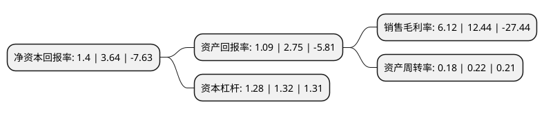

> 本页面由自动化程序生成于 2022年5月20日 01:14
> 内容可能存在错误，如有bug请提交issue至：https://github.com/Eroleice/doc-pi/issues
{.is-warning}

# 上市公司基本情况

## 基本资料

珠海欧比特宇航科技股份有限公司（以下简称“欧比特”）成立于2000年03月20日，珠海市。于2010年02月11日在深交所创业板上市。

欧比特注册资本70,215.821万元，主要从事如下业务:1，高可靠嵌入式SoC芯片类产品的研发，生产和销售;2，系统集成类产品的研发，生产和销售;3，产品代理及其他。本公司的主要产品为:1，嵌入式SoC芯片类产品，包括嵌入式SoC芯片，总线控制器芯片及相应的应用开发系统等;2，系统集成类产品，包括嵌入式总线控制模块(EMBC)，嵌入式智能控制平台(EIPC)及由EMBC，EIPC作为技术平台支撑的系统集成产品以下是详细信息：

- 公司名称: 珠海欧比特宇航科技股份有限公司
- 股票代码: 300053.SZ
- 所在地: 广东 - 珠海市
- 成立日期: 2000年03月20日
- 注册资本: 70,215.821万元
- 法定代表人: 颜志宇
- 主营业务: 主要从事如下业务:1，高可靠嵌入式SoC芯片类产品的研发，生产和销售;2，系统集成类产品的研发，生产和销售;3，产品代理及其他本公司的主要产品为:1，嵌入式SoC芯片类产品，包括嵌入式SoC芯片，总线控制器芯片及相应的应用开发系统等;2，系统集成类产品，包括嵌入式总线控制模块(EMBC)，嵌入式智能控制平台(EIPC)及由EMBC，EIPC作为技术平台支撑的系统集成产品
- 公司官网: www.myorbita.net
- 公司介绍: 公司于2000年3月在珠海特区创立，是首家登陆中国创业板的IC设计公司，现隶属于珠海国资委，由珠海格力集团控股。公司推崇“芯科技、兴中国；小卫星、大数据”的发展理念，主要从事宇航电子、维纳卫星星座及卫星大数据、人工智能技术的研制与生产，服务于航空航天、工业控制、地理信息、国土资源、农林牧渔、环保交通、智慧城市、数字政府、现代金融、个人消费等领域。公司是首家登陆深圳证券交易所创业板的IC设计公司(2010年)，是我国宇航SPARC V8处理器SOC的标杆企业、立体封装SIP宇航微系统的开拓者、卫星星座运营及卫星大数据应用领航者。公司通过了“高新技术企业”和“集成电路设计企业”，首批通过了“双软”认证，是SPARC国际协会会员单位、国家IP核库高级会员、半导体行业协会会员、珠海南方集成电路设计服务中心特约客户和珠海市软件协会和信息协会理事单位、国家火炬计划项目研制单位、广东省国产卫星技术创新联盟理事长单位、中国人工智能产业技术创新战略联盟会员单位。公司重视产学研发展，与数十家高校、科学院院所、航天航空院所、大型企业等成了联合研发中心；公司重视学术研究，经国家批准，院士工作站、博士后工作站和博士后科研实践基地分别落户公司。

## 股东及高管情况

上市公司第一大股东为珠海格力金融投资管理有限公司，持股105,904,291股，占比15.08%，**疑似为**上市公司实际控制人。

截至2022年03月31日，上市公司的前十大股东中，共有5名自然人股东，3名机构股东，1个产品账户，1个海外主体，其中5%以上大股东共有2名。上市公司前十大股东明细如下：

> 未能通过持股比例判定出上市公司实际控制人（持股30%以上）
> 可能存在通过间接持股、联合持股、协议控制等方式拥有实际控制权的主体，具体请参考上市公司定期公告！
{.is-warning}

> 截至2022年03月31日，上市公司前十大股东信息如下：

| 股东名称 | 持股数量（股） | 持股比例 |
| --- | --- | --- |
| 珠海格力金融投资管理有限公司 | 105,904,291 | 15.08% |
| 颜军 | 81,912,194 | 11.67% |
| 湖北长江航天股权投资基金管理有限公司-湖北长江航天产业投资基金合伙企业(有限合伙) | 16,642,335 | 2.37% |
| 香港中央结算有限公司(陆股通) | 6,887,468 | 0.98% |
| 深圳市高新投保证担保有限公司 | 6,405,533 | 0.91% |
| 王涛 | 4,375,200 | 0.62% |
| 珠海市欧比特投资咨询有限公司 | 4,001,600 | 0.57% |
| 沈东容 | 3,727,800 | 0.53% |
| 金勇 | 3,516,200 | 0.5% |
| 管辉 | 3,400,000 | 0.48% |

## 利润表分析

上市公司2021年总收入为6.96亿元，净利润为0.42亿元，实现盈利。

## 杜邦分析

> 数据列示周期：2021年 | 2020年 | 2019年
{.is-info}

上市公司的净资产收益率在近一年有所下降，下降幅度为-61.54%，其变化情况分解如下：
- 上市公司的销售毛利率在近一年下降了-50.8%，可能是生产效率的下降、商品原材料价格上涨或商品价格的下跌所致。
- 上市公司的资产周转率在近一年下降了-18.18%，可能是源自于更慢的销售回款或库存管理效果下降。
- 上市公司的财务杠杆比率在近一年下降了-3.03%，可能是减少负债降低财务费用。

