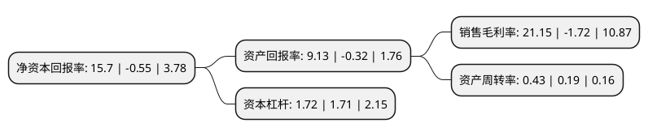

> 本页面由自动化程序生成于 2022年5月20日 01:14
> 内容可能存在错误，如有bug请提交issue至：https://github.com/Eroleice/doc-pi/issues
{.is-warning}

# 上市公司基本情况

## 基本资料

国民技术股份有限公司（以下简称“国民技术”）成立于2000年03月20日，深圳市。于2010年04月30日在深交所创业板上市。

国民技术注册资本59,266.4万元，公司主营业务为安全芯片和通讯芯片产品及解决方案的开发和销售。公司主要产品包括安全芯片和通讯芯片，其中，安全芯片包括USBKEY安全芯片，安全存储芯片，可信计算芯片和移动支付芯片，通讯芯片包括通讯接口芯片，通讯射频芯片等。以下是详细信息：

- 公司名称: 国民技术股份有限公司
- 股票代码: 300077.SZ
- 所在地: 广东 - 深圳市
- 成立日期: 2000年03月20日
- 注册资本: 59,266.4万元
- 法定代表人: 孙迎彤
- 主营业务: 公司主营业务为安全芯片和通讯芯片产品及解决方案的开发和销售公司主要产品包括安全芯片和通讯芯片，其中，安全芯片包括USBKEY安全芯片，安全存储芯片，可信计算芯片和移动支付芯片，通讯芯片包括通讯接口芯片，通讯射频芯片等
- 公司官网: www.nationstech.com
- 公司介绍: 公司是国内专业从事超大规模信息安全芯片和通讯芯片产品设计以及整体解决方案研发和销售的国家级高新技术企业，主要产品包括安全芯片和通讯芯片，其中，安全芯片包括USBKEY安全芯片、安全存储芯片、可信计算芯片和移动支付芯片，通讯芯片包括通讯接口芯片、通讯射频芯片等。公司是国内少数量产32位安全芯片、安全存储芯片和可信计算芯片的集成电路设计企业之一。2018年，公司收购了斯诺实业70%股权，新增业务锂离子电池负极材料研发、生产和销售，用以探索新能源行业的发展方向。

## 股东及高管情况

上市公司第一大股东为孙迎彤，持股22,244,400股，占比3.75%，**疑似为**上市公司实际控制人。

截至2022年03月31日，上市公司的前十大股东中，共有8名自然人股东，2个产品账户。上市公司前十大股东明细如下：

> 未能通过持股比例判定出上市公司实际控制人（持股30%以上）
> 可能存在通过间接持股、联合持股、协议控制等方式拥有实际控制权的主体，具体请参考上市公司定期公告！
{.is-warning}

> 上市公司第一大股东持股不超过10%，请检查是否存在公司控制权风险！
{.is-danger}

> 截至2022年03月31日，上市公司前十大股东信息如下：

| 股东名称 | 持股数量（股） | 持股比例 |
| --- | --- | --- |
| 孙迎彤 | 22,244,400 | 3.75% |
| 中国银行股份有限公司-华夏行业景气混合型证券投资基金 | 13,936,456 | 2.35% |
| 王薇 | 13,314,000 | 2.25% |
| 刘益谦 | 8,992,800 | 1.52% |
| 余运波 | 5,811,600 | 0.98% |
| 国泰君安证券股份有限公司-国联安中证全指半导体产品与设备交易型开放式指数证券投资基金 | 4,962,287 | 0.84% |
| 黄学良 | 4,554,300 | 0.77% |
| 陈依婷 | 3,700,000 | 0.62% |
| 陈瑶希 | 3,422,000 | 0.58% |
| 李标彬 | 2,855,822 | 0.48% |

## 利润表分析

上市公司2021年总收入为10.17亿元，净利润为2.15亿元，实现盈利。

## 杜邦分析

> 数据列示周期：2021年 | 2020年 | 2019年
{.is-info}

上市公司的净资产收益率在近一年有所下降，下降幅度为-2954.55%，其变化情况分解如下：
- 上市公司的销售毛利率在近一年下降了-1329.65%，可能是生产效率的下降、商品原材料价格上涨或商品价格的下跌所致。
- 上市公司的资产周转率在近一年上升了126.32%，可能是源自于更快的销售回款或库存管理效果提升。
- 上市公司的财务杠杆比率在近一年上升了0.58%，可能是增加负债扩大生产规模。

