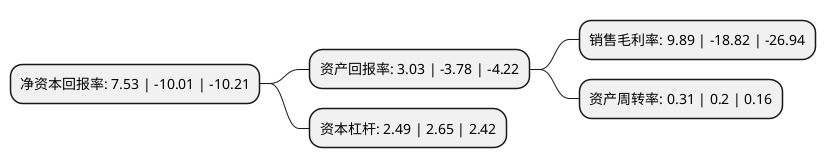

> 本页面由自动化程序生成于 2022年5月20日 01:15
> 内容可能存在错误，如有bug请提交issue至：https://github.com/Eroleice/doc-pi/issues
{.is-warning}

# 上市公司基本情况

## 基本资料

厦门乾照光电股份有限公司（以下简称“乾照光电”）成立于2006年02月21日，厦门市。于2010年08月12日在深交所创业板上市。

乾照光电注册资本89,489.081万元，主营业务为从事半导体光电产品的研发，生产和销售业务。目前主要有高亮度四元系LED外延片及芯片和三结砷化镓太阳能电池外延片及芯片两大类产品。以下是详细信息：

- 公司名称: 厦门乾照光电股份有限公司
- 股票代码: 300102.SZ
- 所在地: 福建 - 厦门市
- 成立日期: 2006年02月21日
- 注册资本: 89,489.081万元
- 法定代表人: 金张育
- 主营业务: 主营业务为从事半导体光电产品的研发，生产和销售业务目前主要有高亮度四元系LED外延片及芯片和三结砷化镓太阳能电池外延片及芯片两大类产品
- 公司官网: www.changelight.com.cn
- 公司介绍: 公司主要生产全色系超高亮度LED外延片及芯片、高性能砷化镓太阳能电池、LED照明产品，并提供节能照明应用解决方案。公司是国家火炬计划重点高新技术企业，拥有国家级博士后科研工作站、省级工程技术研究中心、省级企业技术中心，承担国家“863计划”、国家火炬计划等国家级、省级重点项目，并获得国家战略性创新产品、国家重点新产品等多项重点科技奖项和荣誉。

## 股东及高管情况

上市公司第一大股东为海信视像科技股份有限公司，持股130,351,449股，占比14.5662%，**疑似为**上市公司实际控制人。

截至2022年04月27日，上市公司的前十大股东中，共有1名自然人股东，4名机构股东，4个产品账户，1个海外主体，其中5%以上大股东共有4名。上市公司前十大股东明细如下：

> 未能通过持股比例判定出上市公司实际控制人（持股30%以上）
> 可能存在通过间接持股、联合持股、协议控制等方式拥有实际控制权的主体，具体请参考上市公司定期公告！
{.is-warning}

> 截至2022年04月27日，上市公司前十大股东信息如下：

| 股东名称 | 持股数量（股） | 持股比例 |
| --- | --- | --- |
| 海信视像科技股份有限公司 | 130,351,449 | 14.5662% |
| 海信视像科技股份有限公司 | 118,895,649 | 13.2861% |
| 深圳和君正德资产管理有限公司-正德远盛产业创新结构化私募基金 | 58,800,000 | 6.57% |
| 深圳和君正德资产管理有限公司-正德远盛产业创新结构化私募基金 | 58,800,000 | 6.57% |
| 华能贵诚信托有限公司 | 43,000,000 | 4.81% |
| 大成国际资产管理有限公司-大成国际问鼎1号专户 | 42,000,000 | 4.69% |
| 山西黄河股权投资管理有限公司-太行产业并购私募基金 | 31,860,000 | 3.56% |
| 董伟琳 | 20,500,000 | 2.29% |
| JPMORGAN CHASE BANK,NATIONAL ASSOCIATION | 6,916,746 | 0.77% |
| 宁波宏阳投资管理合伙企业(有限合伙)-宏阳专项基金一期私募证券投资基金 | 5,000,000 | 0.56% |

## 利润表分析

上市公司2021年总收入为18.79亿元，净利润为1.85亿元，实现盈利。

## 杜邦分析

> 数据列示周期：2021年 | 2020年 | 2019年
{.is-info}

上市公司的净资产收益率在近一年有所下降，下降幅度为-175.22%，其变化情况分解如下：
- 上市公司的销售毛利率在近一年下降了-152.55%，可能是生产效率的下降、商品原材料价格上涨或商品价格的下跌所致。
- 上市公司的资产周转率在近一年上升了55%，可能是源自于更快的销售回款或库存管理效果提升。
- 上市公司的财务杠杆比率在近一年下降了-6.04%，可能是减少负债降低财务费用。

