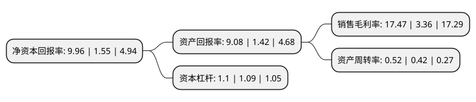

> 本页面由自动化程序生成于 2022年5月20日 01:15
> 内容可能存在错误，如有bug请提交issue至：https://github.com/Eroleice/doc-pi/issues
{.is-warning}

# 上市公司基本情况

## 基本资料

北京君正集成电路股份有限公司（以下简称“北京君正”）成立于2005年07月15日，北京市。于2011年05月31日在深交所创业板上市。

北京君正注册资本48,156.991万元，主要业务:微处理器芯片，智能视频芯片等ASIC芯片产品及整体解决方案的研发和销售。以下是详细信息：

- 公司名称: 北京君正集成电路股份有限公司
- 股票代码: 300223.SZ
- 所在地: 北京 - 北京市
- 成立日期: 2005年07月15日
- 注册资本: 48,156.991万元
- 法定代表人: 刘强
- 主营业务: 微处理器芯片，智能视频芯片等ASIC芯片产品及整体解决方案的研发和销售
- 公司官网: www.ingenic.com
- 公司介绍: 公司是一家集成电路设计企业，拥有全球领先的32位嵌入式CPU技术和低功耗技术。公司主营业务为微处理器芯片、智能视频芯片等ASIC芯片产品及整体解决方案的研发和销售。公司拥有较强的自主创新能力，多年来在自主创新CPU技术、视频编解码技术、图像和声音信号处理技术、SoC芯片技术、软件平台技术等多个领域形成多项核心技术。公司已形成可持续发展的梯队化产品布局，基于自主创新的XBurst CPU和视频编解码等核心技术，公司推出了一系列具有高性价比的微处理器芯片产品和智能视频芯片产品，各类别的芯片产品分别面向不同的市场领域。公司积极培养复合型人才，形成合理的人才梯队，不断加强团队凝聚力，已累计获得多项专利证书，是国内外领先的嵌入式CPU芯片及解决方案提供商之一。

## 股东及高管情况

上市公司第一大股东为北京屹唐盛芯半导体产业投资中心(有限合伙)，持股60,556,704股，占比12.57%，**疑似为**上市公司实际控制人。

截至2022年03月31日，上市公司的前十大股东中，共有4名自然人股东，5名机构股东，1个产品账户，其中5%以上大股东共有4名。上市公司前十大股东明细如下：

> 未能通过持股比例判定出上市公司实际控制人（持股30%以上）
> 可能存在通过间接持股、联合持股、协议控制等方式拥有实际控制权的主体，具体请参考上市公司定期公告！
{.is-warning}

> 截至2022年03月31日，上市公司前十大股东信息如下：

| 股东名称 | 持股数量（股） | 持股比例 |
| --- | --- | --- |
| 北京屹唐盛芯半导体产业投资中心(有限合伙) | 60,556,704 | 12.57% |
| 上海武岳峰集成电路股权投资合伙企业(有限合伙) | 60,544,310 | 12.57% |
| 上海双创投资管理有限公司-上海集岑企业管理中心(有限合伙) | 53,835,926 | 11.18% |
| 刘强 | 40,475,544 | 8.4% |
| 李杰 | 22,554,723 | 4.68% |
| 中国工商银行股份有限公司-诺安成长混合型证券投资基金 | 15,745,937 | 3.27% |
| 北京华创芯原科技有限公司 | 15,713,494 | 3.26% |
| 冼永辉 | 10,873,659 | 2.26% |
| 张紧 | 9,671,685 | 2.01% |
| 北京四海君芯有限公司 | 9,090,909 | 1.89% |

## 利润表分析

上市公司2021年总收入为52.74亿元，净利润为9.21亿元，实现盈利。

## 杜邦分析

> 数据列示周期：2021年 | 2020年 | 2019年
{.is-info}

上市公司的净资产收益率在近一年有所上升，上升幅度为542.58%，其变化情况分解如下：
- 上市公司的销售毛利率在近一年上升了419.94%，可能是生产效率的提升、商品原材料价格下跌或商品价格的上涨所致。
- 上市公司的资产周转率在近一年上升了23.81%，可能是源自于更快的销售回款或库存管理效果提升。
- 上市公司的财务杠杆比率在近一年上升了0.92%，可能是增加负债扩大生产规模。

