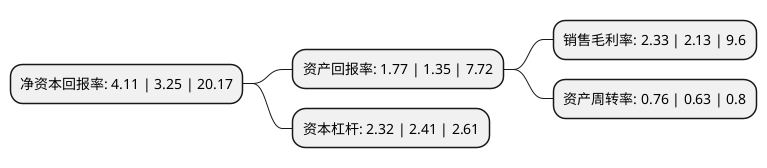

> 本页面由自动化程序生成于 2022年5月20日 01:16
> 内容可能存在错误，如有bug请提交issue至：https://github.com/Eroleice/doc-pi/issues
{.is-warning}

# 上市公司基本情况

## 基本资料

深圳市洲明科技股份有限公司（以下简称“洲明科技”）成立于2004年10月26日，深圳市。于2011年06月22日在深交所创业板上市。

洲明科技注册资本109,408.948万元，主要产品:LED全彩高清显示屏，LED专业照明和城市景观照明三大板块业务。主营业务:LED显示屏，LED灯饰，LED照明灯的生产和销售;电子产品，LED光电应用产品的软硬件开发和销售。以下是详细信息：

- 公司名称: 深圳市洲明科技股份有限公司
- 股票代码: 300232.SZ
- 所在地: 广东 - 深圳市
- 成立日期: 2004年10月26日
- 注册资本: 109,408.948万元
- 法定代表人: 林洺锋
- 主营业务: 主要产品:LED全彩高清显示屏，LED专业照明和城市景观照明三大板块业务主营业务:LED显示屏，LED灯饰，LED照明灯的生产和销售;电子产品，LED光电应用产品的软硬件开发和销售
- 公司官网: www.unilumin.com
- 公司介绍: 公司是一家专业的LED应用产品与解决方案提供商，主要从事LED全彩高清显示屏、LED专业照明和城市景观照明三大板块业务，营销网络和经典案例遍布全球，全球总业绩连续多年位居行业前列。秉承“显示光彩世界，照明幸福生活”的企业愿景，为全球客户提供高质量、高性能的LED全彩显示屏、LED专业照明和城市景观照明系列产品及解决方案。公司的显示产品及解决方案广泛应用于全球的安防监控中心、军队指挥中心、应急指挥中心、广电控制系统、能源调度系统、通信、交通、体育赛事、海关等领域，在国内外打造了众多经典案例。公司在生产制造过程中严格执行ISO9001：2008质量认证体系，产品先后通过国际国内CE、ETL、GOST、CCC、UL、CUL等相关品质认证。公司目前已经得到了国家和行业的高度认可，并获得“国家级高新技术企业”、“中国绿色照明优质产品定点生产企业”、“广东省战略性新兴产业培育企业”、“广东省现代产业500强项目”、“深圳知名品牌”等荣誉资质。

## 股东及高管情况

上市公司第一大股东为林洺锋，持股287,312,618股，占比26.26%，**疑似为**上市公司实际控制人。

截至2022年03月31日，上市公司的前十大股东中，共有4名自然人股东，2名机构股东，4个产品账户，其中5%以上大股东共有1名。上市公司前十大股东明细如下：

> 未能通过持股比例判定出上市公司实际控制人（持股30%以上）
> 可能存在通过间接持股、联合持股、协议控制等方式拥有实际控制权的主体，具体请参考上市公司定期公告！
{.is-warning}

> 截至2022年03月31日，上市公司前十大股东信息如下：

| 股东名称 | 持股数量（股） | 持股比例 |
| --- | --- | --- |
| 林洺锋 | 287,312,618 | 26.26% |
| 新余勤睿投资有限公司 | 37,452,442 | 3.42% |
| 东吴证券(国际)金融控股有限公司-客户资金 | 34,899,180 | 3.19% |
| 深圳市远致富海投资管理有限公司-深圳远致富海并购股权投资基金合伙企业(有限合伙) | 18,354,430 | 1.68% |
| 陕西省国际信托股份有限公司-陕国投·洲明科技第四期员工持股集合资金信托计划 | 11,232,876 | 1.03% |
| 深圳市洲明公益基金会 | 11,000,000 | 1.01% |
| 陆初东 | 10,425,333 | 0.95% |
| 曾广军 | 8,496,635 | 0.78% |
| 上海宁泉资产管理有限公司-宁泉致远39号私募证券投资基金 | 8,457,945 | 0.77% |
| 钱玉军 | 8,080,321 | 0.74% |

## 利润表分析

上市公司2021年总收入为72.29亿元，净利润为1.68亿元，实现盈利。

## 杜邦分析

> 数据列示周期：2021年 | 2020年 | 2019年
{.is-info}

上市公司的净资产收益率在近一年有所上升，上升幅度为26.46%，其变化情况分解如下：
- 上市公司的销售毛利率在近一年上升了9.39%，可能是生产效率的提升、商品原材料价格下跌或商品价格的上涨所致。
- 上市公司的资产周转率在近一年上升了20.63%，可能是源自于更快的销售回款或库存管理效果提升。
- 上市公司的财务杠杆比率在近一年下降了-3.73%，可能是减少负债降低财务费用。

