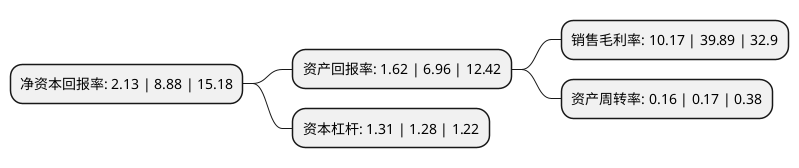

> 本页面由自动化程序生成于 2022年5月20日 01:16
> 内容可能存在错误，如有bug请提交issue至：https://github.com/Eroleice/doc-pi/issues
{.is-warning}

# 上市公司基本情况

## 基本资料

上海新阳半导体材料股份有限公司（以下简称“上海新阳”）成立于2004年05月12日，上海市。于2011年06月29日在深交所创业板上市。

上海新阳注册资本31,338.14万元，主营业务为半导体行业所需电子化学品的研发，生产和销售服务。公司主要产品为应用于半导体行业的电子化学品和配套设备。以下是详细信息：

- 公司名称: 上海新阳半导体材料股份有限公司
- 股票代码: 300236.SZ
- 所在地: 上海 - 上海市
- 成立日期: 2004年05月12日
- 注册资本: 31,338.14万元
- 法定代表人: 王福祥
- 主营业务: 主营业务为半导体行业所需电子化学品的研发，生产和销售服务公司主要产品为应用于半导体行业的电子化学品和配套设备
- 公司官网: www.sinyang.com.cn
- 公司介绍: 公司是以技术为主导，立足于自主创新的高新技术企业，专业从事半导体行业所需电子化学品及配套设备的研发设计、生产制造和销售服务，致力于为用户提供化学材料、配套设备、应用工艺和现场服务一体化的整体解决方案。公司已荣获上海市高新技术企业、上海市外商投资先进技术企业、上海市重合同守信用AAA级企业等多项荣誉以及中国半导体创新产品和技术奖、上海市高新技术成果转化项目等多个奖项。获得了ISO9001、ISO14001、OHSAS18001以及安全生产许可证、危险化学品经营许可证等多项管理认证。

## 股东及高管情况

上市公司第一大股东为SIN YANG INDUSTRIES & TRADING PTE LTD，持股55,682,800股，占比17.77%，**疑似为**上市公司实际控制人。

截至2022年04月26日，上市公司的前十大股东中，共有5名自然人股东，3名机构股东，1个产品账户，1个海外主体，其中5%以上大股东共有3名。上市公司前十大股东明细如下：

> 未能通过持股比例判定出上市公司实际控制人（持股30%以上）
> 可能存在通过间接持股、联合持股、协议控制等方式拥有实际控制权的主体，具体请参考上市公司定期公告！
{.is-warning}

> 截至2022年04月26日，上市公司前十大股东信息如下：

| 股东名称 | 持股数量（股） | 持股比例 |
| --- | --- | --- |
| SIN YANG INDUSTRIES & TRADING PTE LTD | 55,682,800 | 17.77% |
| 上海新晖资产管理有限公司 | 37,879,276 | 12.09% |
| 上海新科投资有限公司 | 22,788,086 | 7.27% |
| 金叶飞 | 4,751,228 | 1.52% |
| 江苏新潮创新投资集团有限公司 | 3,902,600 | 1.25% |
| 中国建设银行股份有限公司-华夏国证半导体芯片交易型开放式指数证券投资基金 | 3,678,249 | 1.17% |
| 孙慧明 | 3,338,883 | 1.07% |
| 王福祥 | 2,881,860 | 0.92% |
| 金叶玲 | 2,622,559 | 0.84% |
| 陈晓钧 | 2,355,700 | 0.75% |

## 利润表分析

上市公司2021年总收入为10.16亿元，净利润为1.03亿元，实现盈利。

## 杜邦分析

> 数据列示周期：2021年 | 2020年 | 2019年
{.is-info}

上市公司的净资产收益率在近一年有所下降，下降幅度为-76.01%，其变化情况分解如下：
- 上市公司的销售毛利率在近一年下降了-74.5%，可能是生产效率的下降、商品原材料价格上涨或商品价格的下跌所致。
- 上市公司的资产周转率在近一年下降了-5.88%，可能是源自于更慢的销售回款或库存管理效果下降。
- 上市公司的财务杠杆比率在近一年上升了2.34%，可能是增加负债扩大生产规模。

