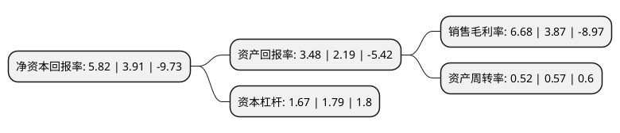

> 本页面由自动化程序生成于 2022年5月20日 01:16
> 内容可能存在错误，如有bug请提交issue至：https://github.com/Eroleice/doc-pi/issues
{.is-warning}

# 上市公司基本情况

## 基本资料

深圳市瑞丰光电子股份有限公司（以下简称“瑞丰光电”）成立于2000年01月24日，深圳市。于2011年07月12日在深交所创业板上市。

瑞丰光电注册资本68,483.571万元，主要产品:照明用LED器件及组件，高端背光源LED器件及组件(中大尺寸液晶电视背光源，小尺寸背光LED等)，显示用LED器件及组件等。主要业务:LED封装技术的研发和LED封装产品制造，销售，提供从LED封装工艺结构设计，光学设计，驱动设计，散热设计，LED器件封装，技术服务到标准光源模组集成的LED光源整体解决方案。以下是详细信息：

- 公司名称: 深圳市瑞丰光电子股份有限公司
- 股票代码: 300241.SZ
- 所在地: 广东 - 深圳市
- 成立日期: 2000年01月24日
- 注册资本: 68,483.571万元
- 法定代表人: 龚伟斌
- 主营业务: 主要产品:照明用LED器件及组件，高端背光源LED器件及组件(中大尺寸液晶电视背光源，小尺寸背光LED等)，显示用LED器件及组件等LED封装技术的研发和LED封装产品制造，销售，提供从LED封装工艺结构设计，光学设计，驱动设计，散热设计，LED器件封装，技术服务到标准光源模组集成的LED光源整体解决方案
- 公司官网: www.refond.com
- 公司介绍: 公司是专业从事LED封装及提供相关解决方案的国家级高新技术企业，也是国内封装领域领军企业。公司的主营业务为LED封装技术的研发和LED封装产品制造、销售，提供从LED封装工艺结构设计、光学设计、驱动设计、散热设计、LED器件封装、技术服务到标准光源模组集成的LED光源整体解决方案。公司主要产品为照明用LED器件及组件、高端背光源LED器件及组件(中大尺寸液晶电视背光源、小尺寸背光LED等)、显示用LED器件及组件等，广泛应用于液晶电视、电脑及手机、日用电子产品、城市亮化照明、室内照明、各类显示屏、工业应用和汽车、医疗健康、安防智控等领域。经过多年努力，公司通过了ISO9001质量管理体系认证、ISO14001环境管理体系认证、TS16949汽车质量管理体系认证，同时荣获“最有前途的LED企业”、“最佳LED封装技术创新企业”、“深圳市优秀半导体封装企业”称号、“30强科技创新企业”、“LED产业杰出贡献奖”、“前海湾优秀社会责任LED企业”、“第四届中国LED先锋奖”等。

## 股东及高管情况

上市公司第一大股东为龚伟斌，持股150,195,307股，占比21.93%，**疑似为**上市公司实际控制人。

截至2022年03月31日，上市公司的前十大股东中，共有6名自然人股东，2名机构股东，2个产品账户，其中5%以上大股东共有2名。上市公司前十大股东明细如下：

> 未能通过持股比例判定出上市公司实际控制人（持股30%以上）
> 可能存在通过间接持股、联合持股、协议控制等方式拥有实际控制权的主体，具体请参考上市公司定期公告！
{.is-warning}

> 截至2022年03月31日，上市公司前十大股东信息如下：

| 股东名称 | 持股数量（股） | 持股比例 |
| --- | --- | --- |
| 龚伟斌 | 150,195,307 | 21.93% |
| 湖北省葛店开发区建设投资有限公司 | 38,461,538 | 5.62% |
| 中国光大银行股份有限公司-华夏磐益一年定期开放混合型证券投资基金 | 5,030,538 | 0.73% |
| 王伟权 | 3,986,153 | 0.58% |
| 紫金信托有限责任公司 | 3,977,700 | 0.58% |
| 上海通怡投资管理有限公司-通怡启明1号私募证券投资基金 | 3,846,153 | 0.56% |
| 丁国金 | 3,021,902 | 0.44% |
| 李蓉 | 2,810,006 | 0.41% |
| 叶爱民 | 2,715,636 | 0.4% |
| 吴强 | 2,680,510 | 0.39% |

## 利润表分析

上市公司2021年总收入为14.72亿元，净利润为0.98亿元，实现盈利。

## 杜邦分析

> 数据列示周期：2021年 | 2020年 | 2019年
{.is-info}

上市公司的净资产收益率在近一年有所上升，上升幅度为48.85%，其变化情况分解如下：
- 上市公司的销售毛利率在近一年上升了72.61%，可能是生产效率的提升、商品原材料价格下跌或商品价格的上涨所致。
- 上市公司的资产周转率在近一年下降了-8.77%，可能是源自于更慢的销售回款或库存管理效果下降。
- 上市公司的财务杠杆比率在近一年下降了-6.7%，可能是减少负债降低财务费用。

