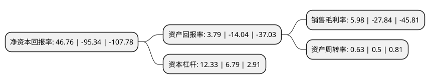

> 本页面由自动化程序生成于 2022年5月20日 01:16
> 内容可能存在错误，如有bug请提交issue至：https://github.com/Eroleice/doc-pi/issues
{.is-warning}

# 上市公司基本情况

## 基本资料

深圳市联建光电股份有限公司（以下简称“ST联建”）成立于2003年04月14日，深圳市。于2011年10月12日在深交所创业板上市。

ST联建注册资本55,608.917万元，公司主营业务是数字显示设备，数字营销服务，数字户外媒体网络等以下是详细信息：

- 公司名称: 深圳市联建光电股份有限公司
- 股票代码: 300269.SZ
- 所在地: 广东 - 深圳市
- 成立日期: 2003年04月14日
- 注册资本: 55,608.917万元
- 法定代表人: 王刚
- 主营业务: 公司主营业务是数字显示设备，数字营销服务，数字户外媒体网络等
- 公司官网: www.lcjh.com
- 公司介绍: 公司致力于打造数据驱动的整合营销服务集团。公司自上市以来，依据自身的核心竞争力和长期发展规划，一方面开展一系列的宣传推广活动和加大对LED小间距显示应用的研发投入，继续保持了数字显示设备业务的领先地位；另一方面，通过内生式发展和外延投资并购整合营销传播服务行业，为客户品牌管理提供全生命周期的服务。现为客户提供的公关策划、代理执行、广告平台、互动活动、广告资源和广告设备在内综合、完善的服务内容，在客户和用户之间搭建完整的传播服务平台，为客户提供定制化、一体化的整合营销传播方案。公司将通过自主研发和投资并购等方式，完善公司数据挖掘、采集、分析方面的能力，实现精准广告投放与精准营销领域，打造数据驱动的整合营销服务集团。让品牌主广告营销简洁、精准；让消费者购买轻松和便捷。

## 股东及高管情况

上市公司第一大股东为刘虎军，持股103,752,620股，占比18.66%，**疑似为**上市公司实际控制人。

截至2022年03月31日，上市公司的前十大股东中，共有10名自然人股东，其中5%以上大股东共有3名。上市公司前十大股东明细如下：

> 未能通过持股比例判定出上市公司实际控制人（持股30%以上）
> 可能存在通过间接持股、联合持股、协议控制等方式拥有实际控制权的主体，具体请参考上市公司定期公告！
{.is-warning}

> 截至2022年03月31日，上市公司前十大股东信息如下：

| 股东名称 | 持股数量（股） | 持股比例 |
| --- | --- | --- |
| 刘虎军 | 103,752,620 | 18.66% |
| 何吉伦 | 65,873,205 | 11.85% |
| 熊瑾玉 | 29,704,777 | 5.34% |
| 张艳君 | 9,039,930 | 1.63% |
| 黄绍云 | 7,754,500 | 1.39% |
| 朱贤洲 | 5,362,426 | 0.96% |
| 凌山 | 4,412,900 | 0.79% |
| 马伟晋 | 3,000,000 | 0.54% |
| 徐虎林 | 2,885,000 | 0.52% |
| 应平 | 2,779,910 | 0.5% |

## 杜邦分析

> 数据列示周期：2021年 | 2020年 | 2019年
{.is-info}

上市公司的净资产收益率在近一年有所下降，下降幅度为-149.05%，其变化情况分解如下：
- 上市公司的销售毛利率在近一年下降了-121.48%，可能是生产效率的下降、商品原材料价格上涨或商品价格的下跌所致。
- 上市公司的资产周转率在近一年上升了26%，可能是源自于更快的销售回款或库存管理效果提升。
- 上市公司的财务杠杆比率在近一年上升了81.59%，可能是增加负债扩大生产规模。

