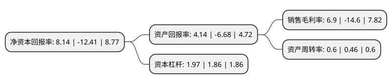

> 本页面由自动化程序生成于 2022年5月20日 01:16
> 内容可能存在错误，如有bug请提交issue至：https://github.com/Eroleice/doc-pi/issues
{.is-warning}

# 上市公司基本情况

## 基本资料

利亚德光电股份有限公司（以下简称“利亚德”）成立于1995年08月21日，北京市。于2012年03月15日在深交所创业板上市。

利亚德注册资本254,290.148万元，主要产品包括LED全彩显示产品，系统显示产品，创意显示产品，LED电视，LED照明产品和LED背光标识系统等六类。主要业务:智能显示，夜游经济，文旅新业态，VR体验。以下是详细信息：

- 公司名称: 利亚德光电股份有限公司
- 股票代码: 300296.SZ
- 所在地: 北京 - 北京市
- 成立日期: 1995年08月21日
- 注册资本: 254,290.148万元
- 法定代表人: 李军
- 主营业务: 主要产品包括LED全彩显示产品，系统显示产品，创意显示产品，LED电视，LED照明产品和LED背光标识系统等六类智能显示，夜游经济，文旅新业态，VR体验
- 公司官网: www.leyard.com
- 公司介绍: 公司是全球视听科技产品及其应用平台的领军企业，是一家专业从事LED应用产品研发、设计、生产、销售和服务的高新技术企业，致力于为客户提供高效、节能、可靠的LED应用产品及其整体解决方案。公司在全国各地承建了数千个项目，安装了数十万块显示屏，逐步成为LED视频及信息发布显示屏领域的引领者。公司部分产品获得美国FCC认证、UL认证、ETL认证及欧盟CE认证。公司参与多项铁路客运引导系统国家标准的起草工作，并获得了多项产品专利。公司拥有计算机系统集成资质、城市及道路照明工程专业承包资质、钢结构工程专业承包资质和电子工程专业承包资质。公司始终以技术研发为根、产品创新为本，业务布局覆盖智能显示、景观亮化、文旅新业态及虚拟现实四大领域。先后被授予：国家技术创新示范企业，中国电子信息百强企业、国家文化科技融合示范企业、北京信息产业十强等多重荣誉。

## 股东及高管情况

上市公司第一大股东为李军，持股575,006,000股，占比22.61%，**疑似为**上市公司实际控制人。

截至2022年03月31日，上市公司的前十大股东中，共有5名自然人股东，1名机构股东，3个产品账户，1个海外主体，其中5%以上大股东共有1名。上市公司前十大股东明细如下：

> 未能通过持股比例判定出上市公司实际控制人（持股30%以上）
> 可能存在通过间接持股、联合持股、协议控制等方式拥有实际控制权的主体，具体请参考上市公司定期公告！
{.is-warning}

> 截至2022年03月31日，上市公司前十大股东信息如下：

| 股东名称 | 持股数量（股） | 持股比例 |
| --- | --- | --- |
| 李军 | 575,006,000 | 22.61% |
| 中泰证券资管-支持民企发展中泰资管2号FOF集合资管计划-证券行业支持民企发展系列之中泰资管22号单一资产管理计划 | 126,369,000 | 4.97% |
| 上海宁泉资产管理有限公司-宁泉致远39号私募证券投资基金 | 44,180,504 | 1.74% |
| 谭连起 | 43,761,222 | 1.72% |
| 香港中央结算有限公司(陆股通) | 41,391,882 | 1.63% |
| 周利鹤 | 38,662,499 | 1.52% |
| 朱晓励 | 31,491,553 | 1.24% |
| 利亚德光电股份有限公司-2021年员工持股计划 | 20,000,000 | 0.79% |
| 中信证券股份有限公司 | 16,142,082 | 0.63% |
| 卢长军 | 13,500,000 | 0.53% |

## 利润表分析

上市公司2021年总收入为88.52亿元，净利润为6.1亿元，实现盈利。

## 杜邦分析

> 数据列示周期：2021年 | 2020年 | 2019年
{.is-info}

上市公司的净资产收益率在近一年有所下降，下降幅度为-165.59%，其变化情况分解如下：
- 上市公司的销售毛利率在近一年下降了-147.26%，可能是生产效率的下降、商品原材料价格上涨或商品价格的下跌所致。
- 上市公司的资产周转率在近一年上升了30.43%，可能是源自于更快的销售回款或库存管理效果提升。
- 上市公司的财务杠杆比率在近一年上升了5.91%，可能是增加负债扩大生产规模。

