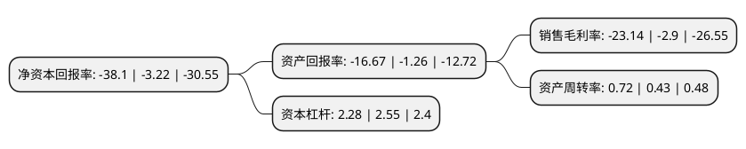

> 本页面由自动化程序生成于 2022年5月20日 01:16
> 内容可能存在错误，如有bug请提交issue至：https://github.com/Eroleice/doc-pi/issues
{.is-warning}

# 上市公司基本情况

## 基本资料

深圳市长方集团股份有限公司（以下简称“*ST长方”）成立于2005年05月30日，深圳市。于2012年03月21日在深交所创业板上市。

*ST长方注册资本79,010.877万元，公司封装产品包括直插式，贴片式LED照明光源器件;照明应用产品包括LED球泡灯，灯管，射灯等。主要业务:LED照明光源器件和LED照明产品的研发，设计，生产和销售。以下是详细信息：

- 公司名称: 深圳市长方集团股份有限公司
- 股票代码: 300301.SZ
- 所在地: 广东 - 深圳市
- 成立日期: 2005年05月30日
- 注册资本: 79,010.877万元
- 法定代表人: 王敏
- 主营业务: 公司封装产品包括直插式，贴片式LED照明光源器件;照明应用产品包括LED球泡灯，灯管，射灯等LED照明光源器件和LED照明产品的研发，设计，生产和销售
- 公司官网: www.cfled.com
- 公司介绍: 公司作为“LED创新前景的引领者”，一直致力于推进LED在照明领域的发展，拥有强大的研发技术和体系完整的解决方案，优秀的品质管理及先进的生产制造设备。公司业务专注于照明用白光LED的封装，并在此基础上向下游照明应用领域延伸，主要从事LED照明光源器件和LED照明产品的研发、设计、生产和销售，属于电子元器件行业的半导体光电器件制造业。公司封装产品包括直插式、贴片式LED照明光源器件，照明应用产品包括手电筒、可充式护眼台灯、手提式探照灯、应急灯、马灯、头灯、可充式节能灯、灭蚊灯以及电蚊拍、多功能移动电源等。经过多年的沉淀，公司封装业务具有产能规模、设备、管控体系及团队等多方面优势，产品销往东南亚、南亚、中亚、南美、非洲、东欧等50多个国家和地区。

## 股东及高管情况

上市公司第一大股东为南昌光谷集团有限公司，持股118,290,826股，占比14.97%，**疑似为**上市公司实际控制人。

截至2022年03月31日，上市公司的前十大股东中，共有7名自然人股东，2名机构股东，1个海外主体，其中5%以上大股东共有3名。上市公司前十大股东明细如下：

> 未能通过持股比例判定出上市公司实际控制人（持股30%以上）
> 可能存在通过间接持股、联合持股、协议控制等方式拥有实际控制权的主体，具体请参考上市公司定期公告！
{.is-warning}

> 截至2022年03月31日，上市公司前十大股东信息如下：

| 股东名称 | 持股数量（股） | 持股比例 |
| --- | --- | --- |
| 南昌光谷集团有限公司 | 118,290,826 | 14.97% |
| 南昌鑫旺资本企业(有限合伙) | 59,258,158 | 7.5% |
| 李迪初 | 41,949,552 | 5.31% |
| 邓子权 | 27,760,000 | 3.51% |
| 邓子长 | 22,957,518 | 2.91% |
| 李映红 | 7,818,500 | 0.99% |
| 蔡志明 | 5,933,600 | 0.75% |
| UBS AG | 3,632,444 | 0.46% |
| 王为生 | 3,111,300 | 0.39% |
| 何晓舟 | 3,000,000 | 0.38% |

## 利润表分析

上市公司2021年总收入为15.99亿元，净利润为-3.71亿元，**未实现盈利**。

## 杜邦分析

> 数据列示周期：2021年 | 2020年 | 2019年
{.is-info}

上市公司的净资产收益率在近一年有所上升，上升幅度为1083.23%，其变化情况分解如下：
- 上市公司的销售毛利率在近一年上升了697.93%，可能是生产效率的提升、商品原材料价格下跌或商品价格的上涨所致。
- 上市公司的资产周转率在近一年上升了67.44%，可能是源自于更快的销售回款或库存管理效果提升。
- 上市公司的财务杠杆比率在近一年下降了-10.59%，可能是减少负债降低财务费用。

