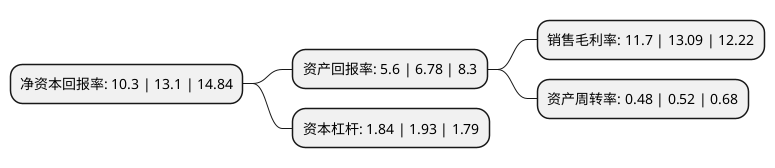

> 本页面由自动化程序生成于 2022年5月20日 01:16
> 内容可能存在错误，如有bug请提交issue至：https://github.com/Eroleice/doc-pi/issues
{.is-warning}

# 上市公司基本情况

## 基本资料

深圳市聚飞光电股份有限公司（以下简称“聚飞光电”）成立于2005年09月15日，深圳市。于2012年03月19日在深交所创业板上市。

聚飞光电注册资本134,258.87万元，主要产品:按用途可分为背光LED器件和照明LED器件。主要业务:SMD LED产品的研发，生产与销售，主营业务属于LED封装。以下是详细信息：

- 公司名称: 深圳市聚飞光电股份有限公司
- 股票代码: 300303.SZ
- 所在地: 广东 - 深圳市
- 成立日期: 2005年09月15日
- 注册资本: 134,258.87万元
- 法定代表人: 邢美正
- 主营业务: 主要产品:按用途可分为背光LED器件和照明LED器件SMD LED产品的研发，生产与销售，主营业务属于LED封装
- 公司官网: www.jfled.com.cn
- 公司介绍: 公司是国家高新技术企业、国家火炬计划重点高新技术企业、深圳高新技术企业、深圳知名品牌企业、广东省著名商标企业，专业从事SMDLED器件的研发、生产与销售的高新技术企业，主要产品为背光LED器件和照明LED器件。自成立以来，公司一直秉承做精、做强、再做大的经营思路，为客户提供质量稳定、高性价比的产品和快速的服务，在背光LED领域的国内市场占有率处于绝对领先地位。尤其是近几年，公司通过技术持续创新，不断推出满足客户需求的新产品，牢牢抓住背光模组国产化比例不断提升的发展机遇，全面推进国际化发展战略，使得公司的大客户数量逐年增加，国际化销售占比持续提升，产品销售收入及市场占有率均保持稳定增长，行业龙头地位进一步得到加强。公司获得多项市、省及国家产品认定证书，其中“010高亮侧发光二极管”获“国家重点新产品”证书，同时获得“深圳市成长型中小工业企业500强企业”、“深圳市知识产权优势企业”、“2010中国LED最具成长性企业”等荣誉称号。

## 股东及高管情况

上市公司第一大股东为李晓丹，持股143,251,643股，占比10.67%，**疑似为**上市公司实际控制人。

截至2022年03月31日，上市公司的前十大股东中，共有4名自然人股东，1名机构股东，5个产品账户，其中5%以上大股东共有2名。上市公司前十大股东明细如下：

> 未能通过持股比例判定出上市公司实际控制人（持股30%以上）
> 可能存在通过间接持股、联合持股、协议控制等方式拥有实际控制权的主体，具体请参考上市公司定期公告！
{.is-warning}

> 截至2022年03月31日，上市公司前十大股东信息如下：

| 股东名称 | 持股数量（股） | 持股比例 |
| --- | --- | --- |
| 李晓丹 | 143,251,643 | 10.67% |
| 邢美正 | 108,251,644 | 8.06% |
| 深圳市一诺财达投资有限公司 | 60,600,000 | 4.51% |
| 中国银行股份有限公司-宝盈国家安全战略沪港深股票型证券投资基金 | 12,240,800 | 0.91% |
| 中国工商银行股份有限公司-宝盈优势产业灵活配置混合型证券投资基金 | 10,911,552 | 0.81% |
| 中国建设银行股份有限公司-宝盈新兴产业灵活配置混合型证券投资基金 | 10,371,110 | 0.77% |
| 招商银行股份有限公司-宝盈成长精选混合型证券投资基金 | 8,547,646 | 0.64% |
| 中国银行股份有限公司-华夏行业景气混合型证券投资基金 | 6,144,600 | 0.46% |
| 吕加奎 | 4,209,014 | 0.31% |
| 姜兆君 | 4,059,500 | 0.3% |

## 利润表分析

上市公司2021年总收入为23.71亿元，净利润为2.77亿元，实现盈利。

## 杜邦分析

> 数据列示周期：2021年 | 2020年 | 2019年
{.is-info}

上市公司的净资产收益率在近一年有所下降，下降幅度为-21.37%，其变化情况分解如下：
- 上市公司的销售毛利率在近一年下降了-10.62%，可能是生产效率的下降、商品原材料价格上涨或商品价格的下跌所致。
- 上市公司的资产周转率在近一年下降了-7.69%，可能是源自于更慢的销售回款或库存管理效果下降。
- 上市公司的财务杠杆比率在近一年下降了-4.66%，可能是减少负债降低财务费用。

