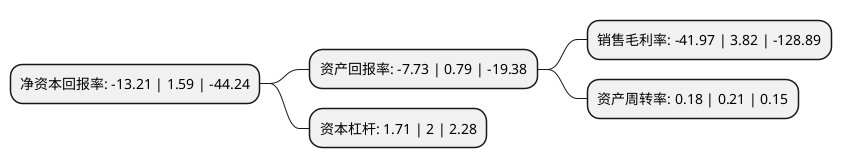

> 本页面由自动化程序生成于 2022年5月20日 01:16
> 内容可能存在错误，如有bug请提交issue至：https://github.com/Eroleice/doc-pi/issues
{.is-warning}

# 上市公司基本情况

## 基本资料

珈伟新能源股份有限公司（以下简称“珈伟新能”）成立于1993年07月17日，深圳市。于2012年05月11日在深交所创业板上市。

珈伟新能注册资本82,428.387万元，公司的主营业务为太阳能和LED相结合的光伏照明产品的研究，生产和销售。主要产品包括太阳能草坪灯，太阳能庭院灯等光伏照明产品。以下是详细信息：

- 公司名称: 珈伟新能源股份有限公司
- 股票代码: 300317.SZ
- 所在地: 广东 - 深圳市
- 成立日期: 1993年07月17日
- 注册资本: 82,428.387万元
- 法定代表人: 丁孔贤
- 主营业务: 公司的主营业务为太阳能和LED相结合的光伏照明产品的研究，生产和销售主要产品包括太阳能草坪灯，太阳能庭院灯等光伏照明产品
- 公司官网: www.jiawei.com
- 公司介绍: 公司是全球太阳能结合LED商业化应用的先行者和开拓者，中国规模化出口太阳能LED应用产品的企业，全球太阳能LED景观灯具的领导者，对世界光伏照明行业的发展和中国光伏照明产业的形成做出了卓越的贡献。历经二十载，公司已发展成国内生产规模大、技术水平高、自主创新能力强的并拥有完善的研、产、销体系的太阳能及LED照明应用企业之一。公司拥有设施一流的照明光学实验室，已获得SGS&ITS认可实验室证书。公司承担并完成“十五”国家科技攻关计划“应用光伏电源的半导体照明系统技术开发——采用光伏电源的半导体照明系统研发”项目。公司拥有一流的品质管理体系，通过INTERTEK ISO9001：2008等多项国际认证，用最严格的生产管理标准打造世界一流产品，让高品质的产品成为行业的标杆和标准。公司主要产品已通过UL、CUL、能源之星、CCC、TUV等国际认证，并率先登陆海外市场。

## 股东及高管情况

上市公司第一大股东为振发能源集团有限公司，持股176,174,851股，占比21.37%，**疑似为**上市公司实际控制人。

截至2022年05月10日，上市公司的前十大股东中，共有1名自然人股东，9名机构股东，其中5%以上大股东共有10名。上市公司前十大股东明细如下：

> 未能通过持股比例判定出上市公司实际控制人（持股30%以上）
> 可能存在通过间接持股、联合持股、协议控制等方式拥有实际控制权的主体，具体请参考上市公司定期公告！
{.is-warning}

> 截至2022年05月10日，上市公司前十大股东信息如下：

| 股东名称 | 持股数量（股） | 持股比例 |
| --- | --- | --- |
| 振发能源集团有限公司 | 176,174,851 | 21.37% |
| 振发能源集团有限公司 | 175,509,161 | 21.2923% |
| 上海储阳光伏电力有限公司 | 69,956,096 | 8.49% |
| 奇盛控股有限公司 | 52,914,712 | 6.42% |
| 奇盛控股有限公司 | 52,914,712 | 6.42% |
| 腾名有限公司 | 51,108,375 | 6.2% |
| 腾名有限公司 | 51,108,375 | 6.2% |
| 阿拉山口市灏轩股权投资有限公司 | 49,565,621 | 6.01% |
| 阿拉山口市灏轩股权投资有限公司 | 49,565,621 | 6.01% |
| 丁孔贤 | 48,536,369 | 5.89% |

## 利润表分析

上市公司2021年总收入为5.79亿元，净利润为-2.44亿元，**未实现盈利**。

## 杜邦分析

> 数据列示周期：2021年 | 2020年 | 2019年
{.is-info}

上市公司的净资产收益率在近一年有所下降，下降幅度为-930.82%，其变化情况分解如下：
- 上市公司的销售毛利率在近一年下降了-1198.69%，可能是生产效率的下降、商品原材料价格上涨或商品价格的下跌所致。
- 上市公司的资产周转率在近一年下降了-14.29%，可能是源自于更慢的销售回款或库存管理效果下降。
- 上市公司的财务杠杆比率在近一年下降了-14.5%，可能是减少负债降低财务费用。

