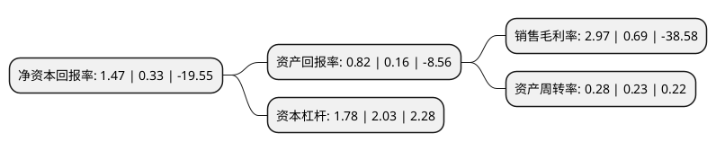

> 本页面由自动化程序生成于 2022年5月20日 01:16
> 内容可能存在错误，如有bug请提交issue至：https://github.com/Eroleice/doc-pi/issues
{.is-warning}

# 上市公司基本情况

## 基本资料

华灿光电股份有限公司（以下简称“华灿光电”）成立于2005年11月08日，武汉市。于2012年06月01日在深交所创业板上市。

华灿光电注册资本124,023.645万元，主要产品:LED外延片及全色系LED芯片。主要业务:化合物光电半导体材料与电器件的研发，生产和销售业务以下是详细信息：

- 公司名称: 华灿光电股份有限公司
- 股票代码: 300323.SZ
- 所在地: 湖北 - 武汉市
- 成立日期: 2005年11月08日
- 注册资本: 124,023.645万元
- 法定代表人: 郭瑾
- 主营业务: 主要产品:LED外延片及全色系LED芯片化合物光电半导体材料与电器件的研发，生产和销售业务
- 公司官网: www.hcsemitek.com
- 公司介绍: 公司是我国领先的LED芯片企业之一，自设立以来一直从事化合物光电半导体材料与电器件的研发、生产和销售业务，主要产品为LED外延片及全色系LED芯片。LED芯片经客户封装后可广泛应用于全彩显示屏、背光源及照明等应用领域。公司始终以技术为先导，汇集国际技术力量，包括MOCVD在内的世界先进水平的全套蓝绿光LED外延和芯片生产线的生产规位列国内前列，在中国LED芯片市场已形成品质超群的良好口碑。历经十几年的发展，公司芯片逐渐占领LED各细分市场，致力满足不同客户的需求，提供芯片级解决方案。如今，公司的LED芯片已经覆盖全国，成为国内第二大芯片供应商，国内最大显示屏芯片供应商。未来，公司将持续引进海内外技术领军人才和高级管理人才，完善培训和研发项目管理体系，加大工程师的自主培训力度，以优良的产品奉献于客户，以至诚的服务取信于客户，实现“做最好的LED产品,做最好的LED企业”的发展愿景。

## 股东及高管情况

上市公司第一大股东为珠海华发实体产业投资控股有限公司，持股308,406,868股，占比24.87%，**疑似为**上市公司实际控制人。

截至2022年03月31日，上市公司的前十大股东中，共有3名自然人股东，5名机构股东，1个产品账户，1个海外主体，其中5%以上大股东共有2名。上市公司前十大股东明细如下：

> 未能通过持股比例判定出上市公司实际控制人（持股30%以上）
> 可能存在通过间接持股、联合持股、协议控制等方式拥有实际控制权的主体，具体请参考上市公司定期公告！
{.is-warning}

> 截至2022年03月31日，上市公司前十大股东信息如下：

| 股东名称 | 持股数量（股） | 持股比例 |
| --- | --- | --- |
| 珠海华发实体产业投资控股有限公司 | 308,406,868 | 24.87% |
| 义乌和谐芯光股权投资合伙企业(有限合伙) | 182,313,043 | 14.7% |
| NEW SURE LIMITED | 56,817,391 | 4.58% |
| 上海虎铂新能股权投资基金合伙企业(有限合伙) | 56,053,812 | 4.52% |
| 浙江灿融科技有限公司 | 42,175,757 | 3.4% |
| 浙江华迅投资有限公司 | 24,116,025 | 1.94% |
| 瑞士嘉盛银行有限公司-自有资金 | 12,510,000 | 1.01% |
| 吴龙驹 | 10,068,907 | 0.81% |
| 马雪峰 | 8,959,834 | 0.72% |
| 周福云 | 7,386,025 | 0.6% |

## 利润表分析

上市公司2021年总收入为31.56亿元，净利润为0.93亿元，实现盈利。

## 杜邦分析

> 数据列示周期：2021年 | 2020年 | 2019年
{.is-info}

上市公司的净资产收益率在近一年有所上升，上升幅度为345.45%，其变化情况分解如下：
- 上市公司的销售毛利率在近一年上升了330.43%，可能是生产效率的提升、商品原材料价格下跌或商品价格的上涨所致。
- 上市公司的资产周转率在近一年上升了21.74%，可能是源自于更快的销售回款或库存管理效果提升。
- 上市公司的财务杠杆比率在近一年下降了-12.32%，可能是减少负债降低财务费用。

