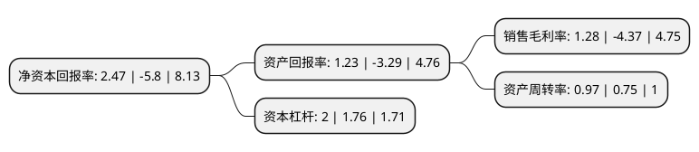

> 本页面由自动化程序生成于 2022年5月20日 01:17
> 内容可能存在错误，如有bug请提交issue至：https://github.com/Eroleice/doc-pi/issues
{.is-warning}

# 上市公司基本情况

## 基本资料

深圳市艾比森光电股份有限公司（以下简称“艾比森”）成立于2001年08月23日，深圳市。于2014年08月01日在深交所创业板上市。

艾比森注册资本31,899.417万元，主要产品:LED全彩显示屏产品。主要业务:LED全彩显示屏的研发，生产，销售，同时开展会务服务业务。以下是详细信息：

- 公司名称: 深圳市艾比森光电股份有限公司
- 股票代码: 300389.SZ
- 所在地: 广东 - 深圳市
- 成立日期: 2001年08月23日
- 注册资本: 31,899.417万元
- 法定代表人: 丁彦辉
- 主营业务: 主要产品:LED全彩显示屏产品LED全彩显示屏的研发，生产，销售，同时开展会务服务业务
- 公司官网: www.absen.cn
- 公司介绍: 公司是全球领先的至真LED显示应用与服务提供商，公司主要业务为LED全彩显示屏的研发、生产、销售，同时开展会务服务业务。公司一直将创新作为企业发展的灵魂，始终坚持产品自主创新，不断加大研发投入，在技术创新及新产品开发方面都取得了巨大的进步。公司已成长为全球LED显示应用领域极为重要的技术引领者，是国内LED显示屏行业提供产品系列最全和产品应用领域最广的企业之一。公司LED显示屏，图像逼真，品质可靠，得到海内外客户一致认可，产品远销美洲、欧洲、澳洲、亚洲、非洲等各个国家和地区，广泛应用于美国NBA球赛、世俱杯、欧洲杯、总统新闻发布会、高档购物商场、奢侈品牌专卖店、国家电视台等领域，显示屏产品出口额连续多年稳居行业第一。近年来，公司获得了“国家高新技术企业”、“广东省著名商标”、“广东省守合同重信用企业”、“深圳市出口10强文化创意企业”、“深圳知名品牌”、“AEO海关高级认证企业”(中国同行业首家获得者)等荣誉称号。

## 股东及高管情况

上市公司第一大股东为丁彦辉，持股123,507,669股，占比34.31%，为上市公司实际控制人。

截至2022年05月20日，上市公司的前十大股东中，共有6名自然人股东，4个产品账户，其中5%以上大股东共有6名。上市公司前十大股东明细如下：

> 截至2022年05月20日，上市公司前十大股东信息如下：

| 股东名称 | 持股数量（股） | 持股比例 |
| --- | --- | --- |
| 丁彦辉 | 123,507,669 | 34.31% |
| 丁彦辉 | 82,507,669 | 25.86% |
| 邓江波 | 61,300,544 | 17.03% |
| 邓江波 | 61,300,544 | 19.22% |
| 任永红 | 51,958,491 | 14.43% |
| 任永红 | 51,958,491 | 16.29% |
| 上海通怡投资管理有限公司-通怡明曦1号私募证券投资基金 | 6,270,000 | 1.97% |
| 宁波银行股份有限公司-恒越核心精选混合型证券投资基金 | 6,180,780 | 1.94% |
| 宁波银行股份有限公司-恒越成长精选混合型证券投资基金 | 2,195,009 | 0.69% |
| 广发证券股份有限公司-恒越内需驱动混合型证券投资基金 | 1,172,700 | 0.37% |

## 利润表分析

上市公司2021年总收入为23.28亿元，净利润为0.29亿元，实现盈利。

## 杜邦分析

> 数据列示周期：2021年 | 2020年 | 2019年
{.is-info}

上市公司的净资产收益率在近一年有所下降，下降幅度为-142.59%，其变化情况分解如下：
- 上市公司的销售毛利率在近一年下降了-129.29%，可能是生产效率的下降、商品原材料价格上涨或商品价格的下跌所致。
- 上市公司的资产周转率在近一年上升了29.33%，可能是源自于更快的销售回款或库存管理效果提升。
- 上市公司的财务杠杆比率在近一年上升了13.64%，可能是增加负债扩大生产规模。

