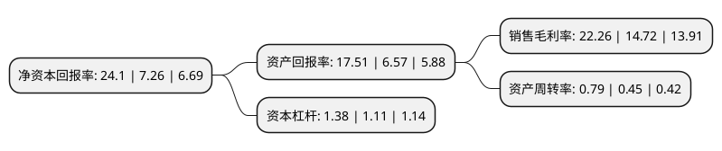

> 本页面由自动化程序生成于 2022年5月20日 01:19
> 内容可能存在错误，如有bug请提交issue至：https://github.com/Eroleice/doc-pi/issues
{.is-warning}

# 上市公司基本情况

## 基本资料

上海富瀚微电子股份有限公司（以下简称“富瀚微”）成立于2004年04月16日，上海市。于2017年02月20日在深交所创业板上市。

富瀚微注册资本12,023.092万元，公司主营业务为数字信号处理芯片的研发和销售，并提供专业技术服务。主要产品为安防视频监控多媒体处理芯片及数字接口模块，专业技术服务以下是详细信息：

- 公司名称: 上海富瀚微电子股份有限公司
- 股票代码: 300613.SZ
- 所在地: 上海 - 上海市
- 成立日期: 2004年04月16日
- 注册资本: 12,023.092万元
- 法定代表人: 杨小奇
- 主营业务: 公司主营业务为数字信号处理芯片的研发和销售，并提供专业技术服务主要产品为安防视频监控多媒体处理芯片及数字接口模块，专业技术服务
- 公司官网: www.fullhan.com
- 公司介绍: 公司成立于2004年4月，专注于视频监控芯片及解决方案，满足高速增长的数字视频监控市场对视频编解码和图像信号处理的芯片需求。公司提供高性能视频编解码SoC和图像信号处理器芯片，以及基于这些芯片的视频监控产品方案。公司致力于与国内外设备制造商、解决方案提供商建立紧密合作关系，共同把握市场契机，为客户提供高性价的产品和服务，持续创造价值。公司是国家集成电路设计企业、上海市高新技术企业、上海市科技小巨人企业、上海市企业技术中心，公司先后承担多项国家、市级研发和产业化类项目，公司研发项目连续多年被认定为上海市高新技术成果转化百佳项目，并获中国半导体创新产品和技术奖、上海市科学技术奖等荣誉。

## 股东及高管情况

上市公司第一大股东为西藏东方企慧投资有限公司，持股19,118,503股，占比15.9%，**疑似为**上市公司实际控制人。

截至2022年03月31日，上市公司的前十大股东中，共有3名自然人股东，4名机构股东，3个产品账户，其中5%以上大股东共有5名。上市公司前十大股东明细如下：

> 未能通过持股比例判定出上市公司实际控制人（持股30%以上）
> 可能存在通过间接持股、联合持股、协议控制等方式拥有实际控制权的主体，具体请参考上市公司定期公告！
{.is-warning}

> 截至2022年03月31日，上市公司前十大股东信息如下：

| 股东名称 | 持股数量（股） | 持股比例 |
| --- | --- | --- |
| 西藏东方企慧投资有限公司 | 19,118,503 | 15.9% |
| 陈春梅 | 16,162,027 | 13.44% |
| 杨小奇 | 9,174,137 | 7.63% |
| 云南朗瀚企业管理有限公司 | 8,653,311 | 7.2% |
| 杰智控股有限公司 | 7,177,686 | 5.97% |
| 龚传军 | 3,028,356 | 2.52% |
| 中国工商银行股份有限公司-华安安康灵活配置混合型证券投资基金 | 1,709,528 | 1.42% |
| 湖州灵视企业管理中心(有限合伙) | 1,671,012 | 1.39% |
| 广州市玄元投资管理有限公司-玄元科新281号私募证券投资基金 | 1,618,700 | 1.35% |
| 上海少薮派投资管理有限公司-少数派万象更新2号私募证券投资基金 | 1,565,171 | 1.3% |

## 利润表分析

上市公司2021年总收入为17.17亿元，净利润为3.82亿元，实现盈利。

## 杜邦分析

> 数据列示周期：2021年 | 2020年 | 2019年
{.is-info}

上市公司的净资产收益率在近一年有所上升，上升幅度为231.96%，其变化情况分解如下：
- 上市公司的销售毛利率在近一年上升了51.22%，可能是生产效率的提升、商品原材料价格下跌或商品价格的上涨所致。
- 上市公司的资产周转率在近一年上升了75.56%，可能是源自于更快的销售回款或库存管理效果提升。
- 上市公司的财务杠杆比率在近一年上升了24.32%，可能是增加负债扩大生产规模。

