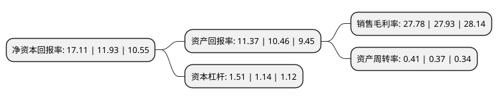

> 本页面由自动化程序生成于 2022年5月20日 01:19
> 内容可能存在错误，如有bug请提交issue至：https://github.com/Eroleice/doc-pi/issues
{.is-warning}

# 上市公司基本情况

## 基本资料

江苏捷捷微电子股份有限公司（以下简称“捷捷微电”）成立于1995年03月29日，南通市。于2017年03月14日在深交所创业板上市。

捷捷微电注册资本73,672.279万元，主要产品;功率半导体芯片和封装器件。从产品类别和下游应用领域划分，目前公司产品主要集中在晶闸管系列产品。主营业务:本公司专业从事功率半导体芯片和器件的研发，设计，生产和销售。以下是详细信息：

- 公司名称: 江苏捷捷微电子股份有限公司
- 股票代码: 300623.SZ
- 所在地: 江苏 - 南通市
- 成立日期: 1995年03月29日
- 注册资本: 73,672.279万元
- 法定代表人: 黄善兵
- 主营业务: 主要产品;功率半导体芯片和封装器件从产品类别和下游应用领域划分，目前公司产品主要集中在晶闸管系列产品主营业务:本公司专业从事功率半导体芯片和器件的研发，设计，生产和销售
- 公司官网: www.jjwdz.com
- 公司介绍: 公司是一家专业从事半导体分立器件、电力电子器件研发、制造及销售的江苏省高新技术企业。同时也是国内生产“方片式”单、双向可控硅最早及品种最齐全的厂家之一。公司建有ERP、MES等基础信息化平台。具有自主开发能力和自主知识产权，具有自己的产品结构特点和独特工艺技术。公司通过ISO9001:2008质量体系认证，ISO14001:2004环境管理体系认证，OHSAS18001:2007职业健康安全管理体系认证，产品符合UL电气绝缘性要求，ROHS环保要求，REACH化学品注册、评估、许可和限制要求，无卤化要求等。

## 股东及高管情况

上市公司第一大股东为江苏捷捷投资有限公司，持股203,310,000股，占比27.6%，**疑似为**上市公司实际控制人。

截至2022年03月31日，上市公司的前十大股东中，共有5名自然人股东，4名机构股东，1个产品账户，其中5%以上大股东共有3名。上市公司前十大股东明细如下：

> 未能通过持股比例判定出上市公司实际控制人（持股30%以上）
> 可能存在通过间接持股、联合持股、协议控制等方式拥有实际控制权的主体，具体请参考上市公司定期公告！
{.is-warning}

> 截至2022年03月31日，上市公司前十大股东信息如下：

| 股东名称 | 持股数量（股） | 持股比例 |
| --- | --- | --- |
| 江苏捷捷投资有限公司 | 203,310,000 | 27.6% |
| 黄善兵 | 58,464,000 | 7.94% |
| 南通中创投资管理有限公司 | 44,332,000 | 6.02% |
| 王成森 | 25,515,000 | 3.46% |
| 张祖蕾 | 19,540,058 | 2.65% |
| 施玉庆 | 17,488,750 | 2.37% |
| 南通蓉俊投资管理有限公司 | 16,416,000 | 2.23% |
| 沈欣欣 | 15,900,000 | 2.16% |
| 江苏疌泉毅达战新创业投资合伙企业(有限合伙) | 6,104,382 | 0.83% |
| 中国建设银行股份有限公司-华夏国证半导体芯片交易型开放式指数证券投资基金 | 5,390,404 | 0.73% |

## 利润表分析

上市公司2021年总收入为17.72亿元，净利润为4.92亿元，实现盈利。

## 杜邦分析

> 数据列示周期：2021年 | 2020年 | 2019年
{.is-info}

上市公司的净资产收益率在近一年有所上升，上升幅度为43.42%，其变化情况分解如下：
- 上市公司的销售毛利率在近一年下降了-0.54%，可能是生产效率的下降、商品原材料价格上涨或商品价格的下跌所致。
- 上市公司的资产周转率在近一年上升了10.81%，可能是源自于更快的销售回款或库存管理效果提升。
- 上市公司的财务杠杆比率在近一年上升了32.46%，可能是增加负债扩大生产规模。

