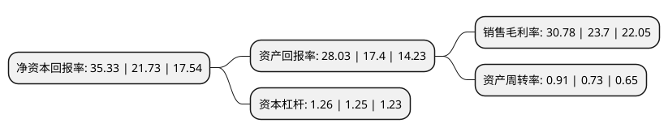

> 本页面由自动化程序生成于 2022年5月20日 01:19
> 内容可能存在错误，如有bug请提交issue至：https://github.com/Eroleice/doc-pi/issues
{.is-warning}

# 上市公司基本情况

## 基本资料

圣邦微电子(北京)股份有限公司（以下简称“圣邦股份”）成立于2007年01月26日，北京市。于2017年06月06日在深交所创业板上市。

圣邦股份注册资本23,602.082万元，主要产品:运算放大器，比较器，音/视频放大器，模拟开关，电平转换及接口电路，小逻辑芯片，AFE，LDO，DC/DC转换器，OVP，负载开关，LED驱动器，微处理器电源监控电路，马达驱动，MOSFET驱动及电池管理芯片等。主营业务:高性能，高品质模拟集成电路芯片设计及销售。以下是详细信息：

- 公司名称: 圣邦微电子(北京)股份有限公司
- 股票代码: 300661.SZ
- 所在地: 北京 - 北京市
- 成立日期: 2007年01月26日
- 注册资本: 23,602.082万元
- 法定代表人: 张世龙
- 主营业务: 主要产品:运算放大器，比较器，音/视频放大器，模拟开关，电平转换及接口电路，小逻辑芯片，AFE，LDO，DC/DC转换器，OVP，负载开关，LED驱动器，微处理器电源监控电路，马达驱动，MOSFET驱动及电池管理芯片等主营业务:高性能，高品质模拟集成电路芯片设计及销售
- 公司官网: www.sg-micro.com
- 公司介绍: 公司是一家专注于高性能、高品质模拟集成电路芯片设计及销售的高新技术企业。公司产品涵盖信号链和电源管理两大领域，包括运算放大器、比较器、音/视频放大器、模拟开关、电平转换及接口电路、小逻辑芯片、AFE、LDO、DC/DC转换器、OVP、负载开关、LED驱动器、微处理器电源监控电路、马达驱动、MOSFET驱动及电池管理芯片等。公司产品可广泛应用于消费类电子、手机与通讯、工业控制、医疗仪器、汽车电子等领域，以及物联网、新能源、可穿戴设备、人工智能、智能家居、无人机、机器人和共享单车等新兴电子产品领域。

## 股东及高管情况

上市公司第一大股东为徐州鸿顺永泰咨询管理有限公司，持股46,331,213股，占比19.58%，**疑似为**上市公司实际控制人。

截至2022年03月31日，上市公司的前十大股东中，共有1名自然人股东，3名机构股东，5个产品账户，1个海外主体，其中5%以上大股东共有4名。上市公司前十大股东明细如下：

> 未能通过持股比例判定出上市公司实际控制人（持股30%以上）
> 可能存在通过间接持股、联合持股、协议控制等方式拥有实际控制权的主体，具体请参考上市公司定期公告！
{.is-warning}

> 截至2022年03月31日，上市公司前十大股东信息如下：

| 股东名称 | 持股数量（股） | 持股比例 |
| --- | --- | --- |
| 徐州鸿顺永泰咨询管理有限公司 | 46,331,213 | 19.58% |
| 徐州宝利鸿雅咨询管理有限公司 | 20,004,781 | 8.46% |
| 香港中央结算有限公司(陆股通) | 17,371,969 | 7.34% |
| 林林 | 16,500,187 | 6.97% |
| 弘威国际发展有限公司 | 11,357,986 | 4.8% |
| 中国工商银行股份有限公司-诺安成长混合型证券投资基金 | 7,515,105 | 3.18% |
| 招商银行股份有限公司-银河创新成长混合型证券投资基金 | 4,820,000 | 2.04% |
| 中国建设银行股份有限公司-广发科技先锋混合型证券投资基金 | 4,354,493 | 1.84% |
| 中国工商银行股份有限公司-广发双擎升级混合型证券投资基金 | 3,411,312 | 1.44% |
| 上海浦东发展银行股份有限公司-广发小盘成长混合型证券投资基金(LOF) | 3,158,844 | 1.34% |

## 利润表分析

上市公司2021年总收入为22.38亿元，净利润为6.88亿元，实现盈利。

## 杜邦分析

> 数据列示周期：2021年 | 2020年 | 2019年
{.is-info}

上市公司的净资产收益率在近一年有所上升，上升幅度为62.59%，其变化情况分解如下：
- 上市公司的销售毛利率在近一年上升了29.87%，可能是生产效率的提升、商品原材料价格下跌或商品价格的上涨所致。
- 上市公司的资产周转率在近一年上升了24.66%，可能是源自于更快的销售回款或库存管理效果提升。
- 上市公司的财务杠杆比率在近一年上升了0.8%，可能是增加负债扩大生产规模。

