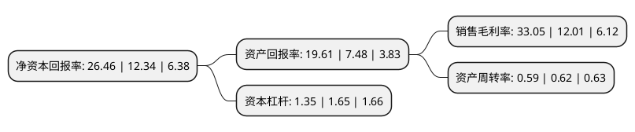

> 本页面由自动化程序生成于 2022年5月20日 01:19
> 内容可能存在错误，如有bug请提交issue至：https://github.com/Eroleice/doc-pi/issues
{.is-warning}

# 上市公司基本情况

## 基本资料

富满微电子集团股份有限公司（以下简称“富满微”）成立于2001年11月05日，深圳市。于2017年07月05日在深交所创业板上市。

富满微注册资本21,668.499万元，主营业务:本公司是集成电路(Integrated Circuit，简称“IC”)设计企业，主要从事高性能模拟及数模混合集成电路的设计研发，封装，测试和销售。主要产品包括电源管理类芯片，LED控制及驱动类芯片，MOSFET类芯片及其他芯片等，在电源管理类芯片，LED控制及驱动类芯片，MOSFET类芯片的产品。以下是详细信息：

- 公司名称: 富满微电子集团股份有限公司
- 股票代码: 300671.SZ
- 所在地: 广东 - 深圳市
- 成立日期: 2001年11月05日
- 注册资本: 21,668.499万元
- 法定代表人: 刘景裕
- 主营业务: 主营业务:本公司是集成电路(Integrated Circuit，简称“IC”)设计企业，主要从事高性能模拟及数模混合集成电路的设计研发，封装，测试和销售主要产品包括电源管理类芯片，LED控制及驱动类芯片，MOSFET类芯片及其他芯片等，在电源管理类芯片，LED控制及驱动类芯片，MOSFET类芯片的产品
- 公司官网: www.superchip.cn
- 公司介绍: 公司是集集成电路设计、封装、测试、销售为一体的综合性的集成电路公司，主要从事高性能模拟及数模混合集成电路的设计研发、封装、测试和销售。依托公司的技术研发、业务模式、快速服务和人才储备等优势，公司已成为集成电路行业电源管理类芯片、LED控制及驱动类芯片等细分领域的优秀企业。公司主要产品包括电源管理类芯片、LED控制及驱动类芯片、MOSFET类芯片及其他芯片等，在电源管理类芯片、LED控制及驱动类芯片、MOSFET类芯片的产品应用市场中，公司拥有较高知名度。

## 股东及高管情况

上市公司第一大股东为集晶(香港)有限公司，持股68,910,043股，占比31.8%，为上市公司实际控制人。

截至2022年03月31日，上市公司的前十大股东中，共有6名自然人股东，3名机构股东，1个海外主体，其中5%以上大股东共有1名。上市公司前十大股东明细如下：

> 截至2022年03月31日，上市公司前十大股东信息如下：

| 股东名称 | 持股数量（股） | 持股比例 |
| --- | --- | --- |
| 集晶(香港)有限公司 | 68,910,043 | 31.8% |
| 李新岗 | 6,161,766 | 2.84% |
| 宁波阳明房地产开发有限公司 | 2,870,895 | 1.32% |
| 郑燕华 | 2,637,022 | 1.22% |
| 肖玲 | 2,442,790 | 1.13% |
| 吴玉胜 | 2,335,966 | 1.08% |
| 香港中央结算有限公司(陆股通) | 1,818,001 | 0.84% |
| 刁云景 | 1,770,000 | 0.82% |
| 张亚飞 | 1,672,644 | 0.77% |
| 银河德睿资本管理有限公司 | 1,303,611 | 0.6% |

## 利润表分析

上市公司2021年总收入为13.69亿元，净利润为4.52亿元，实现盈利。

## 杜邦分析

> 数据列示周期：2021年 | 2020年 | 2019年
{.is-info}

上市公司的净资产收益率在近一年有所上升，上升幅度为114.42%，其变化情况分解如下：
- 上市公司的销售毛利率在近一年上升了175.19%，可能是生产效率的提升、商品原材料价格下跌或商品价格的上涨所致。
- 上市公司的资产周转率在近一年下降了-4.84%，可能是源自于更慢的销售回款或库存管理效果下降。
- 上市公司的财务杠杆比率在近一年下降了-18.18%，可能是减少负债降低财务费用。

