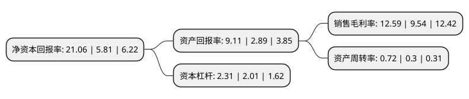

> 本页面由自动化程序生成于 2022年5月20日 01:19
> 内容可能存在错误，如有bug请提交issue至：https://github.com/Eroleice/doc-pi/issues
{.is-warning}

# 上市公司基本情况

## 基本资料

湖南国科微电子股份有限公司（以下简称“国科微”）成立于2008年09月24日，长沙市。于2017年07月12日在深交所创业板上市。

国科微注册资本18,212.13万元，主营业务:致力于大规模集成电路的设计，研发及销售。主要产品:广播电视系列芯片产品，智能视频监控系列芯片产品等。以下是详细信息：

- 公司名称: 湖南国科微电子股份有限公司
- 股票代码: 300672.SZ
- 所在地: 湖南 - 长沙市
- 成立日期: 2008年09月24日
- 注册资本: 18,212.13万元
- 法定代表人: 向平
- 主营业务: 主营业务:致力于大规模集成电路的设计，研发及销售主要产品:广播电视系列芯片产品，智能视频监控系列芯片产品等
- 公司官网: www.goke.com
- 公司介绍: 公司是国家高新技术企业和经工业和信息化部认定的集成电路设计企业，长期致力于大规模集成电路的设计、研发及销售。凭借着先进的管理体系、雄厚的研发能力、优异的产品质量和技术实力，公司设计的广播电视系列芯片和智能监控系列芯片具备较高的性价比，形成了较为明显的领先优势。目前，公司已成为国内广播电视系列芯片和智能监控系列芯片的主流供应商之一。公司将利用既有的技术、产品、市场及品牌优势，在目前系统平台的基础上，进一步加大研发投入和技术创新力度，重点开拓以广播电视、智能监控、固态存储以及物联网领域为核心的产品市场，并适时向其他合适的集成电路领域拓展。

## 股东及高管情况

上市公司第一大股东为湖南国科控股有限公司，持股39,035,306股，占比21.43%，**疑似为**上市公司实际控制人。

截至2022年03月31日，上市公司的前十大股东中，共有6名自然人股东，2名机构股东，1个产品账户，1个海外主体，其中5%以上大股东共有3名。上市公司前十大股东明细如下：

> 未能通过持股比例判定出上市公司实际控制人（持股30%以上）
> 可能存在通过间接持股、联合持股、协议控制等方式拥有实际控制权的主体，具体请参考上市公司定期公告！
{.is-warning}

> 截至2022年03月31日，上市公司前十大股东信息如下：

| 股东名称 | 持股数量（股） | 持股比例 |
| --- | --- | --- |
| 湖南国科控股有限公司 | 39,035,306 | 21.43% |
| 国家集成电路产业投资基金股份有限公司 | 21,000,350 | 11.53% |
| 长沙芯途投资管理有限公司 | 19,491,864 | 10.7% |
| 向平 | 8,268,952 | 4.54% |
| 香港中央结算有限公司(陆股通) | 5,826,936 | 3.2% |
| 贺光平 | 5,732,380 | 3.15% |
| 王春江 | 3,770,254 | 2.07% |
| 刘秋蓉 | 3,135,743 | 1.72% |
| 贺朴 | 2,946,953 | 1.62% |
| 李建佺 | 1,267,543 | 0.7% |

## 利润表分析

上市公司2021年总收入为23.21亿元，净利润为2.92亿元，实现盈利。

## 杜邦分析

> 数据列示周期：2021年 | 2020年 | 2019年
{.is-info}

上市公司的净资产收益率在近一年有所上升，上升幅度为262.48%，其变化情况分解如下：
- 上市公司的销售毛利率在近一年上升了31.97%，可能是生产效率的提升、商品原材料价格下跌或商品价格的上涨所致。
- 上市公司的资产周转率在近一年上升了140%，可能是源自于更快的销售回款或库存管理效果提升。
- 上市公司的财务杠杆比率在近一年上升了14.93%，可能是增加负债扩大生产规模。

