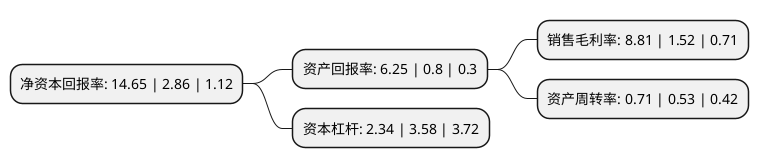

> 本页面由自动化程序生成于 2022年5月20日 01:19
> 内容可能存在错误，如有bug请提交issue至：https://github.com/Eroleice/doc-pi/issues
{.is-warning}

# 上市公司基本情况

## 基本资料

聚灿光电科技股份有限公司（以下简称“聚灿光电”）成立于2010年04月08日，苏州市。于2017年10月16日在深交所创业板上市。

聚灿光电注册资本54,363.175万元，主要产品:GaN基高亮度蓝光LED芯片及外延片;主营业务:LED外延片及芯片的研发，生产和销售业务，并围绕LED照明应用为核心提供合同能源管理服务。以下是详细信息：

- 公司名称: 聚灿光电科技股份有限公司
- 股票代码: 300708.SZ
- 所在地: 江苏 - 苏州市
- 成立日期: 2010年04月08日
- 注册资本: 54,363.175万元
- 法定代表人: 潘华荣
- 主营业务: 主要产品:GaN基高亮度蓝光LED芯片及外延片;主营业务:LED外延片及芯片的研发，生产和销售业务，并围绕LED照明应用为核心提供合同能源管理服务
- 公司官网: www.focuslightings.com
- 公司介绍: 公司的主营业务为LED外延片及芯片的研发、生产和销售业务，并围绕LED照明应用为核心提供合同能源管理服务，公司的主要产品为GaN基高亮度蓝光LED芯片及外延片。本公司自成立以来一直专注于LED外延芯片行业，秉承“传统光源的颠覆者，绿色照明的领航人”的企业愿景和“客户至上、品质第一”的经营理念，持续为绿色LED照明事业做出贡献。目前相继被认定为“高新技术企业”、“江苏省企业技术中心”、“江苏省重大科技成果转化专项项目承担单位”、“江苏省科技型中小企业”、“苏州市科技创新先锋企业”等荣誉称号。

## 股东及高管情况

上市公司第一大股东为潘华荣，持股129,245,978股，占比23.77%，**疑似为**上市公司实际控制人。

截至2022年03月31日，上市公司的前十大股东中，共有8名自然人股东，1名机构股东，1个海外主体，其中5%以上大股东共有2名。上市公司前十大股东明细如下：

> 未能通过持股比例判定出上市公司实际控制人（持股30%以上）
> 可能存在通过间接持股、联合持股、协议控制等方式拥有实际控制权的主体，具体请参考上市公司定期公告！
{.is-warning}

> 截至2022年03月31日，上市公司前十大股东信息如下：

| 股东名称 | 持股数量（股） | 持股比例 |
| --- | --- | --- |
| 潘华荣 | 129,245,978 | 23.77% |
| 孙永杰 | 79,920,000 | 14.7% |
| 徐英盖 | 20,527,488 | 3.78% |
| 黄光辉 | 18,555,805 | 3.41% |
| 郑素婵 | 9,105,900 | 1.68% |
| 殷作钊 | 8,942,346 | 1.64% |
| 香港中央结算有限公司(陆股通) | 3,930,657 | 0.72% |
| 京福资产管理有限公司-北京京福投资管理中心(有限合伙) | 3,445,580 | 0.63% |
| 余水清 | 1,490,000 | 0.27% |
| 程飞龙 | 1,260,000 | 0.23% |

## 利润表分析

上市公司2021年总收入为20.09亿元，净利润为1.77亿元，实现盈利。

## 杜邦分析

> 数据列示周期：2021年 | 2020年 | 2019年
{.is-info}

上市公司的净资产收益率在近一年有所上升，上升幅度为412.24%，其变化情况分解如下：
- 上市公司的销售毛利率在近一年上升了479.61%，可能是生产效率的提升、商品原材料价格下跌或商品价格的上涨所致。
- 上市公司的资产周转率在近一年上升了33.96%，可能是源自于更快的销售回款或库存管理效果提升。
- 上市公司的财务杠杆比率在近一年下降了-34.64%，可能是减少负债降低财务费用。

