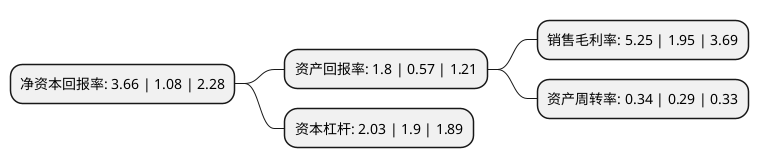

> 本页面由自动化程序生成于 2022年5月20日 01:26
> 内容可能存在错误，如有bug请提交issue至：https://github.com/Eroleice/doc-pi/issues
{.is-warning}

# 上市公司基本情况

## 基本资料

吉林华微电子股份有限公司（以下简称“华微电子”）成立于1999年10月21日，吉林市。于2001年03月16日在上交所主板上市。

华微电子注册资本96,427.13万元，主要产品:功率半导体器件产品。主营业务:功率半导体器件的设计研发，芯片制造，封装测试，销售等业务。以下是详细信息：

- 公司名称: 吉林华微电子股份有限公司
- 股票代码: 600360.SH
- 所在地: 吉林 - 吉林市
- 成立日期: 1999年10月21日
- 注册资本: 96,427.13万元
- 法定代表人: 夏增文
- 主营业务: 主要产品:功率半导体器件产品主营业务:功率半导体器件的设计研发，芯片制造，封装测试，销售等业务
- 公司官网: www.hwdz.com.cn
- 公司介绍: 公司主要从事功率半导体器件的设计研发、芯片制造、封装测试、销售等业务。公司坚持生产、研发、储备相结合的技术开发战略，不断向功率半导体器件的中高端技术及应用领域拓展。公司发挥自身产品设计、工艺设计等综合技术优势，已建立从高端二极管、单双向可控硅、MOS系列产品到第六代IGBT国内最齐全、最具竞争力的功率半导体器件产品体系，正逐步由单一器件供应商向整体解决方案供应商转变；同时公司积极向新能源汽车、军工等领域快速拓展，并已取得明显效果，为公司发展奠定了坚实的基础。

## 股东及高管情况

上市公司第一大股东为上海鹏盛科技实业有限公司，持股214,326,656股，占比22.32%，**疑似为**上市公司实际控制人。

截至2022年03月31日，上市公司的前十大股东中，共有2名自然人股东，3名机构股东，5个产品账户，其中5%以上大股东共有1名。上市公司前十大股东明细如下：

> 未能通过持股比例判定出上市公司实际控制人（持股30%以上）
> 可能存在通过间接持股、联合持股、协议控制等方式拥有实际控制权的主体，具体请参考上市公司定期公告！
{.is-warning}

> 截至2022年03月31日，上市公司前十大股东信息如下：

| 股东名称 | 持股数量（股） | 持股比例 |
| --- | --- | --- |
| 上海鹏盛科技实业有限公司 | 214,326,656 | 22.32% |
| 保宁资本有限公司-保宁新兴市场基金(美国) | 9,118,200 | 0.95% |
| 中信证券股份有限公司 | 7,703,231 | 0.8% |
| 国泰君安证券股份有限公司-国联安中证全指半导体产品与设备交易型开放式指数证券投资基金 | 5,116,324 | 0.53% |
| 戴红 | 4,121,464 | 0.43% |
| 王斌 | 4,020,800 | 0.42% |
| 保宁资本有限公司-保宁新兴市场中小企基金(美国) | 3,615,230 | 0.38% |
| 中信里昂资产管理有限公司-客户资金 | 3,354,734 | 0.35% |
| 建信基金-建设银行-中国建设银行股份有限公司工会委员会员工股权激励理事会 | 3,325,392 | 0.35% |
| 保宁资本有限公司-中国A股基金 | 2,867,348 | 0.3% |

## 利润表分析

上市公司2021年总收入为22.1亿元，净利润为1.15亿元，实现盈利。

## 杜邦分析

> 数据列示周期：2021年 | 2020年 | 2019年
{.is-info}

上市公司的净资产收益率在近一年有所上升，上升幅度为238.89%，其变化情况分解如下：
- 上市公司的销售毛利率在近一年上升了169.23%，可能是生产效率的提升、商品原材料价格下跌或商品价格的上涨所致。
- 上市公司的资产周转率在近一年上升了17.24%，可能是源自于更快的销售回款或库存管理效果提升。
- 上市公司的财务杠杆比率在近一年上升了6.84%，可能是增加负债扩大生产规模。

