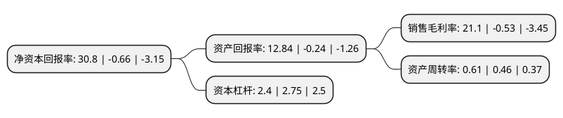

> 本页面由自动化程序生成于 2022年5月20日 01:26
> 内容可能存在错误，如有bug请提交issue至：https://github.com/Eroleice/doc-pi/issues
{.is-warning}

# 上市公司基本情况

## 基本资料

杭州士兰微电子股份有限公司（以下简称“士兰微”）成立于1997年09月25日，杭州市。于2003年03月11日在上交所主板上市。

士兰微注册资本141,607.185万元，主要产品:集成电路，半导体分立器件，LED(发光二极管)产品等三大类。主营业务:电子元器件，电子零部件及其他电子产品设计，制造，销售;机电产品进出口。以下是详细信息：

- 公司名称: 杭州士兰微电子股份有限公司
- 股票代码: 600460.SH
- 所在地: 浙江 - 杭州市
- 成立日期: 1997年09月25日
- 注册资本: 141,607.185万元
- 法定代表人: 陈向东
- 主营业务: 主要产品:集成电路，半导体分立器件，LED(发光二极管)产品等三大类主营业务:电子元器件，电子零部件及其他电子产品设计，制造，销售;机电产品进出口
- 公司官网: www.silan.com.cn
- 公司介绍: 公司经营范围是：电子元器件、电子零部件及其他电子产品设计、制造、销售；机电产品进出口。主要产品包括集成电路、半导体分立器件、LED(发光二极管)产品等三大类。经过将近二十年的发展，公司已经从一家纯芯片设计公司发展成为目前国内为数不多的以IDM模式(设计与制造一体化)为主要发展模式的综合型半导体产品公司。公司属于半导体行业,公司被国家发展和改革委员会、工业和信息化部等国家部委认定为“国家规划布局内重点软件和集成电路设计企业”，陆续承担了国家科技重大专项“01专项”和“02专项”多个科研专项课题。

## 股东及高管情况

上市公司第一大股东为杭州士兰控股有限公司，持股513,503,234股，占比36.26%，为上市公司实际控制人。

截至2022年03月31日，上市公司的前十大股东中，共有2名自然人股东，1名机构股东，6个产品账户，1个海外主体，其中5%以上大股东共有2名。上市公司前十大股东明细如下：

> 截至2022年03月31日，上市公司前十大股东信息如下：

| 股东名称 | 持股数量（股） | 持股比例 |
| --- | --- | --- |
| 杭州士兰控股有限公司 | 513,503,234 | 36.26% |
| 国家集成电路产业投资基金股份有限公司 | 82,350,000 | 5.82% |
| 香港中央结算有限公司(陆股通) | 68,360,395 | 4.83% |
| 招商银行股份有限公司-银河创新成长混合型证券投资基金 | 27,533,869 | 1.94% |
| 中国建设银行股份有限公司-华夏国证半导体芯片交易型开放式指数证券投资基金 | 13,221,592 | 0.93% |
| 全国社保基金一零八组合 | 13,079,735 | 0.92% |
| 陈向东 | 12,349,896 | 0.87% |
| 上海浦东发展银行股份有限公司-景顺长城新能源产业股票型证券投资基金 | 11,543,239 | 0.82% |
| 范伟宏 | 10,613,866 | 0.75% |
| 宁波银行股份有限公司-景顺长城成长龙头一年持有期混合型证券投资基金 | 8,763,075 | 0.62% |

## 利润表分析

上市公司2021年总收入为71.94亿元，净利润为15.18亿元，实现盈利。

## 杜邦分析

> 数据列示周期：2021年 | 2020年 | 2019年
{.is-info}

上市公司的净资产收益率在近一年有所下降，下降幅度为-4766.67%，其变化情况分解如下：
- 上市公司的销售毛利率在近一年下降了-4081.13%，可能是生产效率的下降、商品原材料价格上涨或商品价格的下跌所致。
- 上市公司的资产周转率在近一年上升了32.61%，可能是源自于更快的销售回款或库存管理效果提升。
- 上市公司的财务杠杆比率在近一年下降了-12.73%，可能是减少负债降低财务费用。

