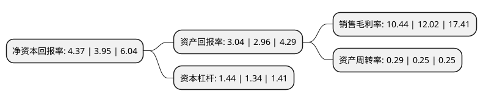

> 本页面由自动化程序生成于 2022年5月20日 01:28
> 内容可能存在错误，如有bug请提交issue至：https://github.com/Eroleice/doc-pi/issues
{.is-warning}

# 上市公司基本情况

## 基本资料

三安光电股份有限公司（以下简称“三安光电”）成立于1993年03月27日，荆州市。于1996年05月28日在上交所主板上市。

三安光电注册资本447,934.131万元，主营业务:LED外延片及芯片的研发，生产和销售。以下是详细信息：

- 公司名称: 三安光电股份有限公司
- 股票代码: 600703.SH
- 所在地: 湖北 - 荆州市
- 成立日期: 1993年03月27日
- 注册资本: 447,934.131万元
- 法定代表人: 林志强
- 主营业务: 主营业务:LED外延片及芯片的研发，生产和销售
- 公司官网: www.sanan-e.com
- 公司介绍: 公司是国家发改委批准的“国家高科技产业化示范工程”企业、工业和信息化部认定的“国家技术创新示范企业”，承担了国家“863”、“973”计划等多项重大课题，拥有国家人事部颁发的博士后科研工作站及国家认定的企业技术中心。公司主要从事全色系超高亮度LED外延片、芯片、Ⅲ-Ⅴ族化合物半导体材料、微波通讯集成电路与功率器件、光通讯元器件等的研发、生产与销售，产品性能指标居国际先进水平。公司凭借强大的企业实力，继2014年扩大LED外延芯片研发与制造产业化规模、同时投资集成电路产业，建设砷化镓高速半导体与氮化镓高功率半导体项目之后，2018年三安光电在福建泉州南安高新技术产业园区，斥资333亿元投资Ⅲ-Ⅴ族化合物半导体材料、LED外延、芯片、微波集成电路、光通讯、射频滤波器、电力电子、SIC材料及器件、特种封装等产业。

## 股东及高管情况

上市公司第一大股东为厦门三安电子有限公司，持股1,213,823,341股，占比27.1%，**疑似为**上市公司实际控制人。

截至2022年04月14日，上市公司的前十大股东中，共有5名机构股东，5个产品账户，其中5%以上大股东共有4名。上市公司前十大股东明细如下：

> 未能通过持股比例判定出上市公司实际控制人（持股30%以上）
> 可能存在通过间接持股、联合持股、协议控制等方式拥有实际控制权的主体，具体请参考上市公司定期公告！
{.is-warning}

> 截至2022年04月14日，上市公司前十大股东信息如下：

| 股东名称 | 持股数量（股） | 持股比例 |
| --- | --- | --- |
| 厦门三安电子有限公司 | 1,213,823,341 | 27.1% |
| 国家集成电路产业投资基金股份有限公司 | 289,772,106 | 6.47% |
| 湖南臻泰股权投资管理合伙企业(有限合伙)-长沙先导高芯投资合伙企业(有限合伙) | 286,368,843 | 6.39% |
| 福建三安集团有限公司 | 243,618,660 | 5.44% |
| 珠海格力电器股份有限公司 | 114,547,537 | 2.56% |
| 中国证券金融股份有限公司 | 94,151,164 | 2.1% |
| 招商银行股份有限公司-睿远成长价值混合型证券投资基金 | 81,264,530 | 1.81% |
| 三安光电股份有限公司-第三期员工持股计划 | 76,017,479 | 1.7% |
| 中国工商银行股份有限公司-诺安成长股票型证券投资基金 | 73,078,498 | 1.63% |
| 招商银行股份有限公司-兴全合润混合型证券投资基金 | 52,448,186 | 1.17% |

## 利润表分析

上市公司2021年总收入为125.72亿元，净利润为13.13亿元，实现盈利。

## 杜邦分析

> 数据列示周期：2021年 | 2020年 | 2019年
{.is-info}

上市公司的净资产收益率在近一年有所上升，上升幅度为10.63%，其变化情况分解如下：
- 上市公司的销售毛利率在近一年下降了-13.14%，可能是生产效率的下降、商品原材料价格上涨或商品价格的下跌所致。
- 上市公司的资产周转率在近一年上升了16%，可能是源自于更快的销售回款或库存管理效果提升。
- 上市公司的财务杠杆比率在近一年上升了7.46%，可能是增加负债扩大生产规模。

