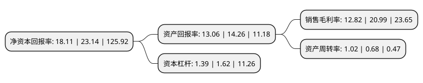

> 本页面由自动化程序生成于 2022年5月20日 01:29
> 内容可能存在错误，如有bug请提交issue至：https://github.com/Eroleice/doc-pi/issues
{.is-warning}

# 上市公司基本情况

## 基本资料

中电科声光电科技股份有限公司（以下简称“声光电科”）成立于1987年11月14日，重庆市。于1995年10月13日在上交所主板上市。

声光电科注册资本118,416.712万元，摩托车以下是详细信息：

- 公司名称: 中电科声光电科技股份有限公司
- 股票代码: 600877.SH
- 所在地: 重庆 - 重庆市
- 成立日期: 1987年11月14日
- 注册资本: 118,416.712万元
- 法定代表人: 王颖
- 主营业务: 摩托车
- 公司官网: www.cetcec.com
- 公司介绍: 公司原主要从事摩托车产品的研发、生产、销售、检测及服务业务，以及通机零部件、汽车和摩托车零部件的生产和销售。2019年，公司通过重大资产重组，出售全部原有业务相关资产和负债，购买空间电源100%股权和力神特电85%股权，注入特种锂离子电源领域的优质资产，主营业务将变为特种锂离子电源的研发、生产、销售和技术服务。空间电源是国内领先的空间储能电池系统提供商，专注于空间飞行器、地面通信设备、水中特种设备、无人机以及特种装备等领域电池和电池组件的研发、生产、销售和技术服务，主营业务突出。力神特电是国内最早研制特种锂离子电池组的企业之一，自2001年起即开始承接特种电源产品设计与生产任务，先后承担了为重点工程配套的锂离子蓄电池组科研项目百余项，产品主要应用于通信、航空、船舶、车辆等领域。经多年努力，力神特电已成为国内最大的特种通信装备和特种便携式无人机用锂离子电池组供应商，在通信电池、无人机电源、AGV电源等领域形成了处于国内领先地位的技术优势，其特种锂离子电源产品广泛应用于各军工科研院所、军工企事业单位及各军种部队，与多个特种装备采购部门及下属科研院所、中央企业下属的科研院所及整机企业建立了长期稳定的合作关系。

## 股东及高管情况

上市公司第一大股东为中电科技集团重庆声光电有限公司，持股303,590,748股，占比25.64%，**疑似为**上市公司实际控制人。

截至2022年03月31日，上市公司的前十大股东中，共有2名自然人股东，7名机构股东，1个产品账户，其中5%以上大股东共有2名。上市公司前十大股东明细如下：

> 未能通过持股比例判定出上市公司实际控制人（持股30%以上）
> 可能存在通过间接持股、联合持股、协议控制等方式拥有实际控制权的主体，具体请参考上市公司定期公告！
{.is-warning}

> 截至2022年03月31日，上市公司前十大股东信息如下：

| 股东名称 | 持股数量（股） | 持股比例 |
| --- | --- | --- |
| 中电科技集团重庆声光电有限公司 | 303,590,748 | 25.64% |
| 中电科核心技术研发投资有限公司 | 103,950,103 | 8.78% |
| 中电科投资控股有限公司 | 41,580,041 | 3.51% |
| 北京益丰润勤信创业投资中心(有限合伙) | 33,094,970 | 2.79% |
| 天津力神电池股份有限公司 | 26,435,121 | 2.23% |
| 合肥中电科国元产业投资基金合伙企业(有限合伙) | 19,707,588 | 1.66% |
| 戚瑞斌 | 19,294,174 | 1.63% |
| 中微半导体(深圳)股份有限公司 | 18,297,024 | 1.55% |
| 中电科西微(天津)集成电路芯片合伙企业(有限合伙) | 13,795,312 | 1.16% |
| 陈振强 | 11,151,041 | 0.94% |

## 利润表分析

上市公司2021年总收入为16.55亿元，净利润为2.12亿元，实现盈利。

## 杜邦分析

> 数据列示周期：2021年 | 2020年 | 2019年
{.is-info}

上市公司的净资产收益率在近一年有所下降，下降幅度为-21.74%，其变化情况分解如下：
- 上市公司的销售毛利率在近一年下降了-38.92%，可能是生产效率的下降、商品原材料价格上涨或商品价格的下跌所致。
- 上市公司的资产周转率在近一年上升了50%，可能是源自于更快的销售回款或库存管理效果提升。
- 上市公司的财务杠杆比率在近一年下降了-14.2%，可能是减少负债降低财务费用。

