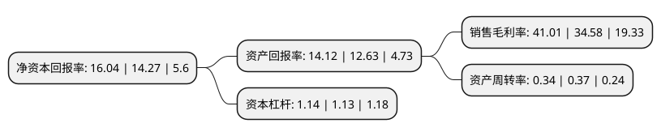

> 本页面由自动化程序生成于 2022年5月20日 01:32
> 内容可能存在错误，如有bug请提交issue至：https://github.com/Eroleice/doc-pi/issues
{.is-warning}

# 上市公司基本情况

## 基本资料

苏州晶方半导体科技股份有限公司（以下简称“晶方科技”）成立于2005年06月10日，苏州市。于2014年02月10日在上交所主板上市。

晶方科技注册资本40,825.772万元，公司主营业务为集成电路的封装测试业务，主要为影像传感芯片，环境光感应芯片，微机电系统(MEMS)，发光电子器件(LED)等提供晶圆级芯片尺寸封装(WLCSP)及测试服务。公司目前封装产品主要有影像传感芯片，环境光感应芯片，医疗电子器件，微机电系统(MEMS)，射频识别芯片(RFID)等，该些产品被广泛应用在消费电子(手机，电脑，照相机等)，医学电子，电子标签身份识别，安防设备等诸多领域。以下是详细信息：

- 公司名称: 苏州晶方半导体科技股份有限公司
- 股票代码: 603005.SH
- 所在地: 江苏 - 苏州市
- 成立日期: 2005年06月10日
- 注册资本: 40,825.772万元
- 法定代表人: 王蔚
- 主营业务: 公司主营业务为集成电路的封装测试业务，主要为影像传感芯片，环境光感应芯片，微机电系统(MEMS)，发光电子器件(LED)等提供晶圆级芯片尺寸封装(WLCSP)及测试服务公司目前封装产品主要有影像传感芯片，环境光感应芯片，医疗电子器件，微机电系统(MEMS)，射频识别芯片(RFID)等，该些产品被广泛应用在消费电子(手机，电脑，照相机等)，医学电子，电子标签身份识别，安防设备等诸多领域
- 公司官网: www.wlcsp.com
- 公司介绍: 公司成立于苏州，是一家致力于开发与创新新技术，为客户提供可靠的，小型化，高性能和高性价比的半导体封装量产服务商。晶方科技的CMOS影像传感器晶圆级封装技术，彻底改变了封装的世界，使高性能，小型化的手机相机模块成为可能。这一价值已经使之成为有史以来应用最广泛的封装技术，现今已有近50％的影像传感器芯片可使用此技术，大量应用于智能电话，平板电脑，可穿戴电子等各类电子产品。公司及子公司Optiz Inc.(位于Palo Alto，加州)将持续专注于技术创新。近十年来，晶方科技已经成为技术开发与创新、提供优质量产服务的领导者。随着公司不断发展壮大，1)设立美国子公司Optiz Inc.，是在影像传感器微型化的增强与分析领域的领导者；2)购买智瑞达资产，是新一代半导体封装技术的创新者。公司先后承担多项国家及省级科研项目，“晶圆级封装关键技术研究”被科技部列入国际科技合作与交流专项基金，“晶圆级芯片尺寸封装技术在影像传感芯片中的开发和应用”被科技部列入国家火炬计划项目等。公司产品荣获“高新技术产品”“国家重点新产品”等称号。

## 股东及高管情况

上市公司第一大股东为中新苏州工业园区创业投资有限公司，持股92,481,104股，占比22.65%，**疑似为**上市公司实际控制人。

截至2022年03月31日，上市公司的前十大股东中，共有2名机构股东，7个产品账户，1个海外主体，其中5%以上大股东共有1名。上市公司前十大股东明细如下：

> 未能通过持股比例判定出上市公司实际控制人（持股30%以上）
> 可能存在通过间接持股、联合持股、协议控制等方式拥有实际控制权的主体，具体请参考上市公司定期公告！
{.is-warning}

> 截至2022年03月31日，上市公司前十大股东信息如下：

| 股东名称 | 持股数量（股） | 持股比例 |
| --- | --- | --- |
| 中新苏州工业园区创业投资有限公司 | 92,481,104 | 22.65% |
| 国家集成电路产业投资基金股份有限公司 | 20,320,146 | 4.98% |
| ENGINEERING AND IP ADVANCED TECHNOLOGIES LTD | 13,877,404 | 3.4% |
| 中国平安人寿保险股份有限公司-投连-个险投连 | 5,599,792 | 1.37% |
| 中国建设银行股份有限公司-华夏国证半导体芯片交易型开放式指数证券投资基金 | 5,002,844 | 1.23% |
| 太平人寿保险有限公司-传统-普通保险产品-022L-CT001沪 | 3,585,148 | 0.88% |
| 中国农业银行股份有限公司-上投摩根新兴动力混合型证券投资基金 | 3,327,069 | 0.81% |
| 中国银行股份有限公司-上投摩根远见两年持有期混合型证券投资基金 | 3,156,997 | 0.77% |
| 中国银行股份有限公司-国泰CES半导体芯片行业交易型开放式指数证券投资基金 | 2,851,768 | 0.7% |
| 国泰君安证券股份有限公司-国联安中证全指半导体产品与设备交易型开放式指数证券投资基金 | 2,685,356 | 0.66% |

## 利润表分析

上市公司2021年总收入为14.11亿元，净利润为5.78亿元，实现盈利。

## 杜邦分析

> 数据列示周期：2021年 | 2020年 | 2019年
{.is-info}

上市公司的净资产收益率在近一年有所上升，上升幅度为12.4%，其变化情况分解如下：
- 上市公司的销售毛利率在近一年上升了18.59%，可能是生产效率的提升、商品原材料价格下跌或商品价格的上涨所致。
- 上市公司的资产周转率在近一年下降了-8.11%，可能是源自于更慢的销售回款或库存管理效果下降。
- 上市公司的财务杠杆比率在近一年上升了0.88%，可能是增加负债扩大生产规模。

