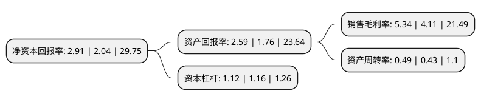

> 本页面由自动化程序生成于 2022年5月20日 01:32
> 内容可能存在错误，如有bug请提交issue至：https://github.com/Eroleice/doc-pi/issues
{.is-warning}

# 上市公司基本情况

## 基本资料

博通集成电路(上海)股份有限公司（以下简称“博通集成”）成立于2004年12月01日，上海市。于2019年04月15日在上交所主板上市。

博通集成注册资本15,127.997万元，无线通讯集成电路芯片的研发与销售，具体类型分为无线数传芯片和无线音频芯片。公司目前产品应用类别主要包括5。8G产品，WIFI产品，蓝牙数传，通用无线，对讲机，广播收发，蓝牙音频，无线麦克风等。以下是详细信息：

- 公司名称: 博通集成电路(上海)股份有限公司
- 股票代码: 603068.SH
- 所在地: 上海 - 上海市
- 成立日期: 2004年12月01日
- 注册资本: 15,127.997万元
- 法定代表人: PENGFEI ZHANG
- 主营业务: 无线通讯集成电路芯片的研发与销售，具体类型分为无线数传芯片和无线音频芯片公司目前产品应用类别主要包括58G产品，WIFI产品，蓝牙数传，通用无线，对讲机，广播收发，蓝牙音频，无线麦克风等
- 公司官网: www.bekencorp.com
- 公司介绍: 公司成立于2004年12月1日,是一家提供无线通讯射频芯片和解决方案的集成电路设计公司，主要基于世界领先的RF-CMOS收发器设计技术和富有创新性的数字信号处理系统设计高集成度高性能的半导体产品。公司成立以来，已成功推出了世界首颗5.8-GHz无绳电话集成收发器芯片，集成度最高的2.4-GHz无绳电话收发器芯片，功耗最低的5.8-GHz通用无线FSK收发器芯片，世界首款满足我国公路不停车收费国家标准的5.8-GHz集成收发器芯片以及其他几个系列的具有广泛应用前景的集成电路产品。近年来，公司的研发团队在多个领域取得显著成绩，先后获得了上海市科技进步奖三等奖、上海市浦东新区科技进步奖二等奖、年度中国IC设计公司成就奖、年度最佳无线产品奖(BK8000蓝牙音频SoC)、年度十大大中华IC设计公司品牌奖、十大最具发展潜力中国IC设计公司等奖项。同时，公司凭借优质的产品和服务，赢得了品牌客户的广泛赞誉，树立了良好的品牌形象，营业收入和盈利水平均保持着较快的增长速度。

## 股东及高管情况

上市公司第一大股东为Beken Corporation，持股30,340,103股，占比20.06%，**疑似为**上市公司实际控制人。

截至2022年03月31日，上市公司的前十大股东中，共有8名机构股东，2个海外主体，其中5%以上大股东共有2名。上市公司前十大股东明细如下：

> 未能通过持股比例判定出上市公司实际控制人（持股30%以上）
> 可能存在通过间接持股、联合持股、协议控制等方式拥有实际控制权的主体，具体请参考上市公司定期公告！
{.is-warning}

> 截至2022年03月31日，上市公司前十大股东信息如下：

| 股东名称 | 持股数量（股） | 持股比例 |
| --- | --- | --- |
| Beken Corporation | 30,340,103 | 20.06% |
| 上海致能工业电子有限公司 | 14,493,846 | 9.58% |
| 上海安析亚管理咨询合伙企业(有限合伙) | 6,505,000 | 4.3% |
| 上海英涤安管理咨询合伙企业(有限合伙) | 5,505,000 | 3.64% |
| 建得投资有限公司 | 4,099,978 | 2.71% |
| 上海武岳峰集成电路股权投资合伙企业(有限合伙) | 3,740,896 | 2.47% |
| 亿厚有限公司 | 2,936,666 | 1.94% |
| 香港中央结算有限公司(陆股通) | 2,267,357 | 1.5% |
| 普訊玖創業投資股份有限公司 | 2,254,996 | 1.49% |
| 耀桦有限公司 | 1,983,112 | 1.31% |

## 利润表分析

上市公司2021年总收入为10.94亿元，净利润为0.58亿元，实现盈利。

## 杜邦分析

> 数据列示周期：2021年 | 2020年 | 2019年
{.is-info}

上市公司的净资产收益率在近一年有所上升，上升幅度为42.65%，其变化情况分解如下：
- 上市公司的销售毛利率在近一年上升了29.93%，可能是生产效率的提升、商品原材料价格下跌或商品价格的上涨所致。
- 上市公司的资产周转率在近一年上升了13.95%，可能是源自于更快的销售回款或库存管理效果提升。
- 上市公司的财务杠杆比率在近一年下降了-3.45%，可能是减少负债降低财务费用。

