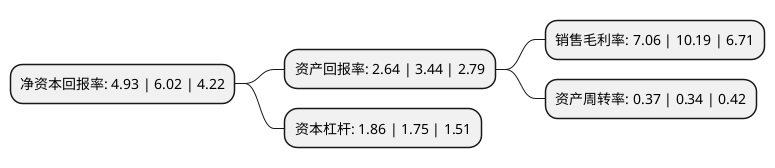

> 本页面由自动化程序生成于 2022年5月20日 01:32
> 内容可能存在错误，如有bug请提交issue至：https://github.com/Eroleice/doc-pi/issues
{.is-warning}

# 上市公司基本情况

## 基本资料

江阴江化微电子材料股份有限公司（以下简称“江化微”）成立于2001年08月17日，无锡市。于2017年04月10日在上交所主板上市。

江化微注册资本19,597.224万元，主营业务为超净高纯试剂，光刻胶及光刻胶配套试剂等湿电子化学品的研发，生产和销售。主要产品有超净高纯试剂，光刻胶及光刻胶配套试剂。以下是详细信息：

- 公司名称: 江阴江化微电子材料股份有限公司
- 股票代码: 603078.SH
- 所在地: 江苏 - 无锡市
- 成立日期: 2001年08月17日
- 注册资本: 19,597.224万元
- 法定代表人: 殷福华
- 主营业务: 主营业务为超净高纯试剂，光刻胶及光刻胶配套试剂等湿电子化学品的研发，生产和销售主要产品有超净高纯试剂，光刻胶及光刻胶配套试剂
- 公司官网: www.jianghuamem.com
- 公司介绍: 公司是目前国内生产规模大、品种齐全、配套完善的湿电子化学品专业服务提供商。公司主要从事超净高纯试剂、光刻胶及光刻胶配套试剂等专用湿电子化学品的研发、生产和销售业务。公司产品主要适用于平板显示、半导体及LED、光伏太阳能以及硅片、锂电池、光磁等电子元器件微细加工的清洗、光刻、显影、蚀刻、去膜、掺杂等制造工艺过程中。公司主要生产设备和测试仪器全部从国外引进，产品质量达到国际同类先进水平。“江化”品牌一直作为国内众多知名的半导体、晶体硅太阳能、大尺寸液晶厂家优选供应商，产品并已远销海外。公司秉持“追求完美，做顾客依赖的合作伙伴”的经营理念和“科学管理、品质一流、追求卓越、满足顾客”的质量方针，不断开发先进的工艺技术和生产高性能的微电子化学品为己任，致力于微电子、光电子专用湿电子化学品制造业的发展，不断满足电子工业日新月异发展的需求。

## 股东及高管情况

上市公司第一大股东为殷福华，持股50,601,062股，占比25.82%，**疑似为**上市公司实际控制人。

截至2022年03月31日，上市公司的前十大股东中，共有3名自然人股东，2名机构股东，5个产品账户，其中5%以上大股东共有3名。上市公司前十大股东明细如下：

> 未能通过持股比例判定出上市公司实际控制人（持股30%以上）
> 可能存在通过间接持股、联合持股、协议控制等方式拥有实际控制权的主体，具体请参考上市公司定期公告！
{.is-warning}

> 截至2022年03月31日，上市公司前十大股东信息如下：

| 股东名称 | 持股数量（股） | 持股比例 |
| --- | --- | --- |
| 殷福华 | 50,601,062 | 25.82% |
| 殷福华 | 37,951,054 | 19.3655% |
| 淄博星恒途松控股有限公司 | 22,448,620 | 11.455% |
| 镇江市杰华投资有限公司 | 9,698,476 | 4.95% |
| 全国社保基金一一六组合 | 5,397,262 | 2.75% |
| 中国工商银行股份有限公司-海富通改革驱动灵活配置混合型证券投资基金 | 2,968,960 | 1.51% |
| 中国农业银行股份有限公司-长城久嘉创新成长灵活配置混合型证券投资基金 | 2,600,050 | 1.33% |
| 中国工商银行股份有限公司-前海开源新经济灵活配置混合型证券投资基金 | 1,943,740 | 0.99% |
| 中国工商银行股份有限公司-富国创新科技混合型证券投资基金 | 1,498,840 | 0.76% |
| 陈永勤 | 1,487,847 | 0.76% |

## 利润表分析

上市公司2021年总收入为7.92亿元，净利润为0.55亿元，实现盈利。

## 杜邦分析

> 数据列示周期：2021年 | 2020年 | 2019年
{.is-info}

上市公司的净资产收益率在近一年有所下降，下降幅度为-18.11%，其变化情况分解如下：
- 上市公司的销售毛利率在近一年下降了-30.72%，可能是生产效率的下降、商品原材料价格上涨或商品价格的下跌所致。
- 上市公司的资产周转率在近一年上升了8.82%，可能是源自于更快的销售回款或库存管理效果提升。
- 上市公司的财务杠杆比率在近一年上升了6.29%，可能是增加负债扩大生产规模。

