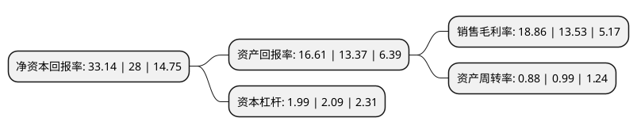

> 本页面由自动化程序生成于 2022年5月20日 01:34
> 内容可能存在错误，如有bug请提交issue至：https://github.com/Eroleice/doc-pi/issues
{.is-warning}

# 上市公司基本情况

## 基本资料

上海韦尔半导体股份有限公司（以下简称“韦尔股份”）成立于2007年05月15日，上海市。于2017年05月04日在上交所主板上市。

韦尔股份注册资本87,572.456万元，主营业务:半导体分立器件和电源管理IC等半导体产品的研发设计，以及被动件(包括电阻，电容，电感等)，结构器件，分立器件和IC等半导体产品的分销业务。，公司研发设计的半导体产品主要有分立器件(包括TVS，MOSFET，肖特基二极管等)，电源管理IC(包括LDO，DC-DC，LED背光驱动，开关等)，直播芯片和射频芯片等，公司代理分销的半导体产品主要有被动件(包括电阻，电容，电感等)，结构器件，分立器件和IC等。以下是详细信息：

- 公司名称: 上海韦尔半导体股份有限公司
- 股票代码: 603501.SH
- 所在地: 上海 - 上海市
- 成立日期: 2007年05月15日
- 注册资本: 87,572.456万元
- 法定代表人: 王崧
- 主营业务: 主营业务:半导体分立器件和电源管理IC等半导体产品的研发设计，以及被动件(包括电阻，电容，电感等)，结构器件，分立器件和IC等半导体产品的分销业务，公司研发设计的半导体产品主要有分立器件(包括TVS，MOSFET，肖特基二极管等)，电源管理IC(包括LDO，DC-DC，LED背光驱动，开关等)，直播芯片和射频芯片等，公司代理分销的半导体产品主要有被动件(包括电阻，电容，电感等)，结构器件，分立器件和IC等
- 公司官网: www.omnivision-group.com
- 公司介绍: 公司是一家以自主研发、销售服务为主体的半导体器件设计和销售公司，主要从事设计、制造和销售应用于便携式电子产品、电视、电动车、电表、通信设备、网络设备、信息终端等领域的高性能集成电路，主要产品包括开关器件、信号放大器件、系统电源及控制方案、系统保护方案、电磁干扰滤波方案、分立器件。公司逐步引进大量人才，重点加强研发、品质等方面人才储备，同时建立了先进的可靠性实验室、EMC实验室，在产品的研发、试产、量产过程中，对产品质量层层把关，并为合作伙伴提供大量的EMC测试，在得到合作伙伴认可的同时，公司正逐步成为国际知名的半导体器件厂商。

## 股东及高管情况

上市公司第一大股东为虞仁荣，持股265,535,000股，占比30.28%，为上市公司实际控制人。

截至2022年03月31日，上市公司的前十大股东中，共有1名自然人股东，5名机构股东，2个产品账户，2个海外主体，其中5%以上大股东共有3名。上市公司前十大股东明细如下：

> 截至2022年03月31日，上市公司前十大股东信息如下：

| 股东名称 | 持股数量（股） | 持股比例 |
| --- | --- | --- |
| 虞仁荣 | 265,535,000 | 30.28% |
| 绍兴市韦豪股权投资基金合伙企业(有限合伙) | 80,839,009 | 9.22% |
| 香港中央结算有限公司(陆股通) | 72,459,038 | 8.26% |
| 青岛融通民和投资中心(有限合伙) | 23,227,364 | 2.65% |
| 嘉兴华清龙芯豪威股权投资合伙企业(有限合伙) | 14,826,129 | 1.69% |
| 嘉兴华清银杏豪威股权投资合伙企业(有限合伙) | 13,446,718 | 1.53% |
| 中国工商银行股份有限公司-诺安成长股票型证券投资基金 | 12,256,561 | 1.4% |
| 上海唐芯企业管理合伙企业(有限合伙) | 8,987,114 | 1.02% |
| 元禾璞华同芯(苏州)投资管理有限公司-合肥元禾华创中合股权投资合伙企业(有限合伙) | 8,950,460 | 1.02% |
| Seagull Strategic Investments(A3), LLC | 8,489,711 | 0.97% |

## 利润表分析

上市公司2021年总收入为241.03亿元，净利润为45.45亿元，实现盈利。

## 杜邦分析

> 数据列示周期：2021年 | 2020年 | 2019年
{.is-info}

上市公司的净资产收益率在近一年有所上升，上升幅度为18.36%，其变化情况分解如下：
- 上市公司的销售毛利率在近一年上升了39.39%，可能是生产效率的提升、商品原材料价格下跌或商品价格的上涨所致。
- 上市公司的资产周转率在近一年下降了-11.11%，可能是源自于更慢的销售回款或库存管理效果下降。
- 上市公司的财务杠杆比率在近一年下降了-4.78%，可能是减少负债降低财务费用。

