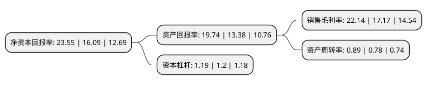

> 本页面由自动化程序生成于 2022年5月20日 01:35
> 内容可能存在错误，如有bug请提交issue至：https://github.com/Eroleice/doc-pi/issues
{.is-warning}

# 上市公司基本情况

## 基本资料

瑞芯微电子股份有限公司（以下简称“瑞芯微”）成立于2001年11月25日，福州市。于2020年02月07日在上交所主板上市。

瑞芯微注册资本41,727.52万元，公司主要从事大规模集成电路及应用方案的设计，开发和销售，为客户提供芯片相关产品及技术服务。公司主要产品为智能应用处理器芯片，电源管理芯片及其他芯片，同时提供专业技术服务及与自研芯片相关的组合器件。自成立以来，公司一直从事集成电路设计行业。公司是国家级高新技术企业和经工业和信息化部认定的集成电路设计企业，经过近二十年的创新发展，已经成为国内集成电路设计行业的优势企业。以下是详细信息：

- 公司名称: 瑞芯微电子股份有限公司
- 股票代码: 603893.SH
- 所在地: 福建 - 福州市
- 成立日期: 2001年11月25日
- 注册资本: 41,727.52万元
- 法定代表人: 励民
- 主营业务: 公司主要从事大规模集成电路及应用方案的设计，开发和销售，为客户提供芯片相关产品及技术服务公司主要产品为智能应用处理器芯片，电源管理芯片及其他芯片，同时提供专业技术服务及与自研芯片相关的组合器件自成立以来，公司一直从事集成电路设计行业公司是国家级高新技术企业和经工业和信息化部认定的集成电路设计企业，经过近二十年的创新发展，已经成为国内集成电路设计行业的优势企业
- 公司官网: www.rock-chips.com
- 公司介绍: 公司是国家级高新技术企业和经工业和信息化部认定的集成电路设计企业,坚持“创新引领、前瞻布局”的发展战略，以市场需求为导向，以持续创新为驱动，以核心技术为支撑，专注于大规模集成电路及应用方案的设计、开发和销售。经过近20年的创新发展，公司在音视频编解码、视觉影像处理、软硬件协同开发、多应用平台开发等方面积累了深厚的技术优势，已经成为国内集成电路设计行业的优势企业。公司主营业务为大规模集成电路及应用方案的设计、开发和销售，为客户提供芯片产品及技术服务。公司主要产品为智能应用处理器芯片、电源管理芯片及其他芯片，同时提供专业技术服务。公司拥有一支以系统级芯片设计、算法研究为特长的研发团队，自主研发了一系列的核心技术，拥有287项发明专利、174项计算机软件著作权、20项集成电路布图设计登记。公司被认定为国家级高新技术企业、国家规划布局内集成电路设计企业、十年(2001-2010)中国芯领军设计企业、中国软件信息服务业“创新影响力企业”、福建省知识产权优势企业、福建省软件骨干企业、福建省企业技术中心，曾获得福建省科技进步一等奖等。

## 股东及高管情况

上市公司第一大股东为励民，持股157,679,892股，占比37.79%，为上市公司实际控制人。

截至2022年03月31日，上市公司的前十大股东中，共有2名自然人股东，5名机构股东，3个产品账户，其中5%以上大股东共有3名。上市公司前十大股东明细如下：

> 截至2022年03月31日，上市公司前十大股东信息如下：

| 股东名称 | 持股数量（股） | 持股比例 |
| --- | --- | --- |
| 励民 | 157,679,892 | 37.79% |
| 黄旭 | 66,600,108 | 15.96% |
| 厦门市润科欣投资管理合伙企业(有限合伙) | 30,777,740 | 7.38% |
| 国家集成电路产业投资基金股份有限公司 | 20,501,149 | 4.91% |
| 上海武岳峰集成电路股权投资合伙企业(有限合伙) | 19,585,000 | 4.69% |
| 平潭腾兴众和投资合伙企业(有限合伙) | 15,115,610 | 3.62% |
| 招商银行股份有限公司-银河创新成长混合型证券投资基金 | 13,719,318 | 3.29% |
| 厦门普芯达投资合伙企业(有限合伙) | 12,140,340 | 2.91% |
| 厦门芯翰投资合伙企业(有限合伙) | 8,452,537 | 2.03% |
| 交通银行股份有限公司-万家行业优选混合型证券投资基金(LOF) | 6,052,923 | 1.45% |

## 利润表分析

上市公司2021年总收入为27.18亿元，净利润为6.01亿元，实现盈利。

## 杜邦分析

> 数据列示周期：2021年 | 2020年 | 2019年
{.is-info}

上市公司的净资产收益率在近一年有所上升，上升幅度为46.36%，其变化情况分解如下：
- 上市公司的销售毛利率在近一年上升了28.95%，可能是生产效率的提升、商品原材料价格下跌或商品价格的上涨所致。
- 上市公司的资产周转率在近一年上升了14.1%，可能是源自于更快的销售回款或库存管理效果提升。
- 上市公司的财务杠杆比率在近一年下降了-0.83%，可能是减少负债降低财务费用。

