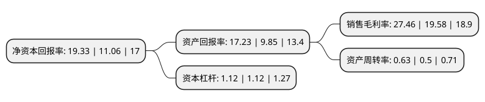

> 本页面由自动化程序生成于 2022年5月20日 01:36
> 内容可能存在错误，如有bug请提交issue至：https://github.com/Eroleice/doc-pi/issues
{.is-warning}

# 上市公司基本情况

## 基本资料

北京兆易创新科技股份有限公司（以下简称“兆易创新”）成立于2005年04月06日，北京市。于2016年08月18日在上交所主板上市。

兆易创新注册资本66,746.71万元，公司主营业务为闪存芯片及其衍生产品的研发，技术支持和销售。公司的主要产品为闪存芯片，具体为串行的代码型闪存芯片。以下是详细信息：

- 公司名称: 北京兆易创新科技股份有限公司
- 股票代码: 603986.SH
- 所在地: 北京 - 北京市
- 成立日期: 2005年04月06日
- 注册资本: 66,746.71万元
- 法定代表人: 何卫
- 主营业务: 公司主营业务为闪存芯片及其衍生产品的研发，技术支持和销售公司的主要产品为闪存芯片，具体为串行的代码型闪存芯片
- 公司官网: www.gigadevice.com
- 公司介绍: 公司成立于2005年4月，是一家以中国为总部的全球化芯片设计公司。公司致力于各类存储器、控制器及周边产品的设计研发，已通过SGS ISO9001及ISO14001等管理体系的认证，在上海、合肥、中国香港设有全资子公司、在深圳设有分公司，在中国台湾地区设有办事处，并在韩国、美国、日本等地通过产品分销商为客户提供优质便捷的本地化服务。公司核心管理团队由来自世界各地的高级管理人员组成，每一位都曾在硅谷、韩国、台湾等各地著名IC企业工作多年，有着丰富的研发及管理经验。公司产品为NOR Flash、NAND Flash及MCU，广泛应用于手持移动终端、消费类电子产品、个人电脑及周边、网络、电信设备、医疗设备、办公设备、汽车电子及工业控制设备等各个领域。公司先后被评为“重大科技成果产业化突出贡献单位”、“创新型试点企业”。

## 股东及高管情况

上市公司第一大股东为朱一明，持股45,758,013股，占比6.86%，**疑似为**上市公司实际控制人。

截至2022年03月31日，上市公司的前十大股东中，共有2名自然人股东，2名机构股东，3个产品账户，3个海外主体，其中5%以上大股东共有2名。上市公司前十大股东明细如下：

> 未能通过持股比例判定出上市公司实际控制人（持股30%以上）
> 可能存在通过间接持股、联合持股、协议控制等方式拥有实际控制权的主体，具体请参考上市公司定期公告！
{.is-warning}

> 上市公司第一大股东持股不超过10%，请检查是否存在公司控制权风险！
{.is-danger}

> 截至2022年03月31日，上市公司前十大股东信息如下：

| 股东名称 | 持股数量（股） | 持股比例 |
| --- | --- | --- |
| 朱一明 | 45,758,013 | 6.86% |
| 香港中央结算有限公司(陆股通) | 34,580,301 | 5.18% |
| InfoGrid Limited | 24,954,400 | 3.74% |
| 聯意(香港)有限公司 | 21,994,220 | 3.3% |
| 葛卫东 | 21,911,707 | 3.28% |
| 国家集成电路产业投资基金股份有限公司 | 20,786,021 | 3.11% |
| 中国工商银行股份有限公司-诺安成长股票型证券投资基金 | 16,418,750 | 2.46% |
| 讯安投资有限公司 | 11,498,187 | 1.72% |
| GIC PRIVATE LIMITED | 10,232,736 | 1.53% |
| 中国建设银行股份有限公司-华夏国证半导体芯片交易型开放式指数证券投资基金 | 9,704,234 | 1.45% |

## 利润表分析

上市公司2021年总收入为85.1亿元，净利润为23.36亿元，实现盈利。

## 杜邦分析

> 数据列示周期：2021年 | 2020年 | 2019年
{.is-info}

上市公司的净资产收益率在近一年有所上升，上升幅度为74.77%，其变化情况分解如下：
- 上市公司的销售毛利率在近一年上升了40.25%，可能是生产效率的提升、商品原材料价格下跌或商品价格的上涨所致。
- 上市公司的资产周转率在近一年上升了26%，可能是源自于更快的销售回款或库存管理效果提升。
- 上市公司的财务杠杆比率在近一年下降了0%，可能是减少负债降低财务费用。

