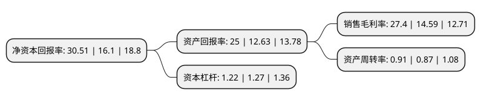

> 本页面由自动化程序生成于 2022年5月20日 01:36
> 内容可能存在错误，如有bug请提交issue至：https://github.com/Eroleice/doc-pi/issues
{.is-warning}

# 上市公司基本情况

## 基本资料

无锡新洁能股份有限公司（以下简称“新洁能”）成立于2013年01月05日，无锡市。于2020年09月28日在上交所主板上市。

新洁能注册资本14,282.1万元，公司主要从事MOSFET，IGBT等半导体功率器件的研发，设计及销售。以下是详细信息：

- 公司名称: 无锡新洁能股份有限公司
- 股票代码: 605111.SH
- 所在地: 江苏 - 无锡市
- 成立日期: 2013年01月05日
- 注册资本: 14,282.1万元
- 法定代表人: 朱袁正
- 主营业务: 公司主要从事MOSFET，IGBT等半导体功率器件的研发，设计及销售
- 公司官网: www.ncepower.com
- 公司介绍: 公司为国内半导体功率器件设计龙头企业之一，在中国半导体行业协会发布的2016年及2017年中国半导体功率器件企业排行榜中，公司均名列“中国半导体功率器件十强企业”。公司是江苏省科技厅、财政厅、国税局、地税局联合认定的高新技术企业，且为中国半导体行业协会会员、中国电源学会理事单位。公司的主营业务为MOSFET等分立器件的研发和销售，公司销售的产品按照是否封装可以分为晶圆片和封装成品。公司目前已经形成沟槽型功率MOSFET(中低压)、超结功率MOSFET(高)两类主要产品系列，以及屏蔽栅沟槽型功率MOSFET(SGT)(中低压)、绝缘栅双极型晶体管(IGBT)和功率模块等新产品系列。公司目前拥有约500种型号的细分产品，产品广泛应用于消费电子、汽车电子、变频家电、新能源汽车及充电桩、LED等领域。公司各类产品的区别主要体现是产品在不同的电压平台下，使用合理及先进的设计技术和制造技术来实现功率器件低导通损耗与低开关损耗，从而提升能源转换效率。

## 股东及高管情况

上市公司第一大股东为朱袁正，持股33,062,400股，占比23.15%，**疑似为**上市公司实际控制人。

截至2022年03月31日，上市公司的前十大股东中，共有2名自然人股东，3名机构股东，5个产品账户，其中5%以上大股东共有1名。上市公司前十大股东明细如下：

> 未能通过持股比例判定出上市公司实际控制人（持股30%以上）
> 可能存在通过间接持股、联合持股、协议控制等方式拥有实际控制权的主体，具体请参考上市公司定期公告！
{.is-warning}

> 截至2022年03月31日，上市公司前十大股东信息如下：

| 股东名称 | 持股数量（股） | 持股比例 |
| --- | --- | --- |
| 朱袁正 | 33,062,400 | 23.15% |
| 上海贝岭股份有限公司 | 7,140,950 | 5% |
| 无锡国联创投基金企业(有限合伙) | 4,122,000 | 2.89% |
| 无锡金投控股有限公司 | 3,881,340 | 2.72% |
| 施罗德投资管理(香港)有限公司-施罗德环球基金系列中国A股(交易所) | 2,889,263 | 2.02% |
| 上海睿扬投资管理有限公司-睿扬新兴成长私募证券投资基金 | 2,600,000 | 1.82% |
| 上海金浦新兴产业股权投资基金合伙企业(有限合伙) | 2,501,391 | 1.75% |
| 珠海横琴锋晟投资企业(有限合伙) | 2,017,600 | 1.41% |
| 朱进强 | 1,925,000 | 1.35% |
| 深圳市达晨创联股权投资基金合伙企业(有限合伙) | 1,897,000 | 1.33% |

## 利润表分析

上市公司2021年总收入为14.98亿元，净利润为4.1亿元，实现盈利。

## 杜邦分析

> 数据列示周期：2021年 | 2020年 | 2019年
{.is-info}

上市公司的净资产收益率在近一年有所上升，上升幅度为89.5%，其变化情况分解如下：
- 上市公司的销售毛利率在近一年上升了87.8%，可能是生产效率的提升、商品原材料价格下跌或商品价格的上涨所致。
- 上市公司的资产周转率在近一年上升了4.6%，可能是源自于更快的销售回款或库存管理效果提升。
- 上市公司的财务杠杆比率在近一年下降了-3.94%，可能是减少负债降低财务费用。

