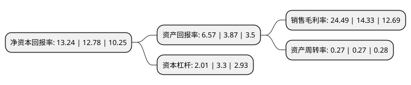

> 本页面由自动化程序生成于 2022年5月20日 01:37
> 内容可能存在错误，如有bug请提交issue至：https://github.com/Eroleice/doc-pi/issues
{.is-warning}

# 上市公司基本情况

## 基本资料

杭州立昂微电子股份有限公司（以下简称“立昂微”）成立于2002年03月19日，杭州市。于2020年09月11日在上交所主板上市。

立昂微注册资本45,732.997万元，公司的主营业务为半导体硅片和半导体分立器件芯片的研发，生产和销售，以及半导体分立器件成品的生产和销售。主要从事半导体分立器件业务，半导体分立器件芯片主要产品包括肖特基二极管芯片，MOSFET芯片等;半导体分立器件主要产品为肖特基二极管。以下是详细信息：

- 公司名称: 杭州立昂微电子股份有限公司
- 股票代码: 605358.SH
- 所在地: 浙江 - 杭州市
- 成立日期: 2002年03月19日
- 注册资本: 45,732.997万元
- 法定代表人: 王敏文
- 主营业务: 公司的主营业务为半导体硅片和半导体分立器件芯片的研发，生产和销售，以及半导体分立器件成品的生产和销售主要从事半导体分立器件业务，半导体分立器件芯片主要产品包括肖特基二极管芯片，MOSFET芯片等;半导体分立器件主要产品为肖特基二极管
- 公司官网: www.li-on.com
- 公司介绍: 公司设立以来，始终专注于半导体材料、半导体芯片及相关产品的研发及制造领域。经过多年的发展，公司不仅在半导体硅片、半导体分立器件芯片及分立器件成品方面已经形成了自身的主打产品；同时，公司还坚持不懈的进行技术研发投入，通过承担国家科技重大专项、引进高端技术人才等多种方式，在半导体材料及芯片领域不断加强自身的研发实力与技术积累。公司先后承担并成功完成了科技部国家863计划、国家火炬计划、国家发改委高技术产业化示范工程、信息产业技术进步与产业升级专项等国家重大科研项目。此外，公司及其子公司多次荣获中国半导体创新产品和技术奖、浙江省技术发明一等奖等重要奖项。

## 股东及高管情况

上市公司第一大股东为王敏文，持股79,615,720股，占比17.41%，**疑似为**上市公司实际控制人。

截至2022年03月31日，上市公司的前十大股东中，共有6名自然人股东，3名机构股东，1个产品账户，其中5%以上大股东共有3名。上市公司前十大股东明细如下：

> 未能通过持股比例判定出上市公司实际控制人（持股30%以上）
> 可能存在通过间接持股、联合持股、协议控制等方式拥有实际控制权的主体，具体请参考上市公司定期公告！
{.is-warning}

> 截至2022年03月31日，上市公司前十大股东信息如下：

| 股东名称 | 持股数量（股） | 持股比例 |
| --- | --- | --- |
| 王敏文 | 79,615,720 | 17.41% |
| 宁波利时信息科技有限公司 | 27,328,800 | 5.98% |
| 仙游泓祥企业管理合伙企业(有限合伙) | 26,998,800 | 5.9% |
| 国投创业投资管理有限公司-国投高新(深圳)创业投资基金(有限合伙) | 13,884,478 | 3.04% |
| 仙游泓万企业管理合伙企业(有限合伙) | 8,289,107 | 1.81% |
| 王式跃 | 6,697,484 | 1.46% |
| 陈卫忠 | 6,595,000 | 1.44% |
| 徐国强 | 6,275,009 | 1.37% |
| 田达晰 | 6,100,339 | 1.33% |
| 韦中总 | 6,073,486 | 1.33% |

## 利润表分析

上市公司2021年总收入为25.4亿元，净利润为6.22亿元，实现盈利。

## 杜邦分析

> 数据列示周期：2021年 | 2020年 | 2019年
{.is-info}

上市公司的净资产收益率在近一年有所上升，上升幅度为3.6%，其变化情况分解如下：
- 上市公司的销售毛利率在近一年上升了70.9%，可能是生产效率的提升、商品原材料价格下跌或商品价格的上涨所致。
- 上市公司的资产周转率在近一年下降了0%，可能是源自于更慢的销售回款或库存管理效果下降。
- 上市公司的财务杠杆比率在近一年下降了-39.09%，可能是减少负债降低财务费用。

