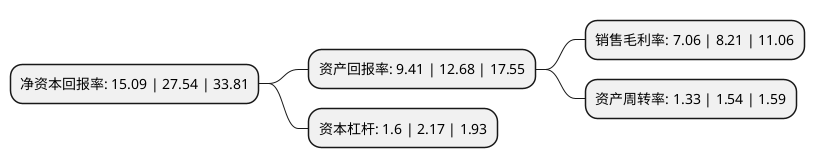

> 本页面由自动化程序生成于 2022年5月20日 01:37
> 内容可能存在错误，如有bug请提交issue至：https://github.com/Eroleice/doc-pi/issues
{.is-warning}

# 上市公司基本情况

## 基本资料

南京冠石科技股份有限公司（以下简称“冠石科技”）成立于2002年01月18日，南京市。于2021年08月12日在上交所主板上市。

冠石科技注册资本7,309.956万元，产品主要包括半导体显示器件及特种胶粘材料两大系列。主营业务为半导体显示器件及特种胶粘材料的研发，生产和销售。以下是详细信息：

- 公司名称: 南京冠石科技股份有限公司
- 股票代码: 605588.SH
- 所在地: 江苏 - 南京市
- 成立日期: 2002年01月18日
- 注册资本: 7,309.956万元
- 法定代表人: 张建巍
- 主营业务: 产品主要包括半导体显示器件及特种胶粘材料两大系列主营业务为半导体显示器件及特种胶粘材料的研发，生产和销售
- 公司官网: www.njkeystone.com
- 公司介绍: 公司主营业务为半导体显示器件及特种胶粘材料的研发、生产和销售，其中半导体显示器件包括偏光片、功能性器件、信号连接器、液晶面板、生产辅耗材及OCA光学胶等，主要应用于液晶电视、智能手机、平板电脑、笔记本电脑、智能穿戴等带有显示屏幕的消费电子产品；特种胶粘材料包括胶带、搭扣、泡棉、保护膜、标签等各类产品，主要应用于工业、轨道交通及汽车行业。公司已与京东方、中电熊猫、彩虹光电、LG、富士康、华星光电、维信诺等国内外显示面板制造龙头企业建立了良好的合作关系，产品最终应用于华为、小米、OPPO、VIVO、海信、创维、苹果、三星等知名消费电子品牌商的畅销机型。

## 股东及高管情况

上市公司第一大股东为张建巍，持股45,833,333股，占比62.7%，为上市公司实际控制人。

截至2022年03月31日，上市公司的前十大股东中，共有5名自然人股东，5名机构股东，其中5%以上大股东共有1名。上市公司前十大股东明细如下：

> 截至2022年03月31日，上市公司前十大股东信息如下：

| 股东名称 | 持股数量（股） | 持股比例 |
| --- | --- | --- |
| 张建巍 | 45,833,333 | 62.7% |
| 镇江冠翔企业管理中心(有限合伙) | 2,250,000 | 3.08% |
| 上海祥禾涌原股权投资合伙企业(有限合伙) | 1,644,737 | 2.25% |
| 门芳芳 | 1,416,667 | 1.94% |
| 上海涌济铧创股权投资合伙企业(有限合伙) | 1,096,491 | 1.5% |
| 宁波梅山保税港区涌杰股权投资合伙企业(有限合伙) | 1,096,491 | 1.5% |
| 宁波泷新股权投资合伙企业(有限合伙) | 986,842 | 1.35% |
| 王顺利 | 500,000 | 0.68% |
| 任伟 | 479,400 | 0.66% |
| 刘津海 | 87,100 | 0.12% |

## 利润表分析

上市公司2021年总收入为13.96亿元，净利润为0.98亿元，实现盈利。

## 杜邦分析

> 数据列示周期：2021年 | 2020年 | 2019年
{.is-info}

上市公司的净资产收益率在近一年有所下降，下降幅度为-45.21%，其变化情况分解如下：
- 上市公司的销售毛利率在近一年下降了-14.01%，可能是生产效率的下降、商品原材料价格上涨或商品价格的下跌所致。
- 上市公司的资产周转率在近一年下降了-13.64%，可能是源自于更慢的销售回款或库存管理效果下降。
- 上市公司的财务杠杆比率在近一年下降了-26.27%，可能是减少负债降低财务费用。

