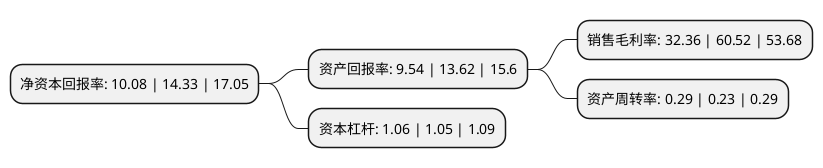

> 本页面由自动化程序生成于 2022年5月20日 01:37
> 内容可能存在错误，如有bug请提交issue至：https://github.com/Eroleice/doc-pi/issues
{.is-warning}

# 上市公司基本情况

## 基本资料

澜起科技股份有限公司（以下简称“澜起科技”）成立于2004年05月27日，上海市。于2019年07月22日在上交所科创板上市。

澜起科技注册资本113,282.411万元，本公司的主营业务是为云计算和人工智能领域提供以芯片为基础的解决方案，目前主要产品包括内存接口芯片，津逮服务器CPU以及混合安全内存模组。经过多年的研发积累，公司产品性能在行业内赢得高度认可，包含公司产品的服务器广泛应用于数据中心，云计算和人工智能等诸多领域，满足了新一代服务器对高性能，高可靠性和高安全性的需求。以下是详细信息：

- 公司名称: 澜起科技股份有限公司
- 股票代码: 688008.SH
- 所在地: 上海 - 上海市
- 成立日期: 2004年05月27日
- 注册资本: 113,282.411万元
- 法定代表人: 杨崇和
- 主营业务: 本公司的主营业务是为云计算和人工智能领域提供以芯片为基础的解决方案，目前主要产品包括内存接口芯片，津逮服务器CPU以及混合安全内存模组经过多年的研发积累，公司产品性能在行业内赢得高度认可，包含公司产品的服务器广泛应用于数据中心，云计算和人工智能等诸多领域，满足了新一代服务器对高性能，高可靠性和高安全性的需求
- 公司官网: www.montage-tech.com/cn
- 公司介绍: 公司是业界领先的集成电路设计公司，为全球仅有的3家内存接口芯片供应商之一。主要经营模式为Fabless模式，在该模式下企业仅需专注于从事产业链中的集成电路设计和营销环节，其余委托代工完成；由公司取得测试芯片成品销售给客户。公司的主营业务是为云计算和人工智能领域提提供以芯片为基础的解决方案，目前主要产品包括内存接口，津逮服务器CPU以及混合安全内存模组。公司发明的DDR4全缓冲“1+9”架构被采纳为国际标准。现已成为全球可提供从DDR2到DDR4内存全缓冲/半缓冲完整解决方案的主要供应商之一，在内存接口芯片市场位列全球前二。

## 股东及高管情况

上市公司第一大股东为中国电子投资控股有限公司，持股161,716,775股，占比14.2755%，**疑似为**上市公司实际控制人。

截至2022年03月31日，上市公司的前十大股东中，共有5名机构股东，1个产品账户，4个海外主体，其中5%以上大股东共有4名。上市公司前十大股东明细如下：

> 未能通过持股比例判定出上市公司实际控制人（持股30%以上）
> 可能存在通过间接持股、联合持股、协议控制等方式拥有实际控制权的主体，具体请参考上市公司定期公告！
{.is-warning}

> 截至2022年03月31日，上市公司前十大股东信息如下：

| 股东名称 | 持股数量（股） | 持股比例 |
| --- | --- | --- |
| 中国电子投资控股有限公司 | 161,716,775 | 14.2755% |
| INTEL CAPITAL CORPORATION | 101,683,250 | 8.9761% |
| WLT Partners, L.P. | 87,816,687 | 7.752% |
| 珠海融英股权投资合伙企业(有限合伙) | 69,265,238 | 6.1144% |
| 上海临理投资合伙企业(有限合伙) | 53,506,750 | 4.7233% |
| 上海齐银股权投资基金管理有限公司-嘉兴宏越投资合伙企业(有限合伙) | 44,247,750 | 3.906% |
| Xinyun Capital Fund I, L.P. | 44,247,750 | 3.906% |
| 香港中央结算有限公司(陆股通) | 24,645,291 | 2.1756% |
| 嘉兴中电朝云投资管理有限公司-嘉兴芯电投资合伙企业(有限合伙) | 21,128,300 | 1.8651% |
| 宁波梅山保税港区宏燚投资管理有限公司-嘉兴莫奈股权投资合伙企业(有限合伙) | 20,634,525 | 1.8215% |

## 利润表分析

上市公司2021年总收入为25.62亿元，净利润为8.29亿元，实现盈利。

## 杜邦分析

> 数据列示周期：2021年 | 2020年 | 2019年
{.is-info}

上市公司的净资产收益率在近一年有所下降，下降幅度为-29.66%，其变化情况分解如下：
- 上市公司的销售毛利率在近一年下降了-46.53%，可能是生产效率的下降、商品原材料价格上涨或商品价格的下跌所致。
- 上市公司的资产周转率在近一年上升了26.09%，可能是源自于更快的销售回款或库存管理效果提升。
- 上市公司的财务杠杆比率在近一年上升了0.95%，可能是增加负债扩大生产规模。

