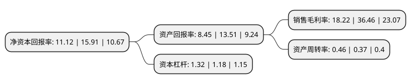

> 本页面由自动化程序生成于 2022年5月20日 01:37
> 内容可能存在错误，如有bug请提交issue至：https://github.com/Eroleice/doc-pi/issues
{.is-warning}

# 上市公司基本情况

## 基本资料

安集微电子科技(上海)股份有限公司（以下简称“安集科技”）成立于2006年02月07日，上海市。于2019年07月22日在上交所科创板上市。

安集科技注册资本5,322.058万元，公司主营业务为关键半导体材料的研发和产业化，目前产品包括不同系列的化学机械抛光液和光刻胶去除剂。以下是详细信息：

- 公司名称: 安集微电子科技(上海)股份有限公司
- 股票代码: 688019.SH
- 所在地: 上海 - 上海市
- 成立日期: 2006年02月07日
- 注册资本: 5,322.058万元
- 法定代表人: Shumin Wang
- 主营业务: 公司主营业务为关键半导体材料的研发和产业化，目前产品包括不同系列的化学机械抛光液和光刻胶去除剂
- 公司官网: www.anjimicro.com
- 公司介绍: 公司是一家集研发、生产、销售、服务为一体的自主创新型高科技微电子材料企业，主营业务为关键半导体材料的研发和产业化。公司产品包括不同系列的化学机械抛光液和光刻胶去除剂，主要应用于集成电路制造和先进封装领域。公司主要采用直接面对终端客户的直销模式，当产品通过客户评价和测试后，生产部门再根据客户订单制定量产计划。公司成功打破了国外厂商对集成电路领域化学机械抛光液的垄断，实现了进口替代，在半导体材料行业取得了一定的市场份额和品牌知名度。公司拥有一系列具有自主知识产权的核心技术，涵盖了整个产品配方及工艺流程，并通过有效的管理降低了产品成本，从而可以给客户提供高性价比的产品。同时公司通过提供本土化、定制化、一体化的服务积累了众多优质客户资源，包括中芯国际、台积电等行业领先的集成电路制造商。

## 股东及高管情况

上市公司第一大股东为Anji Microelectronics Co., Ltd.，持股22,560,328股，占比42.39%，为上市公司实际控制人。

截至2022年03月31日，上市公司的前十大股东中，共有2名机构股东，6个产品账户，2个海外主体，其中5%以上大股东共有2名。上市公司前十大股东明细如下：

> 截至2022年03月31日，上市公司前十大股东信息如下：

| 股东名称 | 持股数量（股） | 持股比例 |
| --- | --- | --- |
| Anji Microelectronics Co., Ltd. | 22,560,328 | 42.39% |
| 国家集成电路产业投资基金股份有限公司 | 4,418,258 | 8.3% |
| 上海大辰科技投资有限公司 | 1,482,028 | 2.78% |
| 香港中央结算有限公司(陆股通) | 855,961 | 1.61% |
| 苏州中和春生三号投资中心(有限合伙) | 793,100 | 1.49% |
| 宁波银行股份有限公司-景顺长城成长龙头一年持有期混合型证券投资基金 | 709,182 | 1.33% |
| 全国社保基金一一五组合 | 680,000 | 1.28% |
| 中国建设银行股份有限公司-广发成长精选混合型证券投资基金 | 600,043 | 1.13% |
| 中国建设银行股份有限公司-景顺长城环保优势股票型证券投资基金 | 584,076 | 1.1% |
| 中国银行股份有限公司-景顺长城优选混合型证券投资基金 | 566,242 | 1.06% |

## 利润表分析

上市公司2021年总收入为6.86亿元，净利润为1.25亿元，实现盈利。

## 杜邦分析

> 数据列示周期：2021年 | 2020年 | 2019年
{.is-info}

上市公司的净资产收益率在近一年有所下降，下降幅度为-30.11%，其变化情况分解如下：
- 上市公司的销售毛利率在近一年下降了-50.03%，可能是生产效率的下降、商品原材料价格上涨或商品价格的下跌所致。
- 上市公司的资产周转率在近一年上升了24.32%，可能是源自于更快的销售回款或库存管理效果提升。
- 上市公司的财务杠杆比率在近一年上升了11.86%，可能是增加负债扩大生产规模。

