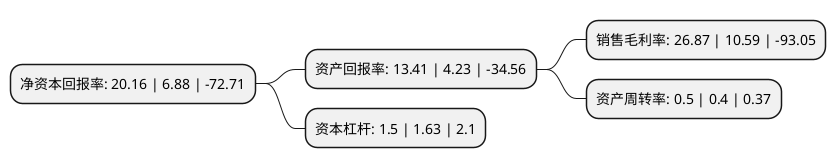

> 本页面由自动化程序生成于 2022年5月20日 01:37
> 内容可能存在错误，如有bug请提交issue至：https://github.com/Eroleice/doc-pi/issues
{.is-warning}

# 上市公司基本情况

## 基本资料

苏州长光华芯光电技术股份有限公司（以下简称“长光华芯”）成立于2012年03月06日，苏州市。于2022年04月01日在上交所科创板上市。

长光华芯注册资本10,169.996万元，主营业务是半导体激光芯片的研发，设计及制造，主要产品包括高功率单管系列产品，高功率巴条系列产品，高效率VCSEL系列产品及光通信芯片系列产品等以下是详细信息：

- 公司名称: 苏州长光华芯光电技术股份有限公司
- 股票代码: 688048.SH
- 所在地: 江苏 - 苏州市
- 成立日期: 2012年03月06日
- 注册资本: 10,169.996万元
- 法定代表人: 闵大勇
- 主营业务: 主营业务是半导体激光芯片的研发，设计及制造，主要产品包括高功率单管系列产品，高功率巴条系列产品，高效率VCSEL系列产品及光通信芯片系列产品等
- 公司官网: www.everbrightphotonics.com
- 公司介绍: 公司聚焦半导体激光行业，始终专注于半导体激光芯片的研发、设计及制造公司紧跟下游市场发展趋势，不断开发具有领先性的产品、创新优化生产制造工艺、布局建设生产线，已形成由半导体激光芯片、器件、模块及直接半导体激光器构成的四大类、多系列产品矩阵，为半导体激光行业的垂直产业链公司。公司系半导体激光行业全球少数具备高功率激光芯片量产能力的企业之一，打破了我国激光行业上游核心环节半导体激光芯片依赖国外进口的局面。自设立以来，公司独立承担、牵头主持或参与国家科技部“十三五”国家重点研发计划项目等众多国家级科技攻关项目，设立了国家级博士后工作站、江苏省博士后创新实践基地、江苏省工程技术中心、江苏省研究生工作站及苏州市工程技术中心等。

## 股东及高管情况

上市公司第一大股东为苏州华丰投资中心(有限合伙)，持股24,930,000股，占比18.38%，**疑似为**上市公司实际控制人。

截至2022年04月01日，上市公司的前十大股东中，共有7名机构股东，3个产品账户，其中5%以上大股东共有4名。上市公司前十大股东明细如下：

> 未能通过持股比例判定出上市公司实际控制人（持股30%以上）
> 可能存在通过间接持股、联合持股、协议控制等方式拥有实际控制权的主体，具体请参考上市公司定期公告！
{.is-warning}

> 截至2022年04月01日，上市公司前十大股东信息如下：

| 股东名称 | 持股数量（股） | 持股比例 |
| --- | --- | --- |
| 苏州华丰投资中心(有限合伙) | 24,930,000 | 18.38% |
| 苏州英镭企业管理合伙企业(有限合伙) | 20,100,000 | 14.82% |
| 长春长光精密仪器集团有限公司 | 8,870,000 | 6.54% |
| 国投(上海)创业投资管理有限公司-国投(上海)科技成果转化创业投资基金企业(有限合伙) | 8,015,294 | 5.91% |
| 伊犁苏新投资基金合伙企业(有限合伙) | 6,624,946 | 4.89% |
| 武汉达润投资管理有限公司-宁波璞玉股权投资合伙企业(有限合伙) | 6,540,000 | 4.82% |
| 哈勃科技投资有限公司 | 5,065,004 | 3.74% |
| 中科院创业投资管理有限公司-中科院科技成果转化创业投资基金(武汉)合伙企业(有限合伙) | 5,009,559 | 3.69% |
| 武汉东湖华科创业投资中心(有限合伙) | 4,690,000 | 3.46% |
| 武汉达润投资管理有限公司-宁波梅山保税港区达润长光股权投资合伙企业(有限合伙) | 3,000,000 | 2.21% |

## 利润表分析

上市公司2021年总收入为4.29亿元，净利润为1.15亿元，实现盈利。

## 杜邦分析

> 数据列示周期：2021年 | 2020年 | 2019年
{.is-info}

上市公司的净资产收益率在近一年有所上升，上升幅度为193.02%，其变化情况分解如下：
- 上市公司的销售毛利率在近一年上升了153.73%，可能是生产效率的提升、商品原材料价格下跌或商品价格的上涨所致。
- 上市公司的资产周转率在近一年上升了25%，可能是源自于更快的销售回款或库存管理效果提升。
- 上市公司的财务杠杆比率在近一年下降了-7.98%，可能是减少负债降低财务费用。

