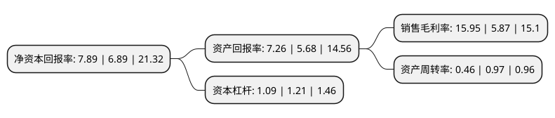

> 本页面由自动化程序生成于 2022年5月20日 01:37
> 内容可能存在错误，如有bug请提交issue至：https://github.com/Eroleice/doc-pi/issues
{.is-warning}

# 上市公司基本情况

## 基本资料

炬芯科技股份有限公司（以下简称“炬芯科技”）成立于2014年06月05日，珠海市。于2021年11月29日在上交所科创板上市。

炬芯科技注册资本12,200万元，中高端智能音频SoC芯片的研发，设计及销售，专注于为无线音频，智能穿戴及智能交互等智慧物联网领域提供专业集成芯片。以下是详细信息：

- 公司名称: 炬芯科技股份有限公司
- 股票代码: 688049.SH
- 所在地: 广东 - 珠海市
- 成立日期: 2014年06月05日
- 注册资本: 12,200万元
- 法定代表人: ZHOU ZHENYU
- 主营业务: 中高端智能音频SoC芯片的研发，设计及销售，专注于为无线音频，智能穿戴及智能交互等智慧物联网领域提供专业集成芯片
- 公司官网: www.actions-semi.com
- 公司介绍: 公司是中国领先的低功耗系统级芯片设计厂商，主营业务为中高端智能音频SoC芯片的研发、设计及销售，专注于为无线音频、智能穿戴及智能交互等智慧物联网领域提供专业集成芯片。公司的主要产品为蓝牙音频SoC芯片系列、便携式音视频SoC芯片系列、智能语音交互SoC芯片系列等，广泛应用于蓝牙音箱、蓝牙耳机、蓝牙语音遥控器、蓝牙收发一体器、智能教育、智能办公、智能家居等领域。公司的智能音频SoC芯片产品占据我国市场重要地位，已成为和音频相关的低功耗无线物联网领域的主流供应商，并已逐步实现相关芯片领域的国产替代，产品已进入的主要终端品牌包括华为、哈曼、SONY、安克创新、罗技、OPPO、小米、传音、飞利浦、漫步者、联想、纽曼、魅族等，并在阿里巴巴、网易和酷我等互联网公司的音频产品中得到应用。公司是中国领先的低功耗系统级芯片设计厂商，主营业务为中高端智能音频SoC芯片的研发、设计及销售，主要产品为蓝牙音频SoC芯片系列、便携式音视频SoC芯片系列、智能语音交互SoC芯片系列，主要服务于国内外品牌客户。

## 股东及高管情况

上市公司第一大股东为珠海瑞昇投资合伙企业(有限合伙)，持股28,223,600股，占比23.13%，**疑似为**上市公司实际控制人。

截至2022年03月31日，上市公司的前十大股东中，共有10名机构股东，其中5%以上大股东共有1名。上市公司前十大股东明细如下：

> 未能通过持股比例判定出上市公司实际控制人（持股30%以上）
> 可能存在通过间接持股、联合持股、协议控制等方式拥有实际控制权的主体，具体请参考上市公司定期公告！
{.is-warning}

> 截至2022年03月31日，上市公司前十大股东信息如下：

| 股东名称 | 持股数量（股） | 持股比例 |
| --- | --- | --- |
| 珠海瑞昇投资合伙企业(有限合伙) | 28,223,600 | 23.13% |
| 珠海炬佳投资合伙企业(有限合伙) | 4,629,400 | 3.79% |
| 珠海横琴安创领睿股权投资合伙企业(有限合伙) | 4,552,000 | 3.73% |
| 珠海炬上仁投资合伙企业(有限合伙) | 4,118,180 | 3.38% |
| 珠海炬上吉投资合伙企业(有限合伙) | 4,054,480 | 3.32% |
| 珠海炬上益投资合伙企业(有限合伙) | 4,021,930 | 3.3% |
| 珠海威元投资合伙企业(有限合伙) | 3,723,000 | 3.05% |
| 华芯原创(青岛)投资管理有限公司-合肥华芯成长五期股权投资合伙企业(有限合伙) | 3,696,000 | 3.03% |
| 珠海景昇投资合伙企业(有限合伙) | 3,566,000 | 2.92% |
| 珠海铭协投资合伙企业(有限合伙) | 3,538,000 | 2.9% |

## 利润表分析

上市公司2021年总收入为5.26亿元，净利润为0.83亿元，实现盈利。

## 杜邦分析

> 数据列示周期：2021年 | 2020年 | 2019年
{.is-info}

上市公司的净资产收益率在近一年有所上升，上升幅度为14.51%，其变化情况分解如下：
- 上市公司的销售毛利率在近一年上升了171.72%，可能是生产效率的提升、商品原材料价格下跌或商品价格的上涨所致。
- 上市公司的资产周转率在近一年下降了-52.58%，可能是源自于更慢的销售回款或库存管理效果下降。
- 上市公司的财务杠杆比率在近一年下降了-9.92%，可能是减少负债降低财务费用。

