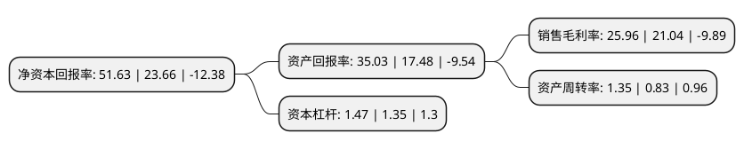

> 本页面由自动化程序生成于 2022年5月20日 01:37
> 内容可能存在错误，如有bug请提交issue至：https://github.com/Eroleice/doc-pi/issues
{.is-warning}

## 股东及高管情况

上市公司第一大股东为盛云，持股10,308,600股，占比10.2%，**疑似为**上市公司实际控制人。

截至2022年04月22日，上市公司的前十大股东中，共有2名自然人股东，6名机构股东，2个产品账户，其中5%以上大股东共有2名。上市公司前十大股东明细如下：

> 未能通过持股比例判定出上市公司实际控制人（持股30%以上）
> 可能存在通过间接持股、联合持股、协议控制等方式拥有实际控制权的主体，具体请参考上市公司定期公告！
{.is-warning}

> 截至2022年04月22日，上市公司前十大股东信息如下：

| 股东名称 | 持股数量（股） | 持股比例 |
| --- | --- | --- |
| 盛云 | 10,308,600 | 10.2% |
| 苏州国润瑞祺创业投资企业(有限合伙) | 8,627,445 | 8.54% |
| 苏州瑞矽信息咨询合伙企业(有限合伙) | 4,662,000 | 4.61% |
| 王一峰 | 3,868,200 | 3.83% |
| 深圳市慧悦成长投资基金企业(有限合伙) | 3,818,700 | 3.78% |
| 光大证券股份有限公司 | 3,381,527 | 3.35% |
| 苏州纳芯壹号信息咨询合伙企业(有限合伙) | 2,773,800 | 2.74% |
| 深圳市上云传感投资合伙企业(有限合伙) | 2,653,200 | 2.63% |
| 上海物联网二期创业投资基金合伙企业(有限合伙) | 2,250,000 | 2.23% |
| 苏州华业致远一号创业投资合伙企业(有限合伙) | 2,250,000 | 2.23% |

## 利润表分析

上市公司2021年总收入为8.62亿元，净利润为2.2亿元，实现盈利。

## 杜邦分析

> 数据列示周期：2021年 | 2020年 | 2019年
{.is-info}

上市公司的净资产收益率在近一年有所上升，上升幅度为118.22%，其变化情况分解如下：
- 上市公司的销售毛利率在近一年上升了23.38%，可能是生产效率的提升、商品原材料价格下跌或商品价格的上涨所致。
- 上市公司的资产周转率在近一年上升了62.65%，可能是源自于更快的销售回款或库存管理效果提升。
- 上市公司的财务杠杆比率在近一年上升了8.89%，可能是增加负债扩大生产规模。

