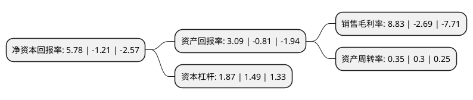

> 本页面由自动化程序生成于 2022年5月20日 01:37
> 内容可能存在错误，如有bug请提交issue至：https://github.com/Eroleice/doc-pi/issues
{.is-warning}

## 股东及高管情况

上市公司第一大股东为国投(上海)科技成果转化创业投资基金企业(有限合伙)，持股17,297,297股，占比13.676%，**疑似为**上市公司实际控制人。

截至2022年04月20日，上市公司的前十大股东中，共有5名机构股东，5个产品账户，其中5%以上大股东共有2名。上市公司前十大股东明细如下：

> 未能通过持股比例判定出上市公司实际控制人（持股30%以上）
> 可能存在通过间接持股、联合持股、协议控制等方式拥有实际控制权的主体，具体请参考上市公司定期公告！
{.is-warning}

> 截至2022年04月20日，上市公司前十大股东信息如下：

| 股东名称 | 持股数量（股） | 持股比例 |
| --- | --- | --- |
| 国投(上海)科技成果转化创业投资基金企业(有限合伙) | 17,297,297 | 13.676% |
| 中微半导体设备(上海)股份有限公司 | 10,622,547 | 8.4% |
| 青岛润扬嘉禾投资合伙企业(有限合伙) | 6,233,158 | 4.9282% |
| 拓荆科技股份有限公司未确认持有人证券专用账户 | 3,250,297 | 2.57% |
| 中国科学院沈阳科学仪器股份有限公司 | 3,000,000 | 2.37% |
| 沈阳信息产业创业投资有限公司 | 2,970,297 | 2.3485% |
| 苏州聚源东方投资基金中心(有限合伙) | 1,800,180 | 1.42% |
| 中车国华(青岛)股权投资合伙企业(有限合伙) | 1,621,622 | 1.2821% |
| 中车资本(天津)股权投资基金管理有限公司-中车国华(青岛)股权投资合伙企业(有限合伙) | 1,621,622 | 1.28% |
| 盐城经济技术开发区燕舞半导体产业基金(有限合伙) | 1,500,000 | 1.186% |

## 利润表分析

上市公司2021年总收入为7.57亿元，净利润为0.66亿元，实现盈利。

## 杜邦分析

> 数据列示周期：2021年 | 2020年 | 2019年
{.is-info}

上市公司的净资产收益率在近一年有所下降，下降幅度为-577.69%，其变化情况分解如下：
- 上市公司的销售毛利率在近一年下降了-428.25%，可能是生产效率的下降、商品原材料价格上涨或商品价格的下跌所致。
- 上市公司的资产周转率在近一年上升了16.67%，可能是源自于更快的销售回款或库存管理效果提升。
- 上市公司的财务杠杆比率在近一年上升了25.5%，可能是增加负债扩大生产规模。

