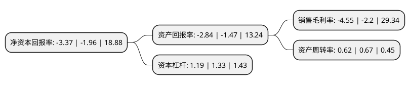

> 本页面由自动化程序生成于 2022年5月20日 01:38
> 内容可能存在错误，如有bug请提交issue至：https://github.com/Eroleice/doc-pi/issues
{.is-warning}

# 上市公司基本情况

## 基本资料

上海安路信息科技股份有限公司（以下简称“安路科技-U”）成立于2011年11月18日，上海市。于2021年11月12日在上交所科创板上市。

安路科技-U注册资本40,010万元，主要向客户提供FPGA产品，包括FPGA芯片和专用EDA软件两部分。主营业务为FPGA芯片和专用EDA软件的研发，设计和销售。以下是详细信息：

- 公司名称: 上海安路信息科技股份有限公司
- 股票代码: 688107.SH
- 所在地: 上海 - 上海市
- 成立日期: 2011年11月18日
- 注册资本: 40,010万元
- 法定代表人: 马玉川
- 主营业务: 主要向客户提供FPGA产品，包括FPGA芯片和专用EDA软件两部分主营业务为FPGA芯片和专用EDA软件的研发，设计和销售
- 公司官网: www.anlogic.com
- 公司介绍: 公司为国内领先的半导体和集成电路设计企业之一，历经近10年的发展，依靠持续不断的研发投入和精益求精的技术创新，公司在众多技术领域取得了突破，获得了下游客户的广泛认可。在硬件设计方面，公司是国内首批具有先进制程FPGA芯片设计能力的企业之一；在FPGA专用EDA软件方面，公司的TangDynasty软件是国内少数全流程自主开发的FPGA专用软件；在FPGA芯片测试方面，公司自主开发的工程和量产技术保证了产品具有竞争力的良率和品质；在FPGA芯片应用方案方面，公司也已经积累了一批成熟的图像处理与人工智能硬件加速技术。公司凭借领先的研发能力、长期的技术积累、可靠的产品质量和优秀的客户服务水平，在国内外积累了良好的品牌认知和优质的客户资源，客户认可度不断提高。此外，公司也与中芯国际、台积电、华天科技等供应商建立了稳定的合作关系。

## 股东及高管情况

上市公司第一大股东为华大半导体有限公司，持股116,691,243股，占比29.17%，**疑似为**上市公司实际控制人。

截至2022年03月31日，上市公司的前十大股东中，共有7名机构股东，3个产品账户，其中5%以上大股东共有5名。上市公司前十大股东明细如下：

> 未能通过持股比例判定出上市公司实际控制人（持股30%以上）
> 可能存在通过间接持股、联合持股、协议控制等方式拥有实际控制权的主体，具体请参考上市公司定期公告！
{.is-warning}

> 截至2022年03月31日，上市公司前十大股东信息如下：

| 股东名称 | 持股数量（股） | 持股比例 |
| --- | --- | --- |
| 华大半导体有限公司 | 116,691,243 | 29.17% |
| 上海安芯企业管理合伙企业(有限合伙) | 83,280,246 | 20.81% |
| 国家集成电路产业投资基金股份有限公司 | 39,117,423 | 9.78% |
| 深圳思齐资本信息技术私募创业投资基金企业(有限合伙) | 33,839,393 | 8.46% |
| 上海科技创业投资有限公司 | 21,724,839 | 5.43% |
| 深圳创维创业投资有限公司 | 11,627,683 | 2.91% |
| 杭州士兰微电子股份有限公司 | 11,627,683 | 2.91% |
| 杭州士兰创业投资有限公司 | 11,627,683 | 2.91% |
| 深圳市创新投资集团有限公司 | 8,234,845 | 2.06% |
| 招商银行股份有限公司-银河创新成长混合型证券投资基金 | 6,207,929 | 1.55% |

## 利润表分析

上市公司2021年总收入为6.78亿元，净利润为-0.31亿元，**未实现盈利**。

## 杜邦分析

> 数据列示周期：2021年 | 2020年 | 2019年
{.is-info}

上市公司的净资产收益率在近一年有所上升，上升幅度为71.94%，其变化情况分解如下：
- 上市公司的销售毛利率在近一年上升了106.82%，可能是生产效率的提升、商品原材料价格下跌或商品价格的上涨所致。
- 上市公司的资产周转率在近一年下降了-7.46%，可能是源自于更慢的销售回款或库存管理效果下降。
- 上市公司的财务杠杆比率在近一年下降了-10.53%，可能是减少负债降低财务费用。

